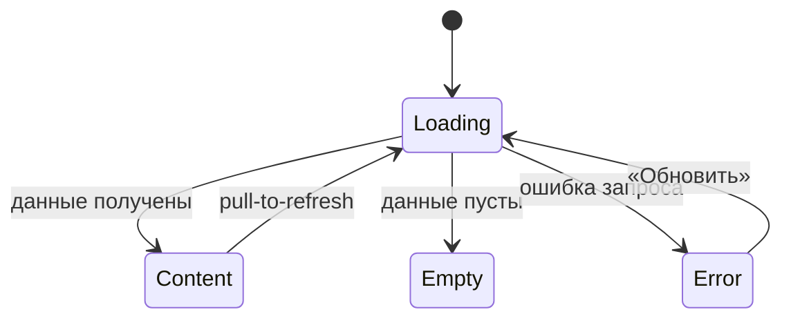

# Требования на дизайн · Foundations (сквозные правила)

> **Этап 3.** Сквозной документ дизайн-требований клиентского приложения скалодрома
> **«Вертикаль»**. Описывает принципы, структурные токены, паттерны навигации и состояний,
> доступность и микрокопию, **общие для всех экранов**. Экранные документы ссылаются сюда и не
> дублируют эти правила.

**Статус:** Черновик · **Версия:** 0.1 · **Дата:** 2026-07-05 · **Зона:** НЗ + АЗ

**Источники:**
[Бизнес-требования](../2-requirements/business-requirements.md) ·
[ФТ](../2-requirements/functional-requirements.md) ·
[НФТ](../2-requirements/non-functional-requirements.md) ·
[Use cases](../2-requirements/use-cases.md) ·
[User stories](../2-requirements/user-stories.md) ·
[Модель данных](../4-design/data-model.md)

> **Объём визуальных требований.** Документ задаёт **функционально-структурные** требования:
> иерархию, компоненты, поведение, ограничения. Конкретная палитра, шрифты и иллюстративный
> стиль — зона ответственности дизайнера; бренд в исходной аналитике не зафиксирован. Токены
> ниже описаны как **правила/уровни** (контраст, размеры, плотность), а не как hex/font-family.

---

## 1. Продукт и аудитория

**«Вертикаль»** — клиентское мобильное приложение для самостоятельной записи на групповые
тренировки по скалолазанию. Заменяет запись через Telegram и бумажную тетрадь.

**Единственная роль — «Клиент».** Инструктор и владелец в приложение не входят. Справочные
данные (слоты, зоны/форматы, инструкторы) — read-only из API. Оплата — **офлайн** (наличные /
перевод на карту на месте); приложение показывает цену и фиксирует бронь, онлайн-оплаты нет.

**Контекст использования:** клиент в зале скалодрома (бывший ангар), нередко с мелом на руках,
спешит перед тренировкой, смотрит расписание между подходами. Это диктует крупные элементы,
высокий контраст и минимум шагов (NFR-1).

---

## 2. Дизайн-принципы

| # | Принцип | Источник | Что это значит для макета |
|---|---------|----------|---------------------------|
| P1 | **Mobile-first для зала** | NFR-1 | Крупные тач-зоны, высокий контраст, читаемость при ярком освещении ангара, минимум мелкого текста. |
| P2 | **Короткий путь к записи** | BR-2, BR-5 | От списка до подтверждения — **≤ 3 экранов**. Не добавлять необязательных шагов/полей. |
| P3 | **Минимальный порог входа** | FR-1, FR-2 | Регистрация — только имя + телефон, без пароля. Не запрашивать лишних данных. |
| P4 | **Воспринимаемая скорость** | NFR-7 | Скелетоны вместо пустого экрана; отклик списка и подтверждения ощущается < 2–3 с. |
| P5 | **Только свои данные** | NFR-9, NFR-10 | Клиент видит лишь свои записи и контакты; в UI нет доступа к чужим/админским данным. |
| P6 | **Честность и спокойствие** | UC-3, UC-4 | Ошибки и правила (места, прокат, 2 часа) объясняются понятно и без давления; штрафов нет. |

---

## 3. Структурные токены (без бренда)

Дизайнер выбирает конкретные значения; ниже — обязательные **правила**.

### 3.1 Тач-зоны и размеры
- Минимальный размер интерактивного элемента — **≥ 44–48 pt** по меньшей стороне.
- Основной CTA — во всю ширину контентной области, высота не менее минимальной тач-зоны.
- Между кликабельными элементами — отступ, исключающий промахи (мел на руках, спешка).

### 3.2 Контраст и читаемость (NFR-1)
- Контраст текста к фону — не ниже **WCAG AA** (обычный текст ≥ 4.5:1, крупный ≥ 3:1).
- Состояния не передаются **только цветом** — дублируются иконкой/текстом/формой.
- Важные числа (свободно мест, цена, время старта) — крупные и контрастные.

### 3.3 Типографическая иерархия (уровни, не шрифты)
- **Заголовок экрана** → **Заголовок секции/карточки** → **Основной текст** →
  **Вторичный/подпись (caption)**. Достаточно 4–5 уровней; держать единообразно.
- Минимальный размер основного текста комфортен для чтения в зале (не «мелкий серый»).

### 3.4 Плотность и сетка
- Единая шкала отступов (кратная базовому шагу) — задаёт дизайнер, применяет везде.
- Контент — в одну колонку (mobile-first), карточки разделены явными отступами/границами.

### 3.5 Иконки и индикаторы
- Иконки сопровождаются текстом в ключевых местах (таб-бар, статусы), не несут смысл в одиночку.
- Индикатор активных фильтров, бейдж статуса записи — визуально считываемы с первого взгляда.

---

## 4. Каркас экрана и навигация

### 4.1 Базовый каркас
```
┌─────────────────────────────┐
│ Хедер (заголовок / назад)    │  ← фиксированный
├─────────────────────────────┤
│                              │
│ Скролл-контент               │  ← основная зона
│                              │
├─────────────────────────────┤
│ Фикс. нижний CTA (если есть) │  ← всегда виден, не перекрыт клавиатурой
└─────────────────────────────┘
│ Таб-бар (в АЗ, верхнеуровневые│  ← только на корневых экранах вкладок
│ экраны)                       │
└─────────────────────────────┘
```

### 4.2 Таб-бар (авторизованная зона)
Три верхнеуровневых раздела, всегда доступны на корневых экранах:
- **Тренировки** ([SCR-002](SCR-002-slot-list.md)) — стартовая вкладка (список доступных слотов).
- **Мои записи** ([SCR-005](SCR-005-my-bookings.md)).
- **Профиль** ([SCR-007](SCR-007-profile.md)).

Таб-бар скрывается на вложенных экранах (карточка слота, оформление, детали брони) и на
bottom sheet. Каждая иконка сопровождается подписью.

### 4.3 Bottom Sheet (шторки BS-001 / BS-002 / BS-003)
Единые правила для всех шторок:
- Высота — по контенту, но не выше ~90% экрана; длинный контент скроллится внутри.
- **Бэкдроп** (затемнение фона) + закрытие по тапу вне шторки (кроме критичных подтверждений,
  где закрытие — только явной кнопкой).
- **Swipe-to-close** жестом вниз + видимый «грабер» (полоска) сверху.
- Явная кнопка закрытия/отмены. Действия-кнопки шторки — в её нижней части.
- Открытие/закрытие — плавная анимация снизу вверх.

### 4.4 Карта навигации
Полная карта переходов — в [design-brief.md §«Пользовательские сценарии»](design-brief.md).
Каждый экранный документ описывает свои входящие/исходящие переходы в разделе «Навигация».

---

## 5. Сквозной паттерн состояний экрана

Применяется ко **всем экранам с запросами к API**. Экранные документы лишь уточняют
специфику (тексты пустых состояний, конкретные ошибки), не переописывая паттерн.



| Состояние | Что показываем | Правило |
|-----------|----------------|---------|
| **Loading** | Скелетон/шиммер в форме будущего контента | Не пустой белый экран; не блокирующий спиннер по возможности (P4). |
| **Content** | Данные | Основной сценарий. |
| **Empty** | Заглушка + понятная подсказка + действие (если применимо) | Объясняет, почему пусто, и что сделать. |
| **Error** | Заглушка ошибки + кнопка **«Обновить»** | Нейтральный тон; не винит пользователя; даёт повтор. |

Специфичные состояния (например, **disabled CTA «Записаться»** при отсутствии свободных мест,
бейдж **«Поздняя отмена»**) описаны в соответствующих экранных документах.

---

## 6. Tone of voice и общая микрокопия

**Тон:** простой, прямой, дружелюбный, без жаргона и канцелярита. Обращение на «вы».
Сообщения — короткие, по делу, без вины и давления (штрафов в продукте нет).

**Сквозные тексты (единые формулировки, переиспользуются экранами):**

| Контекст | Текст |
|----------|-------|
| Оплата | «Оплата на месте: наличные или перевод на карту.» |
| Лейблы снаряжения | «Своё снаряжение» / «Прокатное снаряжение» |
| Правило отмены | «Отмена не позднее чем за 2 часа до старта — место освобождается. Позже — место остаётся за вами, но штрафов нет.» |
| Поздняя отмена (итог) | «Поздняя отмена: место не освобождено (правило 2 часов). Штраф не взимается.» |
| Отмена скалодромом | «Отменена скалодромом» |
| Кнопка повтора | «Обновить» |
| Empty state слотов | «Пока нет доступных тренировок» |
| Сетевая ошибка при загрузке (общая) | «Не удалось загрузить. Проверьте соединение и попробуйте снова.» |
| Сетевая ошибка при действии | «Не удалось выполнить. Проверьте соединение и повторите.» |
| Ошибка сервера при действии (5xx) | «Что-то пошло не так. Попробуйте ещё раз позже.» |
| Ошибка действия без текста от сервера (дефолт 4xx без `message`) | «Не удалось выполнить. Попробуйте ещё раз.» |

> Числовые лимиты (потолок формата, размер прокатного фонда) **не зашиваются в тексты** —
> подставляются из данных слота.
>
> **Раздельная модель доступности (FR-8, FR-9).** Места в группе и прокатный фонд считаются
> **независимо**:
> - **Место в группе** занимается при любой записи (своё или прокатное снаряжение).
> - **Прокатный фонд** уменьшается только при выборе «Прокатное снаряжение».
> - Свободные места **не** ограничиваются прокатным фондом и наоборот.

### 6.1 Каталог снеков успеха (единые формулировки)

| Действие | Экран/Шторка | Текст снека успеха | Примечание |
|----------|--------------|--------------------|------------|
| Сохранение профиля | [SCR-007](SCR-007-profile.md) | «Профиль обновлён» | — |
| Подтверждение смены телефона | [SCR-007](SCR-007-profile.md) | «Изменения сохранены» | После успешного ввода кода. |
| Удаление аккаунта | [SCR-007](SCR-007-profile.md) | «Аккаунт удалён» | На экране входа после выхода из сессии. |
| Выход из аккаунта | [SCR-007](SCR-007-profile.md) | — (снек не показывается) | Обратная связь — переход на [SCR-001](SCR-001-registration.md). |
| Отмена брони (ранняя) | [BS-003](BS-003-cancel-confirm.md) → [SCR-006](SCR-006-booking-details.md) | «Бронь отменена» | Снек показывает экран-родитель. |
| Отмена брони (поздняя) | [BS-003](BS-003-cancel-confirm.md) → [SCR-006](SCR-006-booking-details.md) | «Поздняя отмена: место не освобождено (правило 2 часов). Штраф не взимается.» | Успешный исход, не ошибка. |
| Создание брони | [SCR-004](SCR-004-booking.md) → [BS-002](BS-002-booking-success.md) | — (снек не показывается) | Обратная связь — шторка успеха; дублировать снеком нельзя. |
| Применение/сброс фильтров | [BS-001](BS-001-filters.md) → [SCR-002](SCR-002-slot-list.md) | — (снек не показывается) | Обратная связь — обновлённый список. |
| Успешный pull-to-refresh | любой список | — (снек не показывается) | Снек только при ошибке обновления. |

### 6.2 Кто показывает снек при закрытии шторки

- Снек **успеха/итога** действия, после которого шторка закрывается, показывает **экран-родитель**.
- Снек **ошибки** действия, при которой шторка **остаётся открытой**, показывает **сама шторка**.
- **Нельзя дублировать** обратную связь: если результат выражен переходом на [BS-002](BS-002-booking-success.md),
  снек об успехе на экране-инициаторе **не показывается**.

### 6.3 Снеки vs Error-заглушка

- **Снеком** — результаты **действий** и ошибка при pull-to-refresh.
- **Error-заглушкой** — провал **первичной загрузки** данных экрана.

> **Единый источник правила отмены.** Полный текст правила «2 часов» задаётся **только здесь**.
> Экраны [SCR-006](SCR-006-booking-details.md) и [BS-003](BS-003-cancel-confirm.md) **ссылаются**
> на эти формулировки. Граничный случай **«ровно 2 часа до старта» трактуется как ранняя отмена**
> (`≥ 2 ч` → место освобождается).

---

## 7. Доступность (NFR-1 — WCAG AA)

Целевой уровень — **WCAG 2.1 AA**. Обязательные требования:

- **Контраст:** не ниже WCAG AA — см. §3.2.
- **Тач-зоны:** интерактивные элементы — **≥ 44 pt** по меньшей стороне (§3.1).
- **Dynamic type:** поддержка системного увеличения шрифта; layout не «ломается».
- **Screen reader:** все интерактивные элементы имеют текстовую подпись; статусы и важные числа озвучиваются.
- **Не только цвет:** состояния дублируются иконкой/текстом/формой (§3.2).
- **Малые экраны:** контент скроллится, фикс. CTA не перекрывает контент.
- Фокус-состояния и обратная связь на тап обязательны.

---

## 8. Сквозные функции

### 8.1 Напоминания и уведомления (FR-17, FR-18, NFR-8)
- Push-напоминания за **24 ч и 2 ч** до старта тренировки.
- Push при отмене тренировки скалодромом.
- **Канал — системный push** (APNs/FCM). Управление каналом — на стороне инфраструктуры.
- **Запрос разрешения на push показывается после первой успешной записи** — на
  [BS-002](BS-002-booking-success.md), когда ценность очевидна. [SCR-001](SCR-001-registration.md)
  разрешение **не запрашивает**.
- Отдельного экрана управления уведомлениями в MVP нет.

### 8.2 Безопасность данных в UI (NFR-9, NFR-10)
- На экранах отображаются только данные текущего клиента.
- Персональные данные (имя, телефон) не дублируются без необходимости.

### 8.3 Поведение офлайн и сетевые ошибки
- **Просмотр кэша офлайн разрешён** с пометкой устаревания («Данные могут быть неактуальны»).
- **Мутации офлайн запрещены:** запись, отмена, изменение профиля блокируются с сообщением «нет сети».
- **Таймаут запроса — ~10 с:** по истечении — ошибка с повтором.

---

## 9. Глоссарий

| Термин | Значение |
|--------|----------|
| **Тренировка / Слот** | Конкретное занятие: дата, время старта, зона/формат, инструктор, цена, всего/свободно мест. |
| **Зона / Формат** | Вариант тренировки (болдеринг для новичков / трассы для опытных); свой потолок мест и длительность. |
| **Снаряжение** | Скальники, страховочная система: своё или прокатное из фонда клуба. |
| **Запись (бронь)** | Бронь **одного места** на слот: вариант снаряжения, статус. Одна запись = один клиент. |
| **Ранняя отмена** | Отмена ≥ 2 ч до старта → место и прокатный фонд (если был прокат) возвращаются в слот. |
| **Поздняя отмена** | Отмена < 2 ч до старта → запись фиксируется, место не освобождается, штрафов нет. |
| **Отменена скалодромом** | Тренировку отменил клуб (в т.ч. профилактика); бронь сохраняется с причиной; повторная запись на слот запрещена. |

---

## 10. Карта документов дизайн-требований

| ID | Документ |
|----|----------|
| — | **00-foundations.md** (этот файл) |
| SCR-001 | [Регистрация / Вход](SCR-001-registration.md) |
| SCR-002 | [Список слотов](SCR-002-slot-list.md) |
| BS-001 | [Фильтры](BS-001-filters.md) |
| SCR-003 | [Карточка слота](SCR-003-slot-card.md) |
| SCR-004 | [Оформление записи](SCR-004-booking.md) |
| BS-002 | [Подтверждение записи](BS-002-booking-success.md) |
| SCR-005 | [Мои бронирования](SCR-005-my-bookings.md) |
| SCR-006 | [Детали брони + отмена](SCR-006-booking-details.md) |
| BS-003 | [Подтверждение отмены](BS-003-cancel-confirm.md) |
| SCR-007 | [Профиль клиента](SCR-007-profile.md) |
