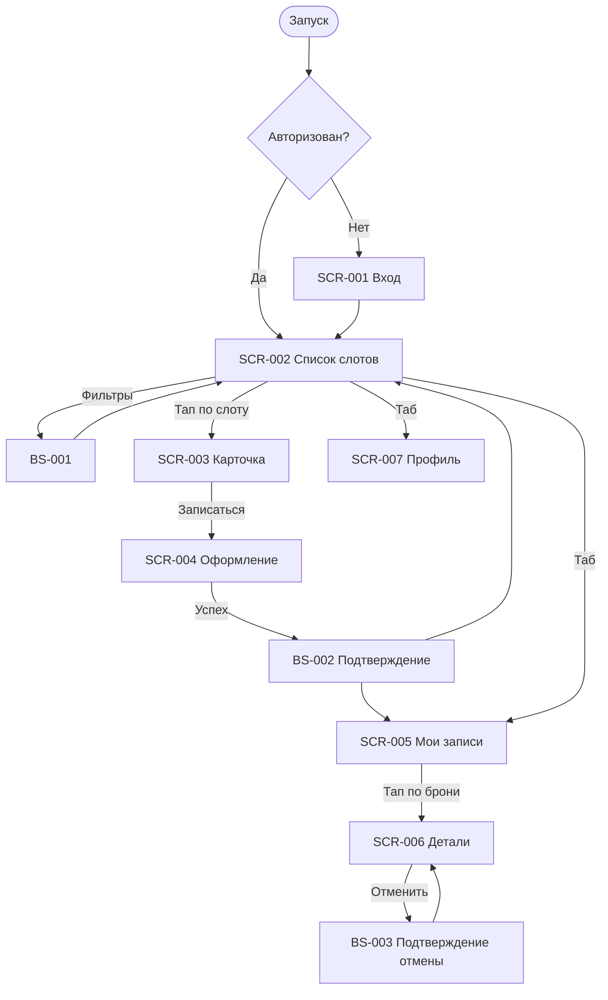

# Бриф для UI/UX дизайнера · «Вертикаль»

> Требования на дизайн клиентского мобильного приложения скалодрома **«Вертикаль»**
> (самостоятельная запись на групповые тренировки). Этот файл — **обзор и реестр экранов**:
> единые правила вынесены в [00-foundations.md](00-foundations.md), детальные требования — в
> отдельный документ на каждый экран (см. §«Реестр экранов»).

**Статус:** Черновик · **Версия:** 0.1 · **Дата:** 2026-07-05

**Источники:**
[Бизнес-требования](../2-requirements/business-requirements.md) ·
[Функциональные требования](../2-requirements/functional-requirements.md) ·
[Нефункциональные требования](../2-requirements/non-functional-requirements.md) ·
[Use cases](../2-requirements/use-cases.md) ·
[User stories](../2-requirements/user-stories.md) ·
[Модель данных](../4-design/data-model.md)

---

## Цель и контекст

**«Вертикаль»** заменяет ручную запись на тренировки через Telegram и бумажную тетрадь,
устраняя двойные брони и путаницу с местами. Клиент самостоятельно просматривает слоты,
фильтрует, записывается на **одно место**, выбирает вариант снаряжения, отменяет записи и
получает напоминания. Платформа — **нативное/гибридное мобильное приложение для iOS и Android**
(mobile-first для использования в зале скалодрома).

**Скоуп — только роль «Клиент».** Инструктор и владелец работают через существующую
инфраструктуру/админку и в приложение не входят. Справочные данные — read-only из API;
оплата — офлайн (наличные / перевод), приложение лишь показывает цену и фиксирует запись.

**Что входит в MVP:**
- Регистрация/вход по имени и телефону (SMS-код).
- Список слотов на 7 дней, фильтрация, карточка слота.
- Запись **одного места** с выбором своё/прокатное снаряжение.
- Список своих бронирований, отмена с правилом 2 часов.
- Отображение отмен скалодромом с причиной.
- Push-напоминания за 24 ч и 2 ч; push при отмене скалодромом.
- Профиль: просмотр/редактирование имени и телефона, выход, удаление аккаунта.

Подробнее о продукте, аудитории, дизайн-принципах и контексте использования —
[00-foundations.md §1–2](00-foundations.md#1-продукт-и-аудитория).

## Роли и их задачи

| Роль | Что делает в приложении |
| :-- | :-- |
| **Клиент** | Просматривает и фильтрует слоты, записывается на одно место, выбирает снаряжение, смотрит цену, отменяет записи, видит свои брони, получает напоминания. |
| Инструктор / Владелец | **Не входят в приложение** — работают через существующую инфраструктуру (вне скоупа). |

## Сквозные правила (foundations)

Единые для всех экранов требования вынесены в **[00-foundations.md](00-foundations.md)**:
дизайн-принципы, структурные токены, каркас и навигация (таб-бар, bottom sheet, нижний CTA),
сквозной паттерн состояний, tone of voice, доступность, уведомления, глоссарий.

## Реестр экранов

Отдельный документ на каждый экран/шторку (всё в этой папке):

| ID | Экран | Тип | Зона | Приоритет | Трассировка (основное) | Документ |
|----|-------|-----|------|-----------|------------------------|----------|
| — | Сквозные правила (foundations) | — | НЗ+АЗ | — | — | [00-foundations.md](00-foundations.md) |
| SCR-001 | Регистрация / Вход | Экран | НЗ | Critical | FR-1, FR-2; US-1; UC-1 | [SCR-001-registration.md](SCR-001-registration.md) |
| SCR-002 | Список слотов | Экран | АЗ | Critical | FR-3, FR-4; US-2, US-3; UC-2 | [SCR-002-slot-list.md](SCR-002-slot-list.md) |
| BS-001 | Фильтры | Bottom Sheet | АЗ | High | FR-4; US-3; UC-2 | [BS-001-filters.md](BS-001-filters.md) |
| SCR-003 | Карточка слота | Экран | АЗ | Critical | FR-5; US-4; UC-3 | [SCR-003-slot-card.md](SCR-003-slot-card.md) |
| SCR-004 | Оформление записи | Экран | АЗ | Critical | FR-6–FR-11; US-5–US-8; UC-3 | [SCR-004-booking.md](SCR-004-booking.md) |
| BS-002 | Подтверждение записи | Bottom Sheet | АЗ | High | FR-6, FR-11; US-5, US-8; UC-3 | [BS-002-booking-success.md](BS-002-booking-success.md) |
| SCR-005 | Мои бронирования | Экран | АЗ | Critical | FR-12, FR-16; US-9, US-11; UC-4, UC-5 | [SCR-005-my-bookings.md](SCR-005-my-bookings.md) |
| SCR-006 | Детали брони + отмена | Экран | АЗ | Critical | FR-13–FR-15; US-10; UC-4 | [SCR-006-booking-details.md](SCR-006-booking-details.md) |
| BS-003 | Подтверждение отмены | Bottom Sheet | АЗ | High | FR-13–FR-15; US-10; UC-4 | [BS-003-cancel-confirm.md](BS-003-cancel-confirm.md) |
| SCR-007 | Профиль клиента | Экран | АЗ | Medium | FR-1, FR-2; NFR-10 | [SCR-007-profile.md](SCR-007-profile.md) |

> **Зоны:** НЗ — неавторизованная, АЗ — авторизованная.
>
> **Вне реестра MVP:** push-уведомления (FR-17, FR-18) — системные, без отдельного экрана;
> онлайн-оплата, оценки инструкторов, лояльность — Phase 2 (FR-W*).

## Пользовательские сценарии (user flows)

Ключевые пути:

- **Вход:** запуск → SCR-001 (телефон → код из SMS → имя для нового) → SCR-002.
- **Запись (UC-3):** SCR-002 → SCR-003 → SCR-004 → BS-002 → (SCR-005). ≤ 3 экранов до подтверждения (P2). После **первой** записи в BS-002 запрашивается разрешение на push.
- **Фильтрация (UC-2):** SCR-002 → BS-001 → SCR-002 (с применёнными фильтрами).
- **Отмена (UC-4):** SCR-005 → SCR-006 → BS-003 → SCR-006 (с обновлённым статусом).
- **Отмена скалодромом (UC-5):** push → SCR-005 / SCR-006 (статус «Отменена скалодромом» + причина).
- **Профиль:** SCR-007 — просмотр/редактирование имени и телефона, выход, удаление аккаунта → SCR-001.

## Состояния экранов

Единый паттерн для всех экранов с запросами — Loading → Content → Empty → Error (+ «Обновить»).
Описан в [00-foundations.md §5](00-foundations.md#5-сквозной-паттерн-состояний-экрана); специфичные
состояния — в соответствующих экранных документах.

## Тон, бренд, ограничения

- **Тон:** простой, прямой, дружелюбный, без давления и штрафов; обращение на «вы» —
  [00-foundations.md §6](00-foundations.md#6-tone-of-voice-и-общая-микрокопия).
- **Бренд:** не зафиксирован в аналитике — визуальный язык за дизайнером.
- **Доступность / mobile-first:** крупные тач-зоны, высокий контраст —
  [§3, §7](00-foundations.md#7-доступность-nfr-1--wcag-aa).
- **Что НЕ делаем на старте (Phase 2+):** онлайн-оплата, рейтинг инструктора, программа
  лояльности, интерфейсы инструктора/владельца — см. [FR-W*](../2-requirements/functional-requirements.md).
