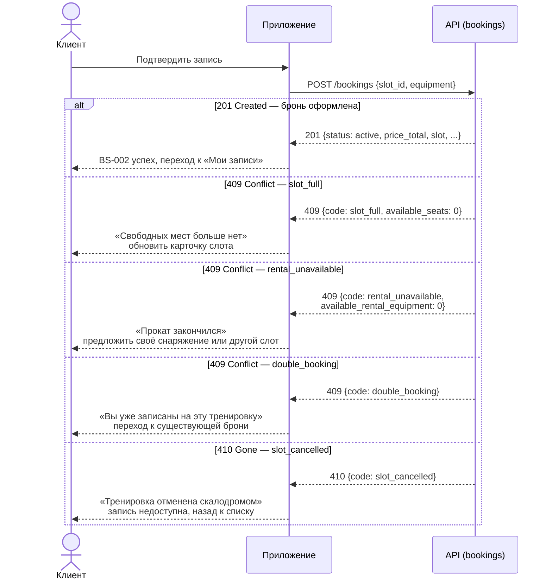

# Sequence-диаграмма API-взаимодействия

> Этап 3. Проектирование. Как клиент и сервер обмениваются вызовами в критичных сценариях
> записи на тренировки. Контракты API — в многофайловой спецификации
> [api/redocly.yaml](../api/redocly.yaml) (домены `auth`, `slots`, `bookings`, `profile`, `instructors`).
> Операции: `createBooking`, `cancelBooking` ([bookings/api.yaml](../api/bookings/api.yaml)).

> **Сквозные правила взаимодействия.**
> - Все вызовы — с `Authorization: Bearer <token>` (`bearerAuth`); при истёкшем/неверном токене
>   сервер отвечает `401`, клиент уходит на вход [SCR-001](../3-design-brief/SCR-001-registration.md).
> - Сервер — **источник истины** по времени и доступности: `slot.start_at` в UTC, тип отмены и
>   наличие мест/проката проверяет сервер, клиент их не пересчитывает (R-004, R-021).
> - Запись/отмена **атомарны**: овербукинг и двойная бронь исключены (NFR-5, R-004).
> - Таймаут запроса ~10 с; мутации офлайн запрещены — см. единый паттерн Error/Retry.

## Сценарий 1: Создание записи (`createBooking`, UC-3)

Поток: [SCR-004 «Оформление записи»](../3-design-brief/SCR-004-booking.md) → `POST /bookings`
→ [BS-002 «Подтверждение»](../3-design-brief/BS-002-booking-success.md). Клиент отправляет
`slot_id` и `equipment` (`own` / `rental`) — **одно место**, без счётчика гостей (FR-6).
Итоговую цену `price_total` (RUB, read-only) считает сервер — клиент её не вычисляет
после ответа, а показывает (R-005, FR-11).

```mermaid
sequenceDiagram
    actor User as Клиент
    participant App as Приложение
    participant API as API (bookings)

    Note over App: SCR-004: выбрано снаряжение,<br/>превью цены из price/rental_price слота
    User->>App: Тап «Подтвердить запись»
    App->>App: Генерирует Idempotency-Key (UUID)

    App->>API: POST /bookings<br/>{slot_id, equipment}<br/>Authorization: Bearer, Idempotency-Key
    Note over API: Атомарно: проверка free_seats,<br/>free_rental_equipment (если rental),<br/>фиксация price_total (NFR-5)

    alt Успех — 201 Created
        API-->>App: 201 Booking {id, status: active,<br/>equipment, price_total, created_at, slot,<br/>is_first_booking, reminder_hours}
        App-->>User: BS-002 «Запись оформлена» + сводка<br/>(после первой записи — запрос push)
    else Нет мест / нет проката / двойная бронь — 409 Conflict
        API-->>App: 409 {code: slot_full / rental_unavailable / double_booking,<br/>available_seats, available_rental_equipment}
        App-->>User: Сообщение о нехватке мест/проката<br/>или о повторной записи; обновление доступности
    else Слот отменён скалодромом — 410 Gone
        API-->>App: 410 {code: slot_cancelled}
        App-->>User: «Тренировка отменена», запись недоступна
    else Невалидные данные — 400 / 422
        API-->>App: 400 BadRequest / 422 Unprocessable
        App-->>User: Подсказка по полям / правилу
    else Токен истёк — 401
        API-->>App: 401 Unauthorized
        App-->>User: Переход на вход (SCR-001)
    else Сеть/сервер/таймаут (~10 c, 5xx)
        API-->>App: Ошибка / нет ответа
        App-->>User: Error + «Повторить» (повтор с тем же<br/>Idempotency-Key — без двойной брони)
    end
```

| Шаг | Что происходит | Источник |
| :-- | :-- | :-- |
| Запрос | `POST /bookings` с `Idempotency-Key`; тело — `CreateBookingRequest` (`slot_id`, `equipment`) | bookings/api.yaml, SCR-004 |
| Проверка | Сервер атомарно: `free_seats > 0`; при `rental` — `free_rental_equipment > 0`; нет активной брони клиента на слот | FR-8, FR-9, NFR-5 |
| `201` | `Booking` со `status=active`, `equipment`, `price_total` (read-only); опционально `is_first_booking`, `reminder_hours` | R-005, R-006 |
| `409 slot_full` | Нет свободных мест; `details.available_seats` — актуальный остаток | UC-3 E1, FR-9 |
| `409 rental_unavailable` | Нет прокатного снаряжения; `details.available_rental_equipment` | UC-3 E2, FR-8 |
| `409 double_booking` | У клиента уже есть активная бронь на этот слот | NFR-5 |
| `410` | Слот отменён скалодромом (`slot_cancelled`) | R-008, UC-3 E4 |
| Повтор | Сетевой сбой → повтор с тем же `Idempotency-Key` исключает дубль | R-022 |

### Ветки ответа `createBooking` (201 / 409 / 410)



## Сценарий 2: Отмена записи (`cancelBooking`, UC-4)

Поток: [SCR-006 «Детали брони»](../3-design-brief/SCR-006-booking-details.md) →
[BS-003 «Подтверждение отмены»](../3-design-brief/BS-003-cancel-confirm.md) → `POST
/bookings/{bookingId}/cancel`. Отмена — **целиком** (одно место). **Тип отмены определяет
сервер** по времени до старта (`slot.start_at` в UTC): `≥ 2 ч` → `cancelled` (место и прокат
возвращаются в слот), `< 2 ч` → `late_cancel` (не возвращаются, штрафов нет). Граница
«ровно 2 часа» = ранняя отмена (R-021).

```mermaid
sequenceDiagram
    actor User as Клиент
    participant App as Приложение
    participant API as API (bookings)

    Note over App: SCR-006: бронь active, старт в будущем
    User->>App: Тап «Отменить запись»
    App-->>User: BS-003 «Подтверждение отмены»<br/>(текст правила 2 часов)
    User->>App: Подтверждает отмену

    App->>API: POST /bookings/{bookingId}/cancel<br/>Authorization: Bearer
    Note over API: Сервер по slot.start_at (UTC) выбирает<br/>тип отмены; граница ровно 2ч = ранняя

    alt Ранняя отмена (≥ 2 ч)
        API-->>App: 200 Booking {status: cancelled, cancelled_at}
        App-->>User: SCR-006 + снек «Запись отменена»<br/>(место/прокат вернулись в слот)
    else Поздняя отмена (< 2 ч)
        API-->>App: 200 Booking {status: late_cancel, cancelled_at}
        App-->>User: SCR-006 + «Поздняя отмена: место не<br/>освобождено. Штраф не взимается.»
    else Слот уже стартовал (422 Unprocessable)
        API-->>App: 422 {code: slot_started}
        App-->>User: Отмена недоступна после старта
    else Уже отменена (409 Conflict)
        API-->>App: 409 {code: already_cancelled}
        App-->>User: Запись уже отменена, статус актуализируется
    else Чужая/несуществующая бронь (403 / 404)
        API-->>App: 403 Forbidden / 404 NotFound
        App-->>User: Запись недоступна
    else Токен истёк (401)
        API-->>App: 401 Unauthorized
        App-->>User: Переход на вход (SCR-001)
    else Сеть/сервер/таймаут (~10 c, 5xx)
        API-->>App: Ошибка / нет ответа
        App-->>User: Снек ошибки на BS-003, шторка остаётся<br/>открытой — можно повторить
    end
```

| Шаг | Что происходит | Источник |
| :-- | :-- | :-- |
| Запрос | `POST /bookings/{bookingId}/cancel` (без тела) | FR-13, bookings/api.yaml |
| Решение | Сервер выбирает `cancelled` / `late_cancel` по `start_at` (UTC) | R-021, FR-14, FR-15 |
| `200` | `Booking` с новым `status` и `cancelled_at`; экран обновляется | [data-model.md](data-model.md) |
| `422` | Слот уже стартовал (`slot_started`) — отмена недоступна | UC-4 E1 |
| `409` | Повторная отмена (`already_cancelled`) — терминальный статус | UC-4 E2 |

> Полная модель состояний брони и инварианты освобождения мест/проката —
> в [data-model.md §«Модель состояний»](data-model.md#модель-состояний-жизненный-цикл).
