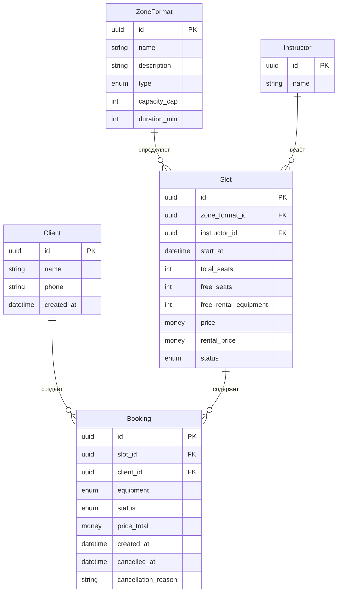
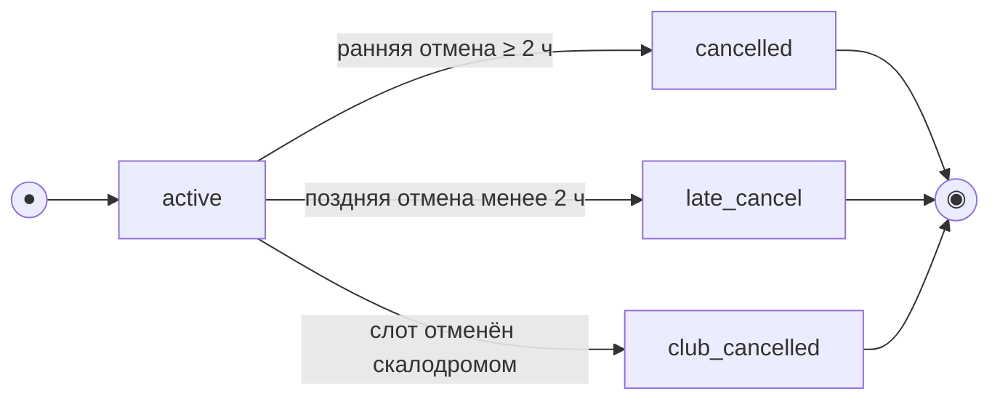
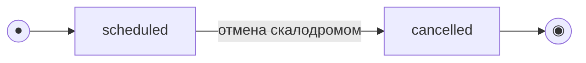

# Модель данных

> Этап 3. Проектирование. Описание сущностей, атрибутов и связей + черновик ERD.
>
> **Скоуп: клиентское приложение и API для него.** Это **ресурсная модель API** (что клиент
> читает/создаёт), а не схема БД существующей инфраструктуры: хранение и бизнес-логика
> расписания, инструкторов и админки принадлежат **бэкенду скалодрома**.
>
> **Данные существующей инфраструктуры (R-015).** Проект учебный/тестовый, легаси-данных нет:
> модель считается **канонической** и совпадает с контрактом API (`01-analysis/api/`).
> Миграция/backfill вне скоупа — бэкенд по условию отдаёт все поля модели.

## Доступ приложения к сущностям

| Сущность | Приложение | Операции через API | Примечание |
| :-- | :-- | :-- | :-- |
| **ZoneFormat** (зона/формат) | **Только чтение** | `listZoneFormats`, вложено в `Slot` | Справочник; создаётся в админке |
| **Instructor** (инструктор) | **Только чтение** | `listInstructors`, вложено в `Slot` как `instructor_info` | Справочник; управление — в инфраструктуре |
| **Slot** (тренировка/слот) | **Только чтение** | `listSlots`, `getSlot` | Расписание формирует владелец; счётчики `free_*` меняются **на сервере** как побочный эффект бронирования/отмены |
| **Client** (клиент) | **Чтение + запись** | `GET/PATCH /profile`, `DELETE /profile` (удаление аккаунта) | Регистрация через OTP-поток (`sendCode` / `verifyCode`) |
| **Booking** (запись/бронь) | **Чтение + запись** | `createBooking`, `listBookings`, `getBooking`, `cancelBooking` | Одна запись = одно место одного клиента (FR-6) |

> OTP-код, push-токен и сессия (Bearer-токен) — транспорт/аутентификация, отдельными
> сущностями в ресурсной модели не хранятся. Оценки инструкторов, статус «оплачено»,
> явка/неявка — вне скоупа клиентского приложения (существующая инфраструктура).

## Сущности и атрибуты

### Client (Клиент) — чтение и запись

| Атрибут | Тип | Описание | Доступ приложения |
| :-- | :-- | :-- | :-- |
| id | UUID (PK) | Идентификатор клиента | read |
| name | string | Имя | read / **write** (`PATCH /profile`) |
| phone | string (unique, E.164) | Номер телефона — логин; вход по SMS-коду (OTP) | read; задаётся при регистрации |
| created_at | datetime | Дата регистрации | read |

> Вход/регистрация — поток телефон → код из SMS → имя (для нового пользователя),
> см. [SCR-001](../3-design-brief/SCR-001-registration.md). Проверка OTP — на бэкенде.
>
> **История броней (R-025).** Клиенту доступна **вся история** своих броней — `listBookings`
> отдаёт её **постранично** (`limit`/`offset`).
>
> **Удаление аккаунта.** При `deleteAccount`:
> - **Активные брони** (`status = active`) → `cancelled` (системная отмена): освобождаются
>   место в слоте и прокатный комплект (если был прокат).
> - **Прошедшие брони** сохраняются обезличенными.
> - **ПДн** (`name`, `phone`) анонимизируются; `phone` освобождается для повторной регистрации.

### ZoneFormat (Зона / формат тренировки) — справочник, read-only

| Атрибут | Тип | Описание |
| :-- | :-- | :-- |
| id | UUID (PK) | Идентификатор зоны/формата |
| name | string | Название (напр. «Болдеринг», «Трассы с верёвкой») |
| description | string? (nullable) | Описательный текст для карточки слота (SCR-003) |
| type | enum (`novice`/`experienced`) | Тип: новичковый / опытный |
| capacity_cap | int | Потолок мест: новичковый ≤ 8, опытный ≤ 16 |
| duration_min | int | Длительность тренировки, мин (≈ 90, 1.5 ч) |

> В ответах API вложен в слот как `zone_format` (NFR-4).

### Instructor (Инструктор) — справочник, read-only

| Атрибут | Тип | Описание |
| :-- | :-- | :-- |
| id | UUID (PK) | Идентификатор инструктора |
| name | string | Имя инструктора |

> В ответах API вложен в слот как `instructor_info` (NFR-4). Рейтинг инструкторов — Phase 2.

### Slot (Слот / тренировка) — предзаполняется, read-only для клиента

| Атрибут | Тип | Описание |
| :-- | :-- | :-- |
| id | UUID (PK) | Идентификатор слота |
| zone_format_id | FK → ZoneFormat | Зона/формат тренировки |
| instructor_id | FK → Instructor | Назначенный инструктор (один на группу) |
| start_at | datetime (UTC) | Дата и время старта в UTC; **источник истины — сервер**. Клиент отображает в локальной зоне; правило отмены 2 ч вычисляет сервер (R-021) |
| total_seats | int | Всего мест в слоте (≤ `zone_format.capacity_cap`) |
| free_seats | int | Свободно мест (денормализованный счётчик) |
| free_rental_equipment | int | Свободно прокатных комплектов снаряжения (скальники + страховочная система) |
| price | money (RUB) | Цена за **одно место** |
| rental_price | money (RUB) | Дополнительный тариф за прокатный комплект (своё снаряжение — без доплаты) |
| status | enum (`scheduled`/`cancelled`) | Статус слота |

> **Одна запись = одно место.** Клиент бронирует ровно одно место; счётчик гостей отсутствует (FR-6, FR-W1).
>
> **Доступность к записи:** слот доступен при `status = scheduled`, `start_at` в будущем и `free_seats > 0`.
> Прокат доступен при `free_rental_equipment > 0` (UC-3 E2).
>
> **Итоговая цена брони** (на сервере, read-only в `Booking.price_total`):
> - своё снаряжение: `price`;
> - прокатное: `price + rental_price` (R-005, FR-11).

### Booking (Запись / бронь) — чтение и запись

| Атрибут | Тип | Описание | Доступ приложения |
| :-- | :-- | :-- | :-- |
| id | UUID (PK) | Идентификатор записи | read |
| slot_id | FK → Slot | Слот | read (задаётся при создании) |
| client_id | FK → Client | Кто записался | read |
| equipment | enum (`own`/`rental`) | Вариант снаряжения: своё / прокатное (FR-7) | **write** при `createBooking` |
| status | enum (`active`/`cancelled`/`late_cancel`/`club_cancelled`) | Статус записи. `club_cancelled` — **«Отменена скалодромом»** (слот снят клубом, R-008) | read; **write** через `cancelBooking` (→ `cancelled` / `late_cancel`) |
| price_total | money (RUB), read-only | Итоговая цена, рассчитанная сервером и **зафиксированная на момент брони** | read |
| created_at | datetime | Время создания | read |
| cancelled_at | datetime? | Время отмены (если была) | read |
| cancellation_reason | string?, read-only | Причина отмены скалодромом; заполняется при `club_cancelled` | read |

> **`price_total` не пересчитывается клиентом** — показывается как пришло из API (R-005).
> Тарифы `price`/`rental_price` лежат во вложенном `slot`.
>
> **«Прошедшая» — не хранимый статус.** Бейдж и группа «Прошедшие» (SCR-005/SCR-006) —
> **производное отображение** по `slot.start_at` в прошлом, не значение `Booking.status`.
>
> Статусы `no_show`, оплата «оплачено/нет» — вне скоупа клиентского приложения.

## ERD

## Модель состояний (жизненный цикл)

> Две сущности имеют явный жизненный цикл: **Booking** (управляется клиентским API) и
> **Slot** (read-only-проекция; переходы выполняет инфраструктура). Состояние **«Прошедшая»**
> — производное по `Slot.start_at`, не отдельный enum.

### Booking (Запись / бронь)

`status ∈ {active, cancelled, late_cancel, club_cancelled}`. Создаётся в `active`.
Тип отмены клиентом (`cancelled` / `late_cancel`) определяет **сервер** по времени до
`slot.start_at` (UTC); граница «ровно 2 часа» = ранняя отмена (`≥ 2 ч`, R-021).
При отмене **слота скалодромом** связанные брони → `club_cancelled` (R-008, FR-16).

| Из | Событие / условие | В | Эффект на слот | Трасса |
| :-- | :-- | :-- | :-- | :-- |
| — | Клиент подтверждает бронь (1 место) | `active` | `free_seats −= 1`; при `equipment = rental` → `free_rental_equipment −= 1` | UC-3, FR-6–FR-10 |
| `active` | Отмена, до старта `≥ 2 ч` | `cancelled` | Место и прокатный комплект **возвращаются** | UC-4, FR-14 |
| `active` | Отмена, до старта `< 2 ч` | `late_cancel` | Место и прокат **НЕ освобождаются**, штрафов нет | UC-4 A1, FR-15 |
| `active` | Слот отменён (`Slot.status → cancelled`) | `club_cancelled` | Слот снят; push клиенту; запись закрыта не по инициативе клиента | R-008, FR-16, FR-18 |
| терминальные | Повторная отмена | — | Не выполняется (`already_cancelled`, UC-4 E2) | UC-4 E2 |

> Отмена клиентом недоступна после старта (`slot_started`, UC-4 E1).

### Slot (Тренировка / слот)

`status ∈ {scheduled, cancelled}` — read-only для клиента. Переход в `cancelled` инициирует
владелец/инструктор в инфраструктуре (FR-W5). Клиент видит статус и реагирует в UI:
при `cancelled` запись недоступна, `createBooking` → `410` (UC-3 E4).

| Статус | Что видит клиент | Запись |
| :-- | :-- | :-- |
| `scheduled` (старт в будущем) | Слот в списке/карточке; при `free_seats = 0` — «Мест нет» | Доступна при `free_seats > 0` |
| `scheduled` (старт в прошлом) — *производное «Прошедшая»* | Не предлагается к записи | Недоступна |
| `cancelled` | «Тренировка отменена» / слот недоступен | Недоступна (`410 slot_cancelled`) |

## Ключевые инварианты (целостность данных)

- **Одна бронь = одно место:** у активной записи всегда ровно одно занятое место в группе.
- `Slot.free_seats = Slot.total_seats − Σ(active + late_cancel bookings по 1 месту)` — при поздней отмене место **не** освобождается.
- `Slot.free_rental_equipment = исходный фонд − Σ(active + late_cancel bookings с equipment = rental)`.
- `Slot.total_seats ≤ ZoneFormat.capacity_cap` (новичковый ≤ 8, опытный ≤ 16).
- Своё снаряжение (`equipment = own`) занимает место, но **не** расходует прокатный фонд.
- Только **ранняя** отмена (`cancelled`) возвращает место и прокатный комплект; `late_cancel` удерживает оба ресурса.
- Запись/отмена **атомарны**: овербукинг и двойная бронь одного клиента на слот исключены (NFR-5, R-004).
- Не более **одной активной брони** одного клиента на слот (`double_booking` → `409`).
