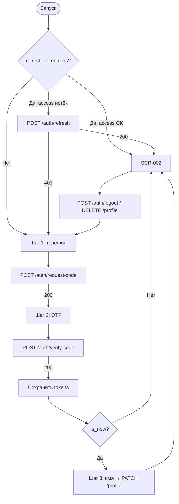

# OTP-авторизация и сессия

**ID:** LOGIC-001  
**Тип:** Логика  
**Домен:** 09. Логики  
**Приоритет:** Critical  
**Статус:** Актуален  
**Функциональные блоки:** FB-AUTH-001 (Вход по телефону), FB-AUTH-002 (Сессия и выход)

---

## История изменений

| Релиз | ТЗ | Описание изменений |
|-------|-----|-------------------|
| 1.0 | [feature-list.md](../feature-list.md) | Адаптация под «Вертикаль» |
| — | — | Первоначальная документация |

---

## Входные данные

| Название | Тип | Возможные значения | Описание |
|----------|-----|-------------------|----------|
| `access_token` | Защищённое хранилище | JWT / отсутствует | Bearer-токен для авторизованных запросов. |
| `refresh_token` | Защищённое хранилище | строка / отсутствует | Обновление access без повторного OTP. |
| `expires_in` | Состояние | integer (сек) | Срок жизни access из `TokenPair`. |
| `phone` | Состояние | E.164 | Номер между шагами 1–2. |
| `resend_after_seconds` | Состояние | integer, напр. `60` | Таймер повторной отправки кода. |
| `ttl_seconds` | Состояние | integer, напр. `300` | Срок жизни OTP. |
| `is_new` | Состояние | `true` / `false` | Из `verifyAuthCode` — нужен шаг 3 (имя). |

---

## Обзор

Логика описывает вход в **«Вертикаль»** по телефону без пароля (OTP) и управление сессией (JWT access + refresh). Трёхшаговый поток на [SCR-001](../SCR-001-registration.md): телефон → код → имя (только новый клиент). Токены хранятся в Keychain / Keystore; при валидной сессии SCR-001 пропускается → [SCR-002](../SCR-002-slot-list.md).

OTP переиспользуется при смене телефона на [SCR-007](../SCR-007-profile.md).

### User Story

> Как клиент скалодрома, я хочу входить по номеру телефона без пароля и оставаться авторизованным между запусками,
> чтобы быстро записаться на тренировку.

### Бизнес-ценность

- Минимальный порог входа (FR-1, FR-2, NFR-3).
- Сохранённая сессия сокращает путь к записи (NFR-2).
- Токены в защищённом хранилище (NFR-9).

---

## Точки применения

| Экран/Компонент | Элемент/Триггер | Условие |
|-----------------|-----------------|---------|
| [SCR-001 Регистрация / Вход](../SCR-001-registration.md) | «Получить код», «Подтвердить», «Продолжить» | НЗ |
| [SCR-001](../SCR-001-registration.md) | Запуск приложения | Проверка сессии |
| [SCR-007 Профиль](../SCR-007-profile.md) | «Выйти», «Удалить аккаунт» | АЗ |
| [SCR-007](../SCR-007-profile.md) | Смена телефона (OTP) | АЗ |

---

## Флоу

---

## API запросы

### POST /auth/request-code

**Триггер:** «Получить код» (шаг 1).

| Параметр | Тип | Источник |
|----------|-----|----------|
| `phone` | string E.164 | Поле «Телефон» |

| Результат | Действие |
|-----------|----------|
| 200 | Переход на шаг 2; `ttl_seconds`, `resend_after_seconds` |
| 400 | Снек «Не удалось войти. Попробуйте ещё раз» |
| 429 | Таймер повтора, блокировка повторной отправки |
| 5xx / сеть | Снек по [00-foundations §6](../../3-design-brief/00-foundations.md) |

### POST /auth/verify-code

**Триггер:** «Подтвердить» (шаг 2).

| Параметр | Тип | Источник |
|----------|-----|----------|
| `phone` | string | Состояние шага 1 |
| `code` | string | Поле кода 4–6 цифр |

| Результат | Действие |
|-----------|----------|
| 200 | Сохранить `access_token`, `refresh_token`; ветка по `is_new` |
| 400 invalid_code | «Код неверен или просрочен. Запросите новый код» |
| 429 | «Слишком много попыток…» + таймер |

### PATCH /profile

**Триггер:** «Продолжить» (шаг 3, `is_new = true`).

| Параметр | Тип | Источник |
|----------|-----|----------|
| `name` | string 1–100 | Поле «Имя» |

| Результат | Действие |
|-----------|----------|
| 200 | SCR-002 |
| 400 | Подсветка поля «Имя» |

### POST /auth/refresh

**Триггер:** access истёк или 401 на запросе.

| Параметр | Тип | Источник |
|----------|-----|----------|
| `refresh_token` | string | Keychain / Keystore |

| Результат | Действие |
|-----------|----------|
| 200 | Новая пара токенов; повтор исходного запроса |
| 401 | Стереть токены → SCR-001 |

### POST /auth/logout

**Триггер:** «Выйти» на SCR-007.

| Результат | Действие |
|-----------|----------|
| 204 / 401 | Стереть токены → SCR-001 |

---

## Локальное хранение

| Ключ | Тип | Описание |
|------|-----|----------|
| `access_token` | Keychain / Keystore | Bearer JWT |
| `refresh_token` | Keychain / Keystore | Только для `/auth/refresh` |

---

## Связанные требования

| ID | Название | Приоритет |
|----|----------|-----------|
| FR-1 | Регистрация (телефон + имя) | Critical |
| FR-2 | Авторизация по OTP | Critical |
| NFR-3 | Вход без пароля | Critical |
| NFR-9 | Защита персональных данных | Critical |

---

## Критерии приёмки

| ID | Критерий |
|----|----------|
| AC-001 | **Дано** нет токенов, **Когда** запуск приложения, **Тогда** SCR-001 шаг 1. |
| AC-002 | **Дано** валидный refresh, **Когда** запуск, **Тогда** SCR-002 без SCR-001. |
| AC-003 | **Дано** `is_new = false`, **Когда** verify 200, **Тогда** сразу SCR-002, шаг 3 пропущен. |
| AC-004 | **Дано** `is_new = true`, **Когда** PATCH profile 200, **Тогда** SCR-002. |
| AC-005 | **Дано** неверный код, **Когда** verify 400, **Тогда** снек об ошибке, номер сохранён. |
| AC-006 | **Дано** авторизован, **Когда** «Выйти», **Тогда** токены стёрты, SCR-001. |
| AC-007 | **Дано** 401 и refresh отклонён, **Тогда** SCR-001 шаг 1. |

---

## Обработка ошибок

| Тип ошибки | Контекст | Действие |
|------------|----------|----------|
| 400 invalid_code | verify | Снек; поле кода доступно |
| 429 | request / verify | Таймер `resend_after_seconds` |
| 401 | любой auth-запрос | refresh → logout flow |
| 5xx / сеть | любой | Снек foundations §6 |
| Двойной тап CTA | все шаги | Loading, блокировка повтора |
