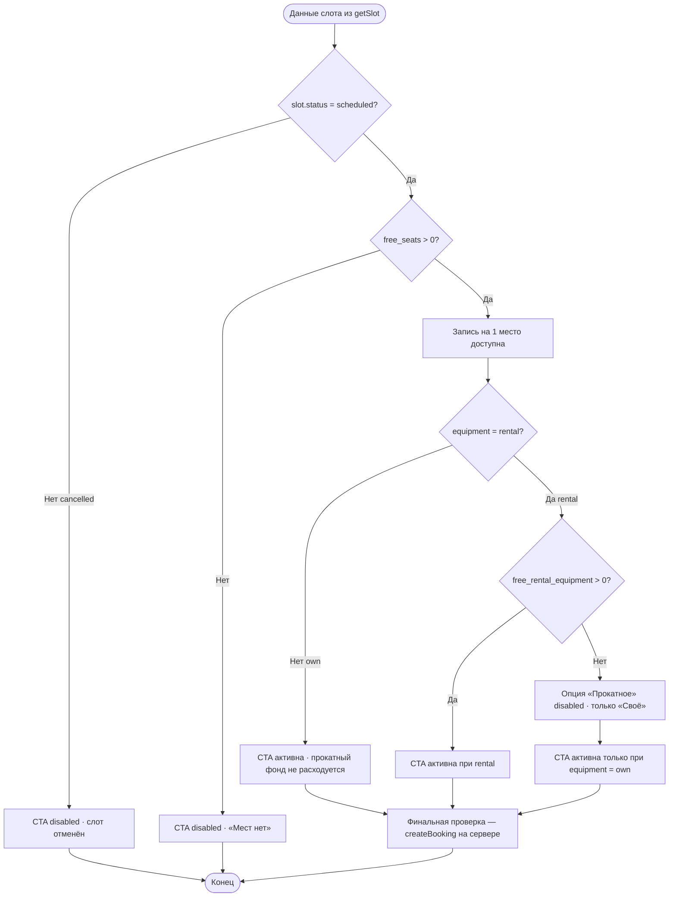

# Расчёт доступности мест и прокатного снаряжения

**ID:** LOGIC-002  
**Тип:** Логика  
**Домен:** 09. Логики  
**Приоритет:** Critical  
**Статус:** Актуален  
**Функциональные блоки:** FB-BOOKING-001 (Запись на слот), FB-BOOKING-002 (Выбор снаряжения)

---

## История изменений

| Релиз | ТЗ | Описание изменений |
|-------|-----|-------------------|
| 1.0 | [feature-list.md](../feature-list.md) | Адаптация под «Вертикаль»: одно место, zone_format, free_rental_equipment |
| — | — | Первоначальная документация |

---

## Входные данные

> Логика — **чистый клиентский расчёт** по данным уже загруженного слота.
> Отдельных запросов не делает; источник всех значений — ответ `getSlot`.

| Название | Тип | Возможные значения | Описание |
|----------|-----|-------------------|----------|
| `free_seats` | Состояние (поле слота) | `0…total_seats` | Число свободных мест в слоте. Из `Slot.free_seats`. Запись на **одно место** доступна при `free_seats > 0` (FR-6). |
| `free_rental_equipment` | Состояние (поле слота) | `≥ 0` | Число свободных прокатных комплектов (скальники + страховочная система). Из `Slot.free_rental_equipment`. Ограничивает выбор `equipment = rental` (FR-8). |
| `zone_format.capacity_cap` | Состояние (поле зоны/формата) | из данных, напр. `8` / `16` | Потолок мест формата (новичковый ≤ 8, опытный ≤ 16). Информирует UI; сервер проверяет лимит при бронировании (FR-9). |
| `slot.status` | Состояние | `scheduled`, `cancelled` | При `cancelled` запись недоступна (410). |
| `equipment` | Состояние (ввод SCR-004) | `own`, `rental` | Выбранный вариант снаряжения. По умолчанию `own`. |

### Валидация входных диапазонов

- Отрицательное или `null` значение `free_seats` / `free_rental_equipment` трактуется как `0`.
- При `free_seats = 0` запись **недоступна** (CTA «Записаться» неактивна, «Мест нет»).
- При `free_rental_equipment = 0` опция «Прокатное снаряжение» **недоступна**; запись возможна только со своим снаряжением.

---

## Обзор

Логика рассчитывает **два независимых лимита** для записи на слот (**одно место**, FR-6, FR-W1):

1. **Место в группе** — запись доступна при `free_seats > 0` и `slot.status = scheduled`.
2. **Прокатный фонд** — выбор `equipment = rental` доступен при `free_rental_equipment > 0`.

«Своё снаряжение» занимает место в группе, но **не** уменьшает прокатный фонд; «Прокатное» — занимает место **и** уменьшает прокатный фонд (FR-8). Счётчика гостей **нет** — одна запись = один клиент.

Это **расчётная логика клиента** по данным слота (`getSlot`). UI предупреждает заранее; **финальную проверку делает сервер** при `createBooking` (FR-9, FR-10).

### User Story

> Как клиент скалодрома, я хочу видеть, доступны ли место и прокатное снаряжение в выбранном слоте,
> чтобы записаться на тренировку без отказа при подтверждении.

### Бизнес-ценность

- Прозрачность лимитов до подтверждения — меньше отказов от сервера.
- Единый расчёт для SCR-003 и SCR-004 без дублирования правил.
- Корректное отражение раздельной модели мест и проката (FR-8).

---

## Точки применения

| Экран/Компонент | Элемент/Триггер | Условие |
|-----------------|-----------------|---------|
| [SCR-003 Карточка слота](../SCR-003-slot-card.md) | При открытии: «Свободно мест / прокат», активность CTA «Записаться» | Всегда |
| [SCR-004 Оформление записи](../SCR-004-booking.md) | Переключатель «Своё / Прокатное», активность CTA | Всегда; пересчёт при смене `equipment` |

---

## Флоу

---

## Описание логики

### Шаг 1: Доступность записи (одно место)

- `can_book = (free_seats > 0) AND (slot.status = scheduled)`.
- На SCR-003: CTA «Записаться» активна только при `can_book = true`.
- На SCR-004: экран недоступен, если `can_book = false` (редирект или disabled CTA).

### Шаг 2: Доступность прокатного снаряжения

- `can_select_rental = (free_rental_equipment > 0)`.
- При `can_select_rental = false` переключатель «Прокатное снаряжение» disabled; выбрано «Своё».
- При `can_select_rental = true` оба варианта доступны; клиент выбирает один.

### Шаг 3: Валидность перед отправкой

CTA «Записаться» на SCR-004 активна, когда:

- `can_book = true`, **и**
- `equipment = own`, **или** `equipment = rental AND can_select_rental = true`.

### Шаг 4: Пересчёт при обновлении данных

При pull-to-refresh (`getSlot`) или возврате на экран расчёт выполняется заново. Если прокат закончился — принудительно `equipment = own`. Если `free_seats = 0` — CTA off.

При **ранней отмене** (≥ 2 ч) сервер возвращает место и прокатный комплект в слот; при **поздней** — нет. Клиент получает актуальные счётчики из API, не пересчитывает локально.

---

## API запросы

> **Отдельных запросов логика не инициирует.** Источник — ответ `GET /slots/{slotId}` (`getSlot`).

| Источник | Поле | Назначение |
|----------|------|------------|
| `Slot` | `free_seats` | Доступность записи на одно место |
| `Slot` | `free_rental_equipment` | Доступность `equipment = rental` |
| `Slot.zone_format` | `capacity_cap` | Справочно; серверная проверка FR-9 |
| `Slot` | `status` | Блокировка при `cancelled` |

Финальная проверка — `POST /bookings` (`createBooking`): коды `422` (нет мест/проката), `410` (слот недоступен).

---

## Связанные требования

| ID | Название | Приоритет |
|----|----------|-----------|
| FR-6 | Запись на одно место | Critical |
| FR-7 | Выбор снаряжения own/rental | Critical |
| FR-8 | Раздельные лимиты мест и проката | Critical |
| FR-9 | Серверная проверка лимитов | Critical |
| FR-10 | Обработка отказа бронирования | Critical |
| FR-W1 | Групповая бронь — Won't | — |

---

## Критерии приёмки

| ID | Критерий |
|----|----------|
| AC-001 | **Дано** `free_seats = 0`, **Когда** открыта SCR-003, **Тогда** CTA «Записаться» неактивна и показано «Мест нет». |
| AC-002 | **Дано** `free_seats > 0` и `free_rental_equipment = 0`, **Когда** открыта SCR-004, **Тогда** доступно только «Своё снаряжение», CTA активна при `equipment = own`. |
| AC-003 | **Дано** `free_seats > 0` и `free_rental_equipment > 0`, **Когда** клиент выбирает «Прокатное», **Тогда** CTA активна и в запрос уходит `equipment = rental`. |
| AC-004 | **Дано** `slot.status = cancelled`, **Когда** открыта SCR-003, **Тогда** запись недоступна независимо от `free_seats`. |
| AC-005 | **Дано** параллельно заняли последний прокатный комплект, **Когда** `createBooking` с `rental` вернул 422, **Тогда** показана ошибка, предложено выбрать «Своё» или обновить данные. |

---

## Обработка ошибок

| Тип ошибки | Контекст | Действие |
|------------|----------|----------|
| 422 `no_seats` | `createBooking` | Снек «Мест больше нет»; обновить слот; CTA off |
| 422 `no_rental` | `createBooking` | Снек «Прокат закончился»; переключить на own |
| 410 `slot_unavailable` | `createBooking` | Снек «Тренировка недоступна»; вернуть к списку |
