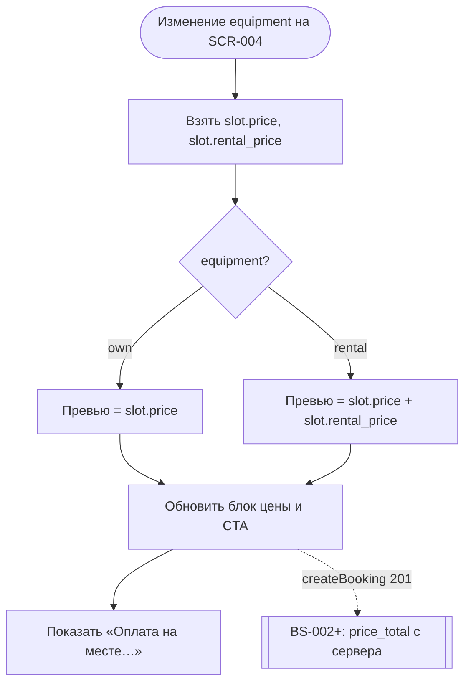

# Расчёт цены брони

**ID:** LOGIC-003  
**Тип:** Логика  
**Домен:** 09. Логики  
**Приоритет:** High  
**Статус:** Актуален  
**Функциональные блоки:** FB-BOOKING-001

---

## История изменений

| Релиз | ТЗ | Описание изменений |
|-------|-----|-------------------|
| 1.0 | [feature-list.md](../feature-list.md) | Одно место: own = price, rental = price + rental_price |
| — | — | Первоначальная документация |

---

## Входные данные

| Название | Тип | Возможные значения | Описание |
|----------|-----|-------------------|----------|
| `slot.price` | Данные слота | целое ≥ 0, RUB | Тариф за одно место. Из `Slot.price`. |
| `slot.rental_price` | Данные слота | целое ≥ 0, RUB | Доплата за прокатный комплект. Из `Slot.rental_price`. |
| `equipment` | Состояние SCR-004 / поле брони | `own`, `rental` | Вариант снаряжения. |
| `price_total` | Поле API (`Booking.price_total`) | целое ≥ 0, read-only | Итог созданной брони — **только с сервера** (R-005). |

---

## Обзор

Логика отображает стоимость записи на **одно место** (FR-6):

**Формула превью (SCR-004) и серверного `price_total` (R-005):**

| `equipment` | Итого |
|-------------|-------|
| `own` | `slot.price` |
| `rental` | `slot.price + slot.rental_price` |

- **До создания брони (SCR-004):** клиент показывает **превью** по формуле выше при смене `equipment`.
- **После создания (BS-002, SCR-005, SCR-006):** итог = **`price_total` из API** — клиент **не пересчитывает**.

Оплата — **офлайн** (наличные / перевод на карту на месте, FR-11).

### User Story

> Как клиент, я хочу видеть итоговую цену тренировки до подтверждения записи,
> чтобы подготовить оплату на месте без сюрпризов.

### Бизнес-ценность

- Прозрачность стоимости до подтверждения.
- Совпадение превью и серверного `price_total` — нет расхождений с бэкендом.
- Явное правило офлайн-оплаты снижает барьер к записи.

---

## Точки применения

| Экран/Компонент | Элемент/Триггер | Условие |
|-----------------|-----------------|---------|
| [SCR-003 Карточка слота](../SCR-003-slot-card.md) | Цена за место (`slot.price`) | Всегда |
| [SCR-004 Оформление записи](../SCR-004-booking.md) | Блок цены + сумма на CTA | Пересчёт при смене `equipment` |
| [BS-002 Подтверждение записи](../BS-002-booking-success.md) | Итог в сводке | `price_total` из `createBooking` |
| [SCR-005 Мои брони](../SCR-005-my-bookings.md) | Итог в карточке | `price_total` из `listBookings` |
| [SCR-006 Детали брони](../SCR-006-booking-details.md) | Итог | `price_total` из `getBooking` |

---

## Флоу

---

## Описание логики

### Шаг 1: Превью на SCR-004

- При `equipment = own`: показать `slot.price` ₽, строка «Тренировка: …».
- При `equipment = rental`: показать `slot.price + slot.rental_price` ₽, разбивка «Тренировка» + «Прокат» (если `rental_price > 0`).
- Сумма дублируется на кнопке «Записаться».

### Шаг 2: Текст об оплате

Под блоком цены — формулировка из [00-foundations §6](../../3-design-brief/00-foundations.md): «Оплата на месте: наличные или перевод на карту.»

### Шаг 3: Итог созданной брони

На BS-002 / SCR-005 / SCR-006 — **`booking.price_total`** из ответа API. Разбивка по `booking.slot.price` и `booking.equipment` — справочно.

### Шаг 4: Невалидные данные

Если `price` отсутствует или < 0 — CTA «Записаться» blocked, вместо суммы «—».

---

## API запросы

> Справочно — данные приходят с экранов.

### GET /slots/{slotId}

**Триггер:** Открытие SCR-003 / SCR-004.

| Поле ответа | Использование |
|-------------|---------------|
| `price` | Базовый тариф, превью own |
| `rental_price` | Доплата проката |

### POST /bookings

**Триггер:** Подтверждение записи на SCR-004.

| Body | Описание |
|------|----------|
| `slot_id` | UUID слота |
| `equipment` | `own` / `rental` |

| Результат | Действие |
|-----------|----------|
| 201 | `price_total`, `is_first_booking`, `reminder_hours` → BS-002 |
| 422 / 409 / 410 | Ошибка; цена не фиксируется |

---

## Связанные требования

| ID | Название | Приоритет |
|----|----------|-----------|
| FR-6 | Одно место | Critical |
| FR-7 | Выбор снаряжения | Critical |
| FR-11 | Цена и офлайн-оплата | Critical |

---

## Критерии приёмки

| ID | Критерий |
|----|----------|
| AC-001 | **Дано** `price = 1200`, `rental_price = 400`, **Когда** на SCR-004 выбрано «Своё», **Тогда** превью = 1200 ₽. |
| AC-002 | **Дано** те же тарифы, **Когда** выбрано «Прокатное», **Тогда** превью = 1600 ₽ с разбивкой. |
| AC-003 | **Дано** успешный `createBooking`, **Когда** открыта BS-002, **Тогда** итог = `price_total` из ответа, не локальный пересчёт. |
| AC-004 | **Дано** любой экран с итогом, **Когда** отображается цена, **Тогда** под ней текст об офлайн-оплате. |

---

## Обработка ошибок

| Тип ошибки | Контекст | Действие |
|------------|----------|----------|
| Отсутствует `price` | SCR-004 | CTA disabled, «—» вместо суммы |
| 5xx при createBooking | SCR-004 | Снек по foundations §6; бронь не создана |
