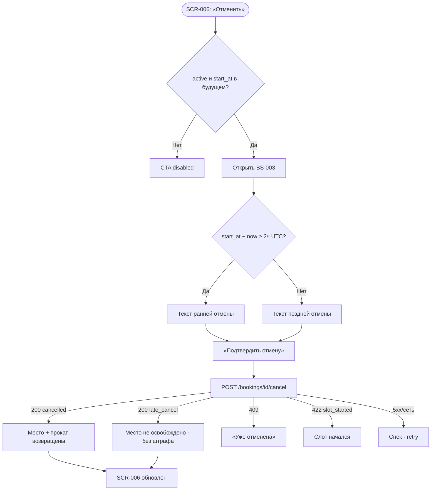

# Отмена брони: правило 2 часов

**ID:** LOGIC-004  
**Тип:** Логика  
**Домен:** 09. Логики  
**Приоритет:** Critical  
**Статус:** Актуален  
**Функциональные блоки:** FB-BOOKING-003

---

## История изменений

| Релиз | ТЗ | Описание изменений |
|-------|-----|-------------------|
| 1.0 | [feature-list.md](../feature-list.md) | Терминология «Вертикаль», одно место, прокатный комплект |
| — | — | Первоначальная документация |

---

## Входные данные

| Название | Тип | Описание |
|----------|-----|----------|
| `slot.start_at` | Данные брони | Время старта тренировки (UTC). |
| `now` | Состояние | Фиксируется при onEnter BS-003. |
| `booking.status` | Данные брони | `active`, `cancelled`, `late_cancel`, `club_cancelled`. |
| `booking.equipment` | Данные брони | `own` / `rental` — влияет на возврат проката при ранней отмене. |
| `booking.cancelled_at` | Данные брони | Заполняется сервером после отмены. |

---

## Обзор

Логика управляет отменой брони клиентом и **правилом 2 часов** (FR-13–FR-15). Запрос: `POST /bookings/{bookingId}/cancel`.

**Правило (источник истины — сервер, R-021):**

| Условие | Статус | Место | Прокат (если был) |
|---------|--------|-------|-------------------|
| ≥ 2 ч до старта | `cancelled` | Возвращается | Возвращается |
| < 2 ч до старта | `late_cancel` | **Не** освобождается | **Не** освобождается |
| Ровно 2 ч | `cancelled` | Возвращается | Возвращается |

Штрафов нет. `club_cancelled` — отмена скалодромом (FR-16), клиентская отмена недоступна.

### User Story

> Как клиент, я хочу отменить запись на тренировку, понимая, освободится ли место,
> чтобы не бояться скрытых штрафов при поздней отмене.

### Бизнес-ценность

- Ранняя отмена возвращает место и прокат — выше заполняемость (BR-3).
- Прозрачность правила 2 часов (P6, foundations §6).
- Серверное решение исключает рассинхрон (NFR-5).

---

## Точки применения

| Экран/Компонент | Элемент/Триггер | Условие |
|-----------------|-----------------|---------|
| [SCR-006 Детали брони](../SCR-006-booking-details.md) | CTA «Отменить» | `status = active`, слот не начался |
| [BS-003 Подтверждение отмены](../BS-003-cancel-confirm.md) | Текст последствий + подтверждение | onEnter: предрасчёт ранняя/поздняя |

---

## Флоу

---

## Описание логики

### Шаг 1: Доступность на SCR-006

CTA enabled только при `status = active` и `slot.start_at > now`. Иначе disabled с пояснением. Подсказка дедлайна: «до `<start_at − 2 ч>`» в локальной зоне клуба.

### Шаг 2: Предрасчёт для BS-003

При открытии BS-003: `Δ = slot.start_at − now` (UTC). `Δ ≥ 2ч` → текст ранней отмены; иначе — поздней. Только для UI; сервер решает окончательно.

### Шаг 3: Подтверждение

«Подтвердить отмену» → `cancelBooking`. Loading на кнопке, блокировка повтора.

### Шаг 4: Результат

- `cancelled` → снек «Бронь отменена» (foundations §6.1).
- `late_cancel` → снек «Поздняя отмена: место не освобождено…» — **успех**, не ошибка.
- 422 `slot_started` → «Тренировка уже началась — отменить нельзя».

---

## API запросы

### POST /bookings/{bookingId}/cancel

**Триггер:** «Подтвердить отмену» на BS-003.

**Headers:** `Authorization: Bearer <access_token>`

**Обработка ответа:**

| Результат | Действие |
|-----------|----------|
| 200 `status=cancelled` | Закрыть BS-003; SCR-006: бейдж «Отменена»; снек успеха |
| 200 `status=late_cancel` | То же; снек поздней отмены |
| 409 | Актуализировать статус; «Запись уже отменена» |
| 422 | Слот начался; статус не меняется |
| 403 / 404 | Снек foundations §6 |
| 5xx / сеть | Снек; остаться в BS-003 |

---

## Связанные требования

| ID | Название | Приоритет |
|----|----------|-----------|
| FR-13 | Отмена до старта | Critical |
| FR-14 | Ранняя отмена ≥ 2 ч | Critical |
| FR-15 | Поздняя отмена без штрафа | Critical |
| FR-16 | Отмена скалодромом (отображение) | Critical |

---

## Критерии приёмки

| ID | Критерий |
|----|----------|
| AC-001 | **Дано** `active`, до старта ≥ 2 ч, **Когда** отмена подтверждена, **Тогда** `status = cancelled`, снек «Бронь отменена». |
| AC-002 | **Дано** `active`, до старта < 2 ч, **Когда** отмена подтверждена, **Тогда** `status = late_cancel`, нейтральный снек без штрафа. |
| AC-003 | **Дано** ровно 2 ч до старта, **Тогда** трактуется как ранняя отмена. |
| AC-004 | **Дано** слот начался, **Когда** cancel, **Тогда** 422, статус `active` сохраняется. |
| AC-005 | **Дано** `club_cancelled`, **Тогда** CTA «Отменить» disabled. |

---

## Обработка ошибок

| Тип ошибки | Контекст | Действие |
|------------|----------|----------|
| 422 slot_started | cancel | Снек; BS-003 закрыть |
| 409 already_cancelled | cancel | Обновить SCR-006 |
| late_cancel в 200 | cancel | Успех, не Error |
