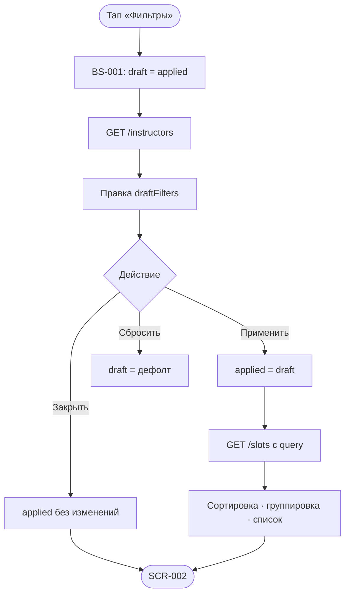

# Фильтрация и сортировка слотов

**ID:** LOGIC-005  
**Тип:** Логика  
**Домен:** 09. Логики  
**Приоритет:** High  
**Статус:** Актуален  
**Функциональные блоки:** FB-SLOTS-001, FB-SLOTS-002

---

## История изменений

| Релиз | ТЗ | Описание изменений |
|-------|-----|-------------------|
| 1.0 | [feature-list.md](../feature-list.md) | zone_format_type вместо route_type |
| — | — | Первоначальная документация |

---

## Входные данные

| Название | Тип | Описание |
|----------|-----|----------|
| `appliedFilters` | Состояние | Фильтры, действующие на SCR-002 |
| `draftFilters` | Состояние | Черновик в BS-001 |
| `filters.date_from` | date-time / не задано | Начало периода (дефолт API: now) |
| `filters.date_to` | date-time / не задано | Конец (дефолт: now + 7 дней, R-027) |
| `filters.zone_format_type` | `[]`, `novice`, `experienced` | Тип тренировки (OR внутри группы) |
| `filters.instructor_id` | массив UUID | Инструкторы (OR внутри группы) |
| `filters.only_available` | boolean, default `false` | Только `free_seats > 0` |
| `instructorsRef` | Кэш | Справочник из `listInstructors` |

**Дефолт («фильтры не заданы»):** все поля = дефолт → индикатор активных фильтров скрыт.

---

## Обзор

Логика формирует выдачу списка тренировок: фильтры на [BS-001](../BS-001-filters.md), запрос [SCR-002](../SCR-002-slot-list.md) через `listSlots`. Комбинирование: **OR внутри группы, AND между группами** (R-026). Сортировка по `start_at` ↑, группировка по дням на клиенте.

### User Story

> Как клиент, я хочу отфильтровать тренировки по дате, типу, инструктору и наличию мест,
> чтобы быстро найти подходящий слот.

### Бизнес-ценность

- Короткий путь к записи (FR-4, US-3, NFR-2).
- Прозрачность: заполненные слоты видны с «Мест нет» при `only_available=false`.

---

## Точки применения

| Экран/Компонент | Элемент/Триггер | Условие |
|-----------------|-----------------|---------|
| [SCR-002](../SCR-002-slot-list.md) | Открытие, PTR, после «Применить» | `listSlots` с `appliedFilters` |
| [BS-001](../BS-001-filters.md) | Открытие, «Применить», «Сбросить» | `listInstructors` + черновик |

---

## Флоу

---

## Описание логики

### Шаг 1: Маппинг фильтров → query `listSlots`

| UI (BS-001) | Query param |
|-------------|-------------|
| Период дат | `date_from`, `date_to` |
| Тип тренировки | `zone_format_type[]` (`novice`, `experienced`) |
| Инструктор | `instructor_id[]` |
| Только свободные | `only_available=true` |

Пустой массив типа/инструктора — параметр не передаётся (= любой).

### Шаг 2: Дефолтный период

Если `date_from` / `date_to` не заданы — API возвращает **7 дней** от текущего момента (FR-3, R-027).

### Шаг 3: Empty state

- Нет слотов вообще → «Пока нет доступных тренировок».
- Пусто по фильтрам → «Ничего не найдено по фильтрам» + CTA «Изменить фильтры».

### Шаг 4: Индикатор активных фильтров

Показывается на SCR-002, если хотя бы одно поле ≠ дефолту.

---

## API запросы

### GET /slots

**Триггер:** Открытие SCR-002, PTR, «Применить» на BS-001.

| Параметр | Тип | Источник |
|----------|-----|----------|
| `date_from` | date-time | appliedFilters |
| `date_to` | date-time | appliedFilters |
| `zone_format_type` | array enum | appliedFilters |
| `instructor_id` | array uuid | appliedFilters |
| `only_available` | boolean | appliedFilters |
| `limit`, `offset` | pagination | скролл |

| Результат | Действие |
|-----------|----------|
| 200, items | Content; сортировка `start_at` ↑ |
| 200, пусто | Empty |
| 401 | Logout flow (L-001) |
| 5xx / сеть | Error-заглушка + «Обновить» |

### GET /instructors

**Триггер:** Открытие BS-001.

| Результат | Действие |
|-----------|----------|
| 200 | Чип-лист инструкторов |
| Ошибка | Группа «Инструктор» disabled + повтор |

---

## Связанные требования

| ID | Название | Приоритет |
|----|----------|-----------|
| FR-3 | Список слотов 7 дней | Critical |
| FR-4 | Фильтрация | Critical |

---

## Критерии приёмки

| ID | Критерий |
|----|----------|
| AC-001 | **Дано** дефолтные фильтры, **Когда** открыт SCR-002, **Тогда** слоты за 7 дней, индикатор скрыт. |
| AC-002 | **Дано** выбран `only_available=true`, **Тогда** только слоты с `free_seats > 0`. |
| AC-003 | **Дано** novice + experienced и один инструктор, **Тогда** OR внутри групп, AND между. |
| AC-004 | **Дано** «Применить», **Когда** результат пуст, **Тогда** empty «Ничего не найдено по фильтрам». |
| AC-005 | **Дано** закрытие BS-001 без «Применить», **Тогда** appliedFilters не изменились. |

---

## Обработка ошибок

| Тип ошибки | Контекст | Действие |
|------------|----------|----------|
| listInstructors fail | BS-001 | Фильтр инструктора недоступен; остальное работает |
| listSlots fail | SCR-002 | Error + «Обновить» |
| PTR fail | SCR-002 | Снек; контент сохранён (L-008) |
