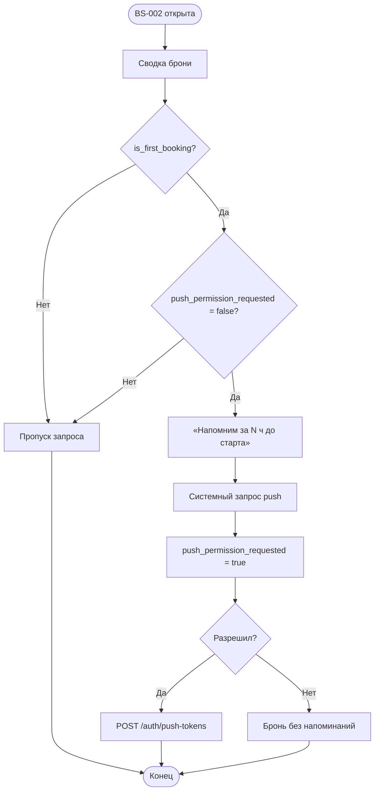

# Запрос разрешения на push-уведомления

**ID:** LOGIC-007  
**Тип:** Логика  
**Домен:** 09. Логики  
**Приоритет:** Medium  
**Статус:** Актуален  
**Функциональные блоки:** FB-NOTIFY-001, FB-BOOKING-003

---

## История изменений

| Релиз | ТЗ | Описание изменений |
|-------|-----|-------------------|
| 1.0 | [feature-list.md](../feature-list.md) | Адаптация под «Вертикаль», FR-17/FR-18 |
| — | — | Первоначальная документация |

---

## Входные данные

| Название | Тип | Описание |
|----------|-----|----------|
| `is_first_booking` | Ответ `createBooking` | `true` — первая успешная бронь (R-006) |
| `reminder_hours` | Ответ `createBooking` | Напр. `[24, 2]` — часы напоминаний (FR-17) |
| `push_permission_requested` | Локальный кэш | Флаг «запрос уже показывался» |
| `system_push_status` | ОС | `not_determined` / `authorized` / `denied` |
| `push_token` | APNs / FCM | Токен устройства |
| `platform` | Состояние | `ios` / `android` |

---

## Обзор

Логика определяет **единственный момент** запроса системного разрешения на push — на [BS-002](../BS-002-booking-success.md) после **первой** успешной записи (`is_first_booking = true`), когда ценность очевидна ([00-foundations §8.1](../../3-design-brief/00-foundations.md)).

**Не запрашивается** на SCR-001 и SCR-007. При согласии — `POST /auth/push-tokens` (`registerPushToken`). При отказе бронь работает без напоминаний. Повторный запрос в приложении **не показывается**; включение — через настройки ОС.

Доставку напоминаний за 24 ч и 2 ч и push при отмене скалодромом обеспечивает инфраструктура (FR-17, FR-18).

### User Story

> Как клиент, я хочу после первой записи разрешить напоминания о тренировке,
> чтобы не пропустить старт — без навязчивых запросов при отказе.

### Бизнес-ценность

- Снижение неявок (BR-5, US-12).
- Высокая конверсия: запрос в момент ценности (после первой брони).
- Уважение к пользователю (P6): один запрос, отказ не блокирует запись.

---

## Точки применения

| Экран/Компонент | Элемент/Триггер | Условие |
|-----------------|-----------------|---------|
| [BS-002 Подтверждение записи](../BS-002-booking-success.md) | После сводки — подводка → системный диалог | `is_first_booking = true` AND `push_permission_requested = false` |

---

## Флоу

---

## Описание логики

### Шаг 1: Условие показа

Запрос только если одновременно:

1. `CreateBookingResponse.is_first_booking = true`
2. `push_permission_requested = false` (локально)
3. `system_push_status = not_determined` (или эквивалент «ещё не спрашивали»)

### Шаг 2: Подводка

Текст использует `reminder_hours` из ответа (не хардкод): «Напомним за 24 и 2 часа до старта» (пример для `[24, 2]`).

### Шаг 3: Регистрация токена

При разрешении: получить push-токен от ОС → `registerPushToken` с `{ token, platform }`.

### Шаг 4: Отказ

Бронь валидна; токен не регистрируется; повтор не показывается. Опционально ссылка «Включить в настройках телефона».

### Шаг 5: Logout

При выходе — `deletePushToken` для текущего устройства.

---

## API запросы

### POST /auth/push-tokens

**Триггер:** Пользователь разрешил push после первой брони.

**Headers:** `Authorization: Bearer <access_token>`

| Параметр | Тип | Источник |
|----------|-----|----------|
| `token` | string | APNs / FCM |
| `platform` | string | `ios` / `android` |

| Результат | Действие |
|-----------|----------|
| 204 | Токен зарегистрирован |
| 401 | Refresh flow (L-001) |
| 5xx / сеть | Тихий retry позже; бронь не откатывается |

### DELETE /auth/push-tokens

**Триггер:** Выход из аккаунта (SCR-007).

| Параметр | Тип | Источник |
|----------|-----|----------|
| `token` | string | Текущий push-токен |

| Результат | Действие |
|-----------|----------|
| 204 | Токен снят |

---

## Локальное хранение

| Ключ | Тип | Описание |
|------|-----|----------|
| `push_permission_requested` | Локальный кэш | `true` после первого показа системного диалога |

---

## Связанные требования

| ID | Название | Приоритет |
|----|----------|-----------|
| FR-17 | Push за 24 ч и 2 ч | Critical |
| FR-18 | Push при отмене скалодромом | Critical |
| NFR-8 | Системный push | High |

---

## Критерии приёмки

| ID | Критерий |
|----|----------|
| AC-001 | **Дано** первая бронь, **Когда** открыта BS-002, **Тогда** показана подводка и системный запрос push. |
| AC-002 | **Дано** вторая и последующие брони, **Тогда** запрос push не показывается. |
| AC-003 | **Дано** пользователь разрешил push, **Тогда** вызван `registerPushToken`. |
| AC-004 | **Дано** пользователь отказал, **Тогда** бронь создана, повторный запрос в приложении не показывается. |
| AC-005 | **Дано** SCR-001, **Тогда** push не запрашивается. |
| AC-006 | **Дано** выход, **Тогда** `deletePushToken` для устройства. |

---

## Обработка ошибок

| Тип ошибки | Контекст | Действие |
|------------|----------|----------|
| registerPushToken fail | после согласия | Retry в фоне; UX не блокируется |
| reminder_hours пуст | BS-002 | Подводка без конкретных часов |
