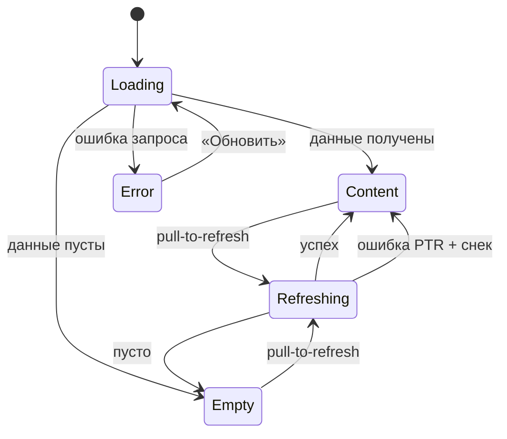

# Сквозной паттерн состояний экрана

**ID:** LOGIC-008  
**Тип:** Логика  
**Домен:** 09. Логики  
**Приоритет:** High  
**Статус:** Актуален  
**Функциональные блоки:** FB-UI-STATES-001

---

## История изменений

| Релиз | ТЗ | Описание изменений |
|-------|-----|-------------------|
| 1.0 | [feature-list.md](../feature-list.md) | Empty states для тренировок; без BS-004 |
| — | — | Первоначальная документация |

---

## Входные данные

| Название | Тип | Описание |
|----------|-----|----------|
| `requestStatus` | Состояние | `loading`, `success`, `empty`, `error` |
| `data` | Состояние | Payload или `null` |
| `isRefreshing` | boolean | Pull-to-refresh поверх контента |
| `actionStatus` | Состояние | `idle`, `submitting` — лоадер на CTA |

---

## Обзор

Единый паттерн для всех экранов с запросами к API ([00-foundations §5](../../3-design-brief/00-foundations.md)):

**Loading** → **Content** | **Empty** | **Error** (+ «Обновить»).

Pull-to-refresh — **Refreshing**: контент не сбрасывается в скелетон; ошибка PTR — снек, контент сохраняется.

Реализуется переиспользуемым компонентом `StateContainer`. Экранные документы задают только тексты Empty/Error.

### User Story

> Как клиент, я хочу понимать, что происходит на экране — загрузка, пусто или ошибка,
> чтобы не смотреть на белый экран и иметь кнопку повтора.

### Бизнес-ценность

- Воспринимаемая скорость (P4, NFR-7).
- Снижение оттока на ошибках.
- Единообразие на всех экранах MVP.

---

## Точки применения

| Экран/Комponent | Условие |
|------------------|---------|
| `StateContainer` (компонент) | Все экраны с API |
| [SCR-002](../SCR-002-slot-list.md) | Список слотов |
| [SCR-003](../SCR-003-slot-card.md) | Карточка слота |
| [SCR-005](../SCR-005-my-bookings.md) | Мои записи |
| [SCR-006](../SCR-006-booking-details.md) | Детали брони |
| [SCR-007](../SCR-007-profile.md) | Профиль |

---

## Флоу

---

## Описание логики

### Шаг 1: Loading

Скелетон в форме будущего контента (карточки, строки). Не пустой экран, не full-screen spinner (P4).

### Шаг 2: Content / Empty / Error

- **Content:** данные непустые — основной сценарий.
- **Empty:** успех, но пусто — заглушка + действие.
- **Error:** первичная загрузка провалилась — «Не удалось загрузить…» + «Обновить» ([foundations §6](../../3-design-brief/00-foundations.md)).

### Шаг 3: Refreshing (PTR)

Индикатор сверху; контент остаётся. Ошибка → снек «Не удалось обновить…», **не** переход в Error.

### Шаг 4: Submitting (действия)

CTA в Loading, повторные тапы blocked (`actionStatus = submitting`).

### Шаг 5: Каталог Empty (MVP)

| Контекст | Заголовок | Действие |
|----------|-----------|----------|
| Нет слотов | «Пока нет доступных тренировок» | PTR |
| Пусто по фильтрам | «Ничего не найдено по фильтрам» | «Изменить фильтры» |
| Нет предстоящих броней | «Пока нет предстоящих записей» | «Записаться» → SCR-002 |
| Нет прошедших броней | «Здесь появятся прошедшие тренировки» | «Записаться» → SCR-002 |

### Шаг 6: Снеки vs Error

- **Error-заглушка** — провал **первичной** загрузки.
- **Снек** — результат **действия** или ошибка PTR.

Каталог снеков — [00-foundations §6.1–6.3](../../3-design-brief/00-foundations.md).

---

## API запросы

> Паттерн не инициирует запросы — оборачивает их на экранах. Типовая обработка:

| Результат | Состояние UI |
|-----------|--------------|
| In flight (первичная) | Loading |
| 200 + data | Content |
| 200 + [] | Empty |
| 4xx/5xx/timeout/сеть (первичная) | Error |
| PTR error | Content + снек |

Таймаут запроса ~10 с ([foundations §8.3](../../3-design-brief/00-foundations.md)).

---

## Связанные требования

| ID | Название | Приоритет |
|----|----------|-----------|
| NFR-7 | Воспринимаемая скорость | High |
| NFR-1 | Mobile-first, контраст | Critical |

---

## Критерии приёмки

| ID | Критерий |
|----|----------|
| AC-001 | **Дано** первый вход на SCR-002, **Когда** идёт запрос, **Тогда** скелетон, не белый экран. |
| AC-002 | **Дано** listSlots вернул [], **Тогда** Empty «Пока нет доступных тренировок». |
| AC-003 | **Дано** первичная загрузка 5xx, **Тогда** Error + «Обновить». |
| AC-004 | **Дано** PTR при Content, **Когда** ошибка, **Тогда** контент сохранён + снек. |
| AC-005 | **Дано** «Записаться» submitting, **Тогда** повторный тап заблокирован. |
| AC-006 | **Дано** tap «Обновить» в Error, **Тогда** переход в Loading и повтор запроса. |

---

## Обработка ошибок

| Тип ошибки | Контекст | Действие |
|------------|----------|----------|
| Первичная сеть/5xx | любой список/детали | Error + «Обновить» |
| PTR сеть/5xx | Content | Снек; контент не менять |
| Offline (мутация) | запись/отмена/профиль | Блок + «нет сети» (foundations §8.3) |
| Offline (просмотр) | кэш | Content + «Данные могут быть неактуальны» |
