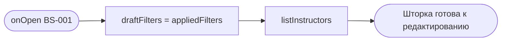
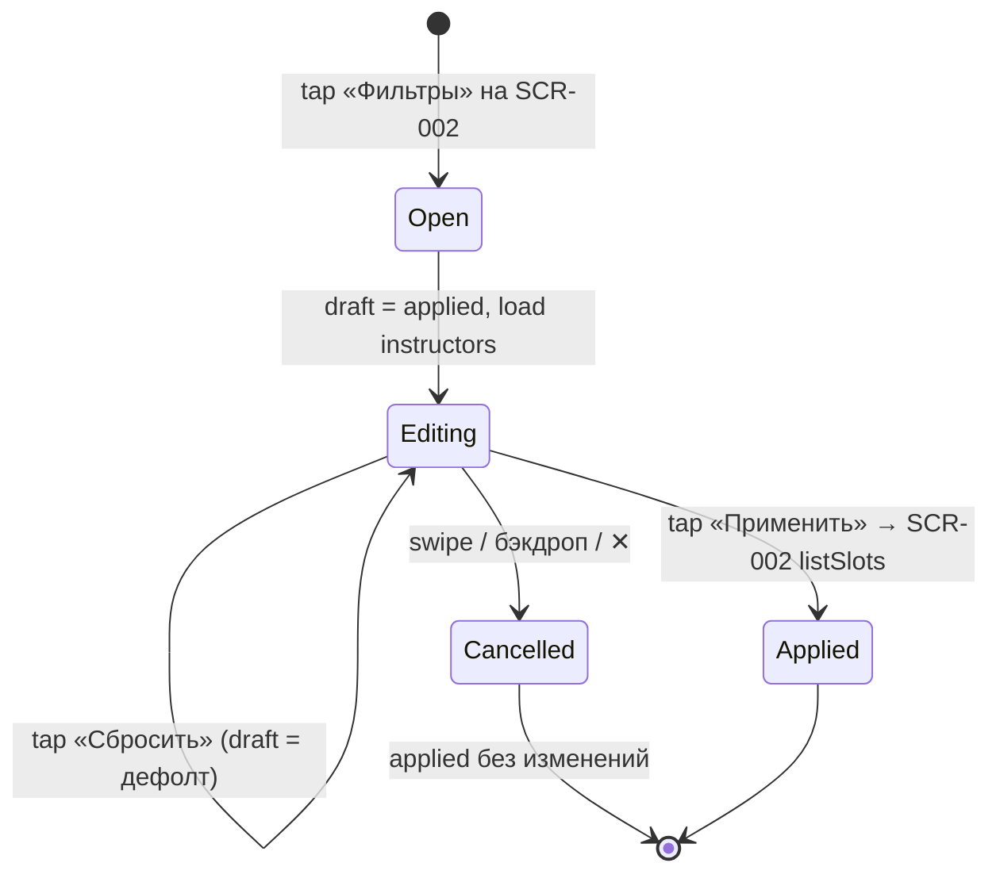

# Фильтры

**ID:** BS-001  
**Тип:** Bottom Sheet  
**Домен:** 02. Слоты / Расписание  
**Приоритет:** High  
**Статус:** Черновик  
**Функциональные блоки:** FB-SLOTS-002 (Фильтрация)  
**Зона авторизации:** АЗ  
**Дизайн-макет:** — (макет не в Figma для «Вертикаль»)

---

## Содержание

- [История изменений](#история-изменений)
- [Обзор](#обзор)
- [Навигация](#навигация)
- [Входные данные](#входные-данные)
- [Применяемые логики](#применяемые-логики)
- [Свойства Bottom Sheet](#свойства-bottom-sheet)
- [Инициализация](#инициализация)
- [Используемые запросы](#используемые-запросы)
- [Макет экрана](#макет-экрана)
- [Элементы экрана](#элементы-экрана)
- [Состояния экрана](#состояния-экрана)
- [Действия пользователя](#действия-пользователя)
- [Связанные требования](#связанные-требования)
- [Критерии приёмки](#критерии-приёмки)

---

## История изменений

| Релиз | ТЗ | Описание изменений |
|-------|-----|-------------------|
| 0.1.0 | BS-001 «Фильтры» | Первоначальная версия ТЗ: шторка фильтрации списка тренировок для «Вертикаль». |

---

## Обзор

**BS-001 — bottom sheet фильтрации** списка слотов на [SCR-002](SCR-002-slot-list.md). Позволяет сузить выдачу по **периоду дат**, **типу тренировки** (зона/формат: novice / experienced), **наличию свободных мест** и **инструктору** (FR-4).

Шторка работает с **черновиком** (`draftFilters`), который копируется из применённых фильтров (`appliedFilters`) при открытии. Изменения попадают в список **только** по кнопке «Применить». Закрытие без «Применить» отбрасывает черновик.

Снек при применении или сбросе **не показывается** — обратная связь через обновлённый список ([00-foundations §6.1](../3-design-brief/00-foundations.md)).

### User Story

> Как клиент скалодрома, я хочу отфильтровать тренировки по дате, типу, свободным местам и инструктору,
> чтобы быстро найти подходящую без долгого скролла по полному расписанию.

### Бизнес-ценность

- Быстрый поиск релевантной тренировки (US-3, UC-2 A1/A2).
- Четыре независимые группы фильтров покрывают основные сценарии выбора в зале.
- Черновик/применение предотвращает случайное изменение выдачи при закрытии шторки.

---

## Навигация

### Входящая (откуда открывается)

| Источник | Триггер | Условие | Передаваемые параметры |
|----------|---------|---------|------------------------|
| [SCR-002 Список слотов](SCR-002-slot-list.md) | Тап «Фильтры» в хедере | Экран в Content / Empty (фильтры) | `appliedFilters` (текущее состояние SCR-002) |
| [SCR-002 Список слотов](SCR-002-slot-list.md) | CTA «Изменить фильтры» (empty state) | Пустая выдача с активными фильтрами | `appliedFilters` |

### Исходящая (куда ведёт)

| Назначение | Триггер | Передаваемые параметры |
|------------|---------|------------------------|
| [SCR-002 Список слотов](SCR-002-slot-list.md) | «Применить» | Обновлённые `appliedFilters` (= `draftFilters`) |
| [SCR-002 Список слотов](SCR-002-slot-list.md) | «Сбросить» + «Применить» | `appliedFilters` = дефолт |
| [SCR-002 Список слотов](SCR-002-slot-list.md) | Закрытие без «Применить» (swipe / бэкдроп / ✕) | `appliedFilters` **без изменений** |

---

## Входные данные

| Название | Тип | Возможные значения | Описание |
|----------|-----|-------------------|----------|
| `appliedFilters` | Параметр от SCR-002 | объект фильтров | Текущие применённые фильтры; копируются в `draftFilters` при открытии. |
| `draftFilters` | Состояние шторки | объект фильтров | Черновик, редактируемый пользователем. |
| `draftFilters.date_from` | Состояние | `date-time` / не задано | Начало периода. |
| `draftFilters.date_to` | Состояние | `date-time` / не задано | Конец периода. |
| `draftFilters.zone_format_type` | Состояние | `[]`, `[novice]`, `[experienced]`, оба | Мультивыбор типа тренировки. |
| `draftFilters.instructor_id` | Состояние | массив UUID / `[]` | Мультивыбор инструкторов. |
| `draftFilters.only_available` | Состояние | `true` / `false` | Только слоты с `free_seats > 0`. |
| `instructorsRef` | Кэш | массив `Instructor` | Справочник из `listInstructors`; загружается при открытии шторки. |

**Дефолт («фильтры не заданы»):** `date_from`/`date_to` не заданы, `zone_format_type = []`, `instructor_id = []`, `only_available = false`.

---

## Применяемые логики

| Логика | Элемент/Триггер | Описание |
|--------|-----------------|----------|
| [LOGIC-005 Фильтрация слотов](09_Логики/LOGIC-005_Фильтрация-слотов.md) | «Применить», «Сбросить», закрытие шторки | Черновик vs применённые фильтры; формирование query; комбинирование OR/AND; дефолт 7 дней на сервере. |

> Для домена «Вертикаль» в API используется параметр `zone_format_type` (не `route_type`).

---

## Свойства Bottom Sheet

| Свойство | Значение |
|----------|----------|
| Высота | Динамическая (по контенту), не выше ~90% экрана; длинный контент скроллится внутри |
| Закрытие свайпом | Да (swipe-to-close вниз) |
| Закрытие по тапу вне области | Да (бэкдроп) |
| Затемнение фона | Да |
| Кнопка закрытия | Да (✕ в правом верхнем углу) + грабер сверху |

> Общие правила шторок — [00-foundations §4.3](../3-design-brief/00-foundations.md).

---

## Инициализация

> При открытии: `draftFilters = copy(appliedFilters)` + запрос `listInstructors` для блока «Инструктор».

### Диаграмма загрузки



### Запросы при открытии

| № | Запрос | Критичный | Зависит от | Условие |
|---|--------|-----------|------------|---------|
| 1 | [listInstructors](#listinstructors) | Нет | — | Всегда при открытии (для блока «Инструктор») |

> Запрос `listSlots` выполняется на SCR-002 **после** «Применить», не при открытии шторки.

---

## Используемые запросы

> Базовый URL — `https://api.vertical-gym.example/v1`.

### listInstructors

**Тип:** REST  
**Метод:** GET `/instructors`  
**Спецификация:** [../api/instructors/api.yaml](../api/instructors/api.yaml) → `listInstructors`

**Триггер:** Открытие шторки BS-001.

> Заголовки: `Authorization: Bearer <access_token>`.

**Параметры:**

| Параметр | Тип | Обязательность | Источник | Описание |
|----------|-----|----------------|----------|----------|
| `limit` | integer | Нет | конфигурация | Размер страницы (дефолт `20`). |
| `offset` | integer | Нет | `0` | Смещение. |

**Обработка ответа:**

| Результат | Условие | UI-реакция |
|-----------|---------|------------|
| Загрузка | — | Скелетон в блоке «Инструктор»; остальные группы интерактивны |
| Успех | HTTP 200, `items` не пуст | Чекбоксы/чипы инструкторов; кэш `instructorsRef` |
| Успех | HTTP 200, `items` пуст | Блок «Инструктор»: «Список инструкторов пуст»; фильтр недоступен |
| HTTP 401 | — | Refresh-on-401; при неуспехе — закрыть шторку, SCR-001 |
| HTTP 5xx / сеть | — | Неблокирующая ошибка в блоке «Инструктор» + кнопка «Обновить» в блоке; прочие фильтры доступны |

---

### listSlots (косвенно)

**Тип:** REST  
**Метод:** GET `/slots`  
**Спецификация:** [../api/slots/api.yaml](../api/slots/api.yaml) → `listSlots`

**Триггер:** Тап «Применить» → закрытие шторки → SCR-002 выполняет `listSlots` с обновлёнными `appliedFilters`.

> Полное описание параметров — в [SCR-002 § listSlots](SCR-002-slot-list.md#listslots).

**Параметры (формируются из `draftFilters` при «Применить»):**

| Параметр | Источник `draftFilters` | Правило передачи |
|----------|-------------------------|------------------|
| `date_from` | `date_from` | Опускается, если не задано |
| `date_to` | `date_to` | Опускается, если не задано |
| `zone_format_type` | `zone_format_type` | Опускается, если `[]` |
| `instructor_id` | `instructor_id` | Только UUID из `instructorsRef`; опускается, если `[]` |
| `only_available` | `only_available` | Передаётся только `true` |

**Комбинирование фильтров:**
- **OR** внутри группы (тип, инструктор).
- **AND** между группами.

---

## Макет экрана

### Структура

```
┌─────────────────────────────────┐
│            ▭▭▭                   │  ← грабер
│  Фильтры                    ✕   │
├─────────────────────────────────┤
│  Период                          │
│  [ 5 июл ] — [ 12 июл ]         │  ← date range picker
│                                  │
│  Тип тренировки                  │
│  [ Новичковый ] [ Опытный ]      │  ← мультивыбор чипов
│                                  │
│  Только со свободными местами ☐  │  ← переключатель
│                                  │
│  Инструктор                      │
│  ☐ Анна  ☐ Игорь  ☐ ...         │  ← мультивыбор; скелетон при загрузке
├─────────────────────────────────┤
│  [ Сбросить ]  [  Применить  ]   │  ← фикс. нижние кнопки шторки
└─────────────────────────────────┘
```

### Компоненты

| Компонент | Описание | Обязательность |
|-----------|----------|----------------|
| Грабер | Полоска для swipe-to-close | Да |
| Заголовок «Фильтры» | — | Да |
| Кнопка закрытия ✕ | Закрытие без применения | Да |
| Date range picker | Период `date_from` — `date_to` | Да |
| Чипы типа | «Новичковый» (`novice`), «Опытный» (`experienced`) | Да |
| Переключатель «Только со свободными местами» | `only_available` | Да |
| Список инструкторов | Чекбоксы по `instructorsRef` | Да |
| Кнопка «Сбросить» | Secondary | Да |
| Кнопка «Применить» | Primary | Да |

---

## Элементы экрана

### 1. Период дат

| Элемент | Описание | Источник данных | Валидация | Действие |
|---------|----------|-----------------|-----------|----------|
| Поле «С» | Начало периода | `draftFilters.date_from` | `date_from ≤ date_to`. Нарушение → «Применить» **disabled**, подсказка «Конец периода не может быть раньше начала» | Открыть date picker |
| Поле «По» | Конец периода | `draftFilters.date_to` | см. выше | Открыть date picker |

**Логика:**
- [LOGIC-005](09_Логики/LOGIC-005_Фильтрация-слотов.md) — если обе даты не заданы, после «Применить» API применяет дефолт 7 дней.

**Условия доступности:**
- Кнопка «Применить» **disabled**, если `date_from > date_to`.

### 2. Тип тренировки

| Элемент | Описание | Источник данных | Валидация | Действие |
|---------|----------|-----------------|-----------|----------|
| Чип «Новичковый» | Toggle | `draftFilters.zone_format_type` | — | Добавить/убрать `novice` из массива |
| Чип «Опытный» | Toggle | `draftFilters.zone_format_type` | — | Добавить/убрать `experienced` из массива |

**Логика:**
- Мультивыбор: ни один / один / оба чипа активны. Пустой массив = любой тип.

### 3. Только со свободными местами

| Элемент | Описание | Источник данных | Валидация | Действие |
|---------|----------|-----------------|-----------|----------|
| Переключатель | `only_available` | `draftFilters.only_available` | — | Toggle `true`/`false` |

**Логика:**
- При `true` — в выдаче только слоты с `free_seats > 0` (параметр API `only_available=true`).

### 4. Инструктор

| Элемент | Описание | Источник данных | Валидация | Действие |
|---------|----------|-----------------|-----------|----------|
| Список чекбоксов | Имя инструктора | `instructorsRef[].name`, `id` | — | Toggle UUID в `draftFilters.instructor_id` |
| Скелетон | При загрузке `listInstructors` | — | — | — |
| Ошибка блока | При сбое загрузки | — | — | Кнопка «Обновить» → повтор `listInstructors` |

**Логика:**
- При ошибке/пустом справочнике: `draftFilters.instructor_id` сбрасывается к `[]`; фильтр по инструктору недоступен, остальные группы работают.

### 5. Нижние кнопки

| Элемент | Описание | Источник данных | Валидация | Действие |
|---------|----------|-----------------|-----------|----------|
| «Сбросить» | Secondary | — | — | `draftFilters` = дефолт (внутри шторки; SCR-002 не обновляется до «Применить») |
| «Применить» | Primary | — | `date_from ≤ date_to` | `appliedFilters = draftFilters` → закрыть шторку → SCR-002 перезагружает список |

**Условия доступности:**
- «Применить» **disabled** при некорректном диапазоне дат.

---

## Состояния экрана

### Таблица состояний

| Состояние | Условие | Отображение |
|-----------|---------|-------------|
| Content | Шторка открыта, фильтры редактируются | Все группы фильтров + кнопки |
| Loading инструкторов | `listInstructors` в процессе | Скелетон в блоке «Инструктор» |
| Error инструкторов | Сбой `listInstructors` | Сообщение + «Обновить» в блоке; остальное доступно |
| Валидация дат | `date_from > date_to` | «Применить» disabled + подсказка |

### Диаграмма переходов



---

## Действия пользователя

| Действие | Элемент | Триггер | Результат |
|----------|---------|---------|-----------|
| Выбрать период | Date picker | Tap | Обновить `draftFilters.date_from` / `date_to` |
| Выбрать тип | Чипы «Новичковый» / «Опытный» | Tap | Toggle в `zone_format_type` |
| Только свободные | Переключатель | Tap | Toggle `only_available` |
| Выбрать инструктора | Чекбокс | Tap | Toggle UUID в `instructor_id` |
| Сбросить фильтры | «Сбросить» | Tap | `draftFilters` = дефолт |
| Применить | «Применить» | Tap | Закрыть шторку; SCR-002 → `listSlots` |
| Отменить | Swipe / бэкдроп / ✕ | Gesture / Tap | Закрыть без изменения `appliedFilters` |
| Повторить загрузку инструкторов | «Обновить» в блоке | Tap | Повтор `listInstructors` |

---

## Связанные требования

### Функциональные (REQ-FUNC-*)

| ID | Название | Приоритет |
|----|----------|-----------|
| FR-4 | Фильтрация по дате, типу, местам, инструктору | Must |

### Интеграции (REQ-INT-*)

| ID | Название | Приоритет |
|----|----------|-----------|
| REQ-INT-INSTRUCTORS | Instructors API: `listInstructors` ([../api/instructors/api.yaml](../api/instructors/api.yaml)) | High |
| REQ-INT-SLOTS | Slots API: `listSlots` (через SCR-002 после «Применить`) | Critical |

### UI (REQ-UI-*)

| ID | Название | Приоритет |
|----|----------|-----------|
| US-3 | Фильтрация слотов | High |

---

## Критерии приёмки

### Позитивные сценарии

| ID | Критерий | Приоритет |
|----|----------|-----------|
| AC-001 | **Дано** открыта BS-001, **Когда** клиент просматривает шторку, **Тогда** представлены все 4 группы фильтров: период, тип, свободные места, инструктор. | P0 |
| AC-002 | **Дано** клиент изменил фильтры и нажал «Применить», **Когда** шторка закрылась, **Тогда** SCR-002 перезагрузил список с новыми параметрами и показал индикатор активных фильтров. | P0 |
| AC-003 | **Дано** клиент нажал «Сбросить», затем «Применить», **Когда** список обновился, **Тогда** показаны слоты на ближайшие 7 дней (дефолт API), индикатор фильтров скрыт. | P0 |
| AC-004 | **Дано** выбраны несколько типов и инструкторов, **Когда** фильтры применены, **Тогда** в выдаче слоты, удовлетворяющие OR внутри групп и AND между группами. | P1 |

### Негативные сценарии

| ID | Критерий | Приоритет |
|----|----------|-----------|
| AC-N01 | **Дано** клиент изменил черновик, **Когда** закрыл шторку свайпом без «Применить», **Тогда** `appliedFilters` и список SCR-002 не изменились. | P0 |
| AC-N02 | **Дано** `date_from > date_to`, **Когда** клиент пытается применить, **Тогда** кнопка «Применить» disabled, запрос не отправляется. | P0 |
| AC-N03 | **Дано** `listInstructors` вернул ошибку, **Когда** шторка открыта, **Тогда** блок «Инструктор» показывает ошибку с «Обновить», остальные фильтры и «Применить» доступны. | P1 |

### Граничные условия (Edge Cases)

| ID | Критерий | Приоритет |
|----|----------|-----------|
| AC-E01 | **Дано** период шире 7 дней задан явно, **Когда** «Применить», **Тогда** `listSlots` запрашивает расширенный диапазон (UC-2 A1). | P1 |
| AC-E02 | **Дано** «Применить» или «Сбросить», **Когда** действие завершено, **Тогда** снек **не** показывается ([00-foundations §6.1](../3-design-brief/00-foundations.md)). | P2 |

---
