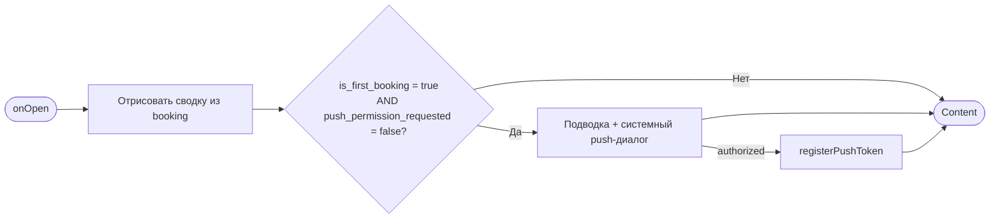
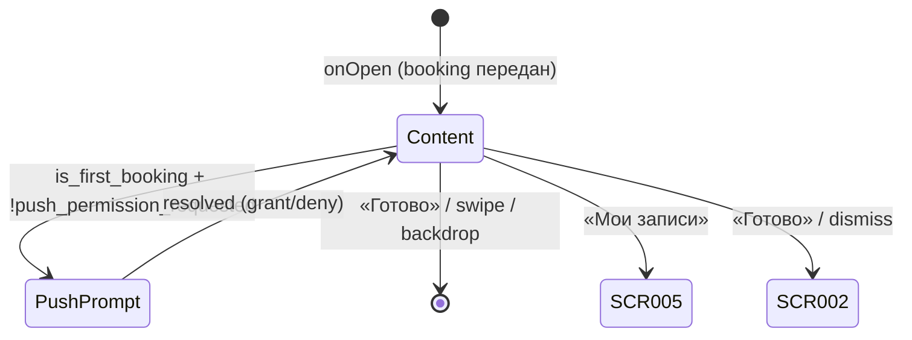

# Подтверждение записи («Вы записаны»)

**ID:** BS-002  
**Тип:** Bottom Sheet  
**Домен:** 02. Запись на слот  
**Приоритет:** High  
**Статус:** Черновик  
**Функциональные блоки:** FB-BOOKING-003 (Завершение записи), FB-NOTIFY-001 (Напоминания о записи)  
**Зона авторизации:** АЗ  
**Дизайн-макет:** [BS-002 «Подтверждение записи»](../3-design-brief/BS-002-booking-success.md) — версия 0.1

> Шторка открывается **только после успешного** `createBooking` на [SCR-004](SCR-004-booking.md). Ошибки записи обрабатываются на SCR-004 и сюда не доходят (UC-3). Снек успеха на SCR-004 **не показывается** — обратная связь только через эту шторку ([foundations §6.1](../3-design-brief/00-foundations.md)).

---

## Содержание

- [История изменений](#история-изменений)
- [Обзор](#обзор)
- [Навигация](#навигация)
- [Входные данные](#входные-данные)
- [Применяемые логики](#применяемые-логики)
- [Свойства Bottom Sheet](#свойства-bottom-sheet)
- [Инициализация](#инициализация)
- [Используемые запросы](#используемые-запросы)
- [Макет экрана](#макет-экрана)
- [Элементы экрана](#элементы-экрана)
- [Состояния экрана](#состояния-экрана)
- [Действия пользователя](#действия-пользователя)
- [Связанные требования](#связанные-требования)
- [Критерии приёмки](#критерии-приёмки)

---

## История изменений

| Релиз | ТЗ | Описание изменений |
|-------|-----|-------------------|
| 0.1 | [BS-002](../3-design-brief/BS-002-booking-success.md) | Первоначальная версия ТЗ на шторку подтверждения записи для скалодрома «Вертикаль». |

---

## Обзор

Bottom Sheet **BS-002 «Вы записаны»** завершает сценарий записи на групповую тренировку: подтверждает успешное создание брони, показывает сводку (дата/время, зона/формат, инструктор, снаряжение, цена), напоминает об **офлайн-оплате** и предлагает следующий шаг — перейти в «Мои записи» или вернуться к списку тренировок.

Шторка открывается **только после успеха** `createBooking` (HTTP 201) на [SCR-004](SCR-004-booking.md). Данные брони передаются с родительского экрана — повторный запрос при открытии не требуется. Таб-бар скрыт на время отображения шторки.

При **первой успешной записи** клиента (`is_first_booking = true`) после показа сводки инициируется запрос системного разрешения на push по [LOGIC-007](09_Логики/LOGIC-007_Запрос-push-разрешения.md); при согласии push-токен регистрируется через `registerPushToken` (`POST /auth/push-tokens`).

### User Story

> Как клиент скалодрома «Вертикаль», я хочу после записи увидеть подтверждение с датой, форматом, инструктором, снаряжением и ценой,
> чтобы быть уверенным, что место занято, и понимать, сколько платить на месте.

### Бизнес-ценность

- Спокойное позитивное завершение записи без давления (P6).
- Прозрачность стоимости и напоминание об офлайн-оплате до прихода в зал (FR-11).
- Единственная точка запроса push-разрешения после первой брони — повышение конверсии напоминаний (FR-17, US-12).

---

## Навигация

### Входящая (откуда открывается)

| Источник | Триггер | Условие | Передаваемые параметры |
|----------|---------|---------|------------------------|
| [SCR-004 «Оформление записи»](SCR-004-booking.md) | Успешный `createBooking` (201) | Только при успехе; ошибки остаются на SCR-004 | `booking` — объект `CreateBookingResponse`: поля `Booking` + `is_first_booking`, `reminder_hours` |

### Исходящая (куда ведёт)

| Назначение | Триггер | Передаваемые параметры |
|------------|---------|------------------------|
| [SCR-005 «Мои записи»](SCR-005-my-bookings.md) | Тап «Мои записи» | — (стек записи очищен, таб «Мои записи» активен) |
| [SCR-002 «Список слотов»](SCR-002-slot-list.md) | Тап «Готово» / закрытие шторки | — (стек записи очищен, вкладка «Тренировки») |

---

## Входные данные

| Название | Тип | Возможные значения | Описание |
|----------|-----|-------------------|----------|
| `booking` | Параметр навигации (от SCR-004) | `CreateBookingResponse` | Полный объект созданной брони: `id`, `equipment`, `status`, `price_total`, `slot` (с `start_at`, `zone_format`, `instructor_info`), `is_first_booking`, `reminder_hours`. |
| `is_first_booking` | Поле `booking` | `true` / `false` | Признак первой успешной брони клиента (R-006). Управляет показом push-запроса. |
| `reminder_hours` | Поле `booking` | массив, напр. `[24, 2]` | Часы напоминаний до старта; подставляются в подводку push (не хардкодятся). |
| `push_permission_requested` | Локальный кэш | `true` / `false` | Флаг «системный запрос push уже показывался на устройстве» ([LOGIC-007](09_Логики/LOGIC-007_Запрос-push-разрешения.md)). |

---

## Применяемые логики

| Логика | Элемент/Триггер | Описание |
|--------|-----------------|----------|
| [LOGIC-007 Запрос push-разрешения](09_Логики/LOGIC-007_Запрос-push-разрешения.md) | После отрисовки сводки брони | При `is_first_booking = true` и `push_permission_requested = false` — подводка «Напомним за N часов до старта» → системный диалог → при согласии `registerPushToken`. |

---

## Свойства Bottom Sheet

| Свойство | Значение |
|----------|----------|
| Высота | Динамическая (по контенту, не выше ~90% экрана) |
| Закрытие свайпом | Да (жест вниз; данные брони уже сохранены) |
| Закрытие по тапу вне области | Да (тап по бэкдропу) |
| Затемнение фона | Да (бэкдроп) |
| Кнопка закрытия | Грабер (полоска) сверху; явной иконки «×» нет — закрытие через «Готово», swipe или бэкдроп |

> См. общие правила шторок [foundations §4.3](../3-design-brief/00-foundations.md). Закрытие любым способом эквивалентно «Готово» — переход на SCR-002 со сбросом стека записи.

---

## Инициализация

> При открытии шторки **сетевые запросы не отправляются** — контент строится из переданного объекта `booking`. Единственный возможный запрос — `registerPushToken` по действию после согласия на push ([LOGIC-007](09_Логики/LOGIC-007_Запрос-push-разрешения.md)).

### Диаграмма загрузки



### Запросы при открытии

| № | Запрос | Критичный | Зависит от | Условие |
|---|--------|-----------|------------|---------|
| — | Сетевые запросы при открытии не выполняются | — | — | Данные из параметра `booking` (SCR-004) |

---

## Используемые запросы

### registerPushToken

**Тип:** REST  
**Метод:** POST `/auth/push-tokens`  
**Спецификация:** [../api/auth/api.yaml](../api/auth/api.yaml) → `registerPushToken`

**Триггер:** Получение push-токена от ОС после согласия пользователя на системный запрос разрешения ([LOGIC-007](09_Логики/LOGIC-007_Запрос-push-разрешения.md), Шаг 4)

**Заголовки:** `Authorization: Bearer <access_token>`, `Content-Type: application/json`

**Параметры (тело):**

| Параметр | Тип | Обязательность | Источник | Описание |
|----------|-----|----------------|----------|----------|
| `token` | string | Да | Системный API уведомлений (APNs / FCM) | Push-токен устройства |
| `platform` | string (`ios` / `android`) | Да | Состояние приложения | Платформа устройства |

**Обработка ответа:**

| Результат | Условие | UI-реакция |
|-----------|---------|------------|
| Успех | HTTP 204 | Тихо; UI шторки не меняется |
| HTTP 400 / 401 | — | Тихо игнорировать; при 401 — общий refresh-flow (LOGIC-001). Шторка и переходы доступны |
| HTTP 5xx / сеть | — | Не показывать ошибку; отложенная повторная регистрация при следующем запуске |

---

## Макет экрана

### Структура

```
┌─────────────────────────────────────┐
│                ▭▭▭                    │  ← грабер
│               ( ✓ )                   │
│            Вы записаны                │
│                                       │
│  🗓  Ср, 9 июля · 18:00               │
│  🧗  Болдеринг с инструктажем         │
│  👤  Инструктор: Анна                 │
│  🎒  Своё снаряжение                  │
│  ─────────────────────────────────    │
│  💳  Итого: 1 200 ₽                   │
│  Оплата на месте: наличные или        │
│  перевод на карту.                    │
│                                       │
│  [      Мои записи      ]             │  ← primary
│  [        Готово        ]             │  ← secondary
└─────────────────────────────────────┘
```

### Компоненты

| Компонент | Описание | Обязательность |
|-----------|----------|----------------|
| Грабер | Полоска сверху шторки | Да |
| Иконка успеха | Визуальное подтверждение | Да |
| Заголовок «Вы записаны» | Заголовок шторки | Да |
| Блок сводки | Дата/время, зона/формат, инструктор, снаряжение, цена, оплата | Да |
| CTA «Мои записи» | Primary, во всю ширину | Да |
| CTA «Готово» | Secondary, во всю ширину | Да |
| Подводка push (условно) | Текст перед системным диалогом | Опционально (первая бронь) |

---

## Элементы экрана

### 1. Сводка брони

| Элемент | Описание | Источник данных | Валидация | Действие |
|---------|----------|-----------------|-----------|----------|
| Иконка успеха | Позитивный индикатор | — | — | — |
| Заголовок «Вы записаны» | Подтверждение записи | — | — | — |
| Дата и время | Форматированный `slot.start_at` | `booking.slot.start_at` | — | — |
| Зона/формат | Название формата тренировки | `booking.slot.zone_format.name` | — | — |
| Инструктор | «Инструктор: {имя}» | `booking.slot.instructor_info.name` | — | — |
| Снаряжение | «Своё снаряжение» / «Прокатное снаряжение» | `booking.equipment` (`own` / `rental`) | — | — |
| Итого | «Итого: {price_total} ₽» | `booking.price_total` | — | — |
| Напоминание об оплате | Текст из foundations §6 | — | — | — |

**Логика:**
- Лейблы снаряжения: `own` → «Своё снаряжение», `rental` → «Прокатное снаряжение» ([foundations §6](../3-design-brief/00-foundations.md)).
- Текст оплаты: «Оплата на месте: наличные или перевод на карту.» — без изменений.

### 2. Действия и push

| Элемент | Описание | Источник данных | Валидация | Действие |
|---------|----------|-----------------|-----------|----------|
| Кнопка «Мои записи» | Primary CTA | — | — | Закрыть шторку → [SCR-005](SCR-005-my-bookings.md), сброс стека записи |
| Кнопка «Готово» | Secondary CTA | — | — | Закрыть шторку → [SCR-002](SCR-002-slot-list.md), сброс стека записи |
| Подводка push | «Напомним за N часов до старта» (часы из `reminder_hours`) | `booking.reminder_hours` | — | Перед системным диалогом ([LOGIC-007](09_Логики/LOGIC-007_Запрос-push-разрешения.md)) |

**Логика:**
- Push-запрос: [LOGIC-007](09_Логики/LOGIC-007_Запрос-push-разрешения.md) — только при `is_first_booking = true` и `push_permission_requested = false`. Отказ не блокирует шторку и переходы.
- Снек успеха **не показывается** на BS-002 и не дублируется на SCR-004 ([foundations §6.1](../3-design-brief/00-foundations.md)).

**Условия доступности:**
- Обе кнопки активны сразу после отрисовки сводки; системный push-диалог не блокирует CTA.

---

## Состояния экрана

### Таблица состояний

| Состояние | Условие | Отображение |
|-----------|---------|-------------|
| Content | `booking` передан | Сводка + CTA |
| Push prompt | `is_first_booking = true`, push ещё не запрашивался | Системный диалог ОС поверх шторки (после подводки) |

> Отдельных состояний Loading / Error / Empty нет — шторка открывается только при успехе с готовыми данными.

### Диаграмма переходов



---

## Действия пользователя

| Действие | Элемент | Триггер | Результат |
|----------|---------|---------|-----------|
| Перейти к записям | «Мои записи» | Tap | Закрытие → [SCR-005](SCR-005-my-bookings.md) |
| Вернуться к расписанию | «Готово» | Tap | Закрытие → [SCR-002](SCR-002-slot-list.md) |
| Закрыть шторку | Swipe / бэкдроп | Жест / Tap | Как «Готово» → SCR-002 |
| Разрешить push | Системный диалог | Tap «Разрешить» | `registerPushToken`; шторка без изменений |
| Отклонить push | Системный диалог | Tap «Запретить» | Без регистрации токена; шторка работает штатно |

---

## Связанные требования

### Функциональные (REQ-FUNC-*)

| ID | Название | Приоритет |
|----|----------|-----------|
| FR-6 | Запись клиента на одно место в слот | Must |
| FR-11 | Показ цены и фиксация брони; офлайн-оплата | Must |
| FR-17 | Напоминания push за 24 ч и 2 ч до старта | Must |

### Интеграции (REQ-INT-*)

| ID | Название | Приоритет |
|----|----------|-----------|
| REQ-INT-PUSH | Auth API: `registerPushToken` ([../api/auth/api.yaml](../api/auth/api.yaml)) | Medium |

### UI (REQ-UI-*)

| ID | Название | Приоритет |
|----|----------|-----------|
| US-5 | Успешная запись с подтверждением | High |
| US-8 | Видеть цену до подтверждения | Must |
| US-12 | Получать напоминание о записи | Should |

### Данные (REQ-DATA-*)

| ID | Название | Приоритет |
|----|----------|-----------|
| R-006 | `is_first_booking`, `reminder_hours` в ответе createBooking | Must |

---

## Критерии приёмки

### Позитивные сценарии

| ID | Критерий | Приоритет |
|----|----------|-----------|
| AC-001 | **Дано** успешный `createBooking`, **Когда** открывается BS-002, **Тогда** шторка показывает дату/время, зону/формат, инструктора, снаряжение, цену и текст офлайн-оплаты | P0 |
| AC-002 | **Дано** открыта BS-002, **Когда** клиент нажимает «Мои записи», **Тогда** открывается SCR-005 с новой бронью в списке | P0 |
| AC-003 | **Дано** первая успешная запись (`is_first_booking = true`), **Когда** показана сводка, **Тогда** запрашивается системное разрешение на push ([LOGIC-007](09_Логики/LOGIC-007_Запрос-push-разрешения.md)) | P0 |
| AC-004 | **Дано** клиент разрешил push, **Когда** получен токен ОС, **Тогда** вызывается `registerPushToken` (`POST /auth/push-tokens`) | P0 |
| AC-005 | **Дано** успешная запись, **Когда** клиент на SCR-004, **Тогда** снек успеха на SCR-004 **не показывается** | P0 |

### Негативные сценарии

| ID | Критерий | Приоритет |
|----|----------|-----------|
| AC-N01 | **Дано** клиент отклонил push, **Когда** обрабатывается отказ, **Тогда** шторка и CTA работают штатно, повторный запрос не показывается | P1 |
| AC-N02 | **Дано** `registerPushToken` вернул 5xx/сеть, **Когда** регистрация токена, **Тогда** ошибка клиенту не показывается, шторка доступна | P1 |

### Граничные условия (Edge Cases)

| ID | Критерий | Приоритет |
|----|----------|-----------|
| AC-E01 | **Дано** повторная бронь (`is_first_booking = false`), **Когда** открыта BS-002, **Тогда** push-запрос не показывается | P1 |
| AC-E02 | **Дано** шторка открыта, **Когда** клиент закрывает swipe/бэкдроп, **Тогда** переход на SCR-002, бронь сохранена | P2 |

---
