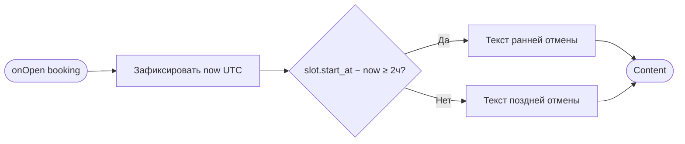
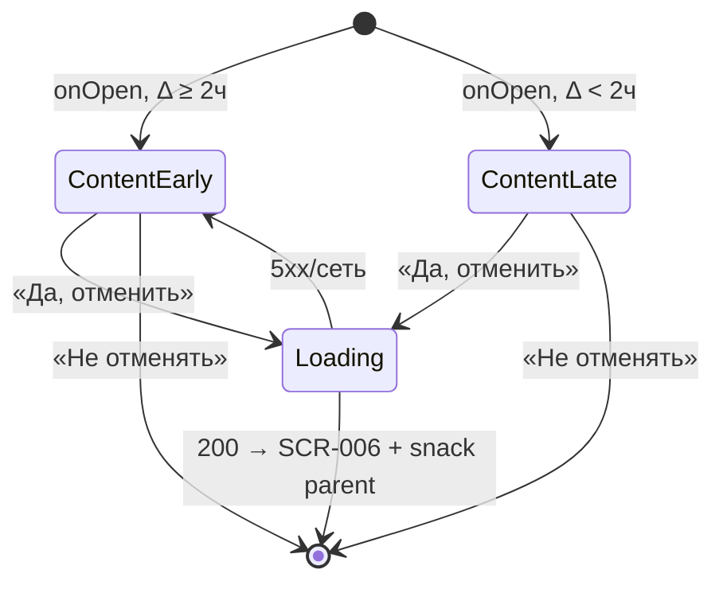

# Подтверждение отмены

**ID:** BS-003  
**Тип:** Bottom Sheet  
**Домен:** 03. Мои бронирования  
**Приоритет:** High  
**Статус:** Черновик  
**Функциональные блоки:** FB-BOOKINGS-004 (Отмена записи)  
**Зона авторизации:** АЗ  
**Дизайн-макет:** [BS-003 «Подтверждение отмены»](../3-design-brief/BS-003-cancel-confirm.md) — версия 0.1

> **Критичное подтверждение:** закрытие по тапу вне шторки **отключено** — только явные кнопки «Да, отменить» / «Не отменять» ([foundations §4.3](../3-design-brief/00-foundations.md)). Снек успеха после отмены показывает **экран-родитель SCR-006** ([foundations §6.2](../3-design-brief/00-foundations.md)).

---

## Содержание

- [История изменений](#история-изменений)
- [Обзор](#обзор)
- [Навигация](#навигация)
- [Входные данные](#входные-данные)
- [Применяемые логики](#применяемые-логики)
- [Свойства Bottom Sheet](#свойства-bottom-sheet)
- [Инициализация](#инициализация)
- [Используемые запросы](#используемые-запросы)
- [Макет экрана](#макет-экрана)
- [Элементы экрана](#элементы-экрана)
- [Состояния экрана](#состояния-экрана)
- [Действия пользователя](#действия-пользователя)
- [Связанные требования](#связанные-требования)
- [Критерии приёмки](#критерии-приёмки)

---

## История изменений

| Релиз | ТЗ | Описание изменений |
|-------|-----|-------------------|
| 0.1 | [BS-003](../3-design-brief/BS-003-cancel-confirm.md) | Первоначальная версия ТЗ на шторку подтверждения отмены для «Вертикаль». |

---

## Обзор

Bottom Sheet **BS-003 «Отменить запись?»** — подтверждение **отмены записи** клиентом. Объясняет последствия в зависимости от времени до старта тренировки: **ранняя отмена** (≥ 2 ч) освобождает место; **поздняя** (< 2 ч) — нет, но **без штрафов** (FR-14, FR-15, BR-3).

Тексты предупреждений — **только из** [foundations §6](../3-design-brief/00-foundations.md); не переписывать.

Источник истины по типу отмены — **сервер** (R-021); клиент предварительно выбирает вариант текста по локальному расчёту ([LOGIC-004](09_Логики/LOGIC-004_Отмена-правило-2-часов.md)).

### User Story

> Как клиент, я хочу осознанно подтвердить отмену записи, понимая правило 2 часов,
> чтобы принять решение без скрытых последствий и штрафов.

### Бизнес-ценность

- Снижение случайных отмен (явное подтверждение).
- Честное объяснение последствий ранней и поздней отмены (P6).
- Корректное освобождение мест при ранней отмене (FR-14).

---

## Навигация

### Входящая (откуда открывается)

| Источник | Триггер | Условие | Передаваемые параметры |
|----------|---------|---------|------------------------|
| [SCR-006 «Детали записи»](SCR-006-booking-details.md) | Тап «Отменить запись» | `status = active`, слот не начался | `booking` (объект `Booking`) |

### Исходящая (куда ведёт)

| Назначение | Триггер | Передаваемые параметры |
|------------|---------|------------------------|
| [SCR-006 «Детали записи»](SCR-006-booking-details.md) | «Да, отменить» + успех `cancelBooking` | обновлённый `booking`; снек на SCR-006 |
| [SCR-006](SCR-006-booking-details.md) | «Не отменять» | — (без изменений) |
| [SCR-006](SCR-006-booking-details.md) | Ошибка 409/422 после попытки | актуализированный статус; снек на SCR-006 или шторке |

---

## Входные данные

| Название | Тип | Возможные значения | Описание |
|----------|-----|-------------------|----------|
| `booking` | Параметр навигации | объект `Booking` | Текущая бронь: `id`, `status`, `slot.start_at`, `slot.zone_format` |
| `cancel_variant` | Состояние (вычисляемое) | `early` / `late` | Предварительный вариант текста по `slot.start_at − now` на onEnter |
| `now` | Состояние | date-time | Фиксируется в момент onEnter шторки (UTC) |

---

## Применяемые логики

| Логика | Элемент/Триггер | Описание |
|--------|-----------------|----------|
| [LOGIC-004 Отмена: правило 2 часов](09_Логики/LOGIC-004_Отмена-правило-2-часов.md) | onEnter: выбор текста; «Да, отменить» → `cancelBooking` | Граница ≥ 2 ч = ранняя; сервер — финальный статус |

---

## Свойства Bottom Sheet

| Свойство | Значение |
|----------|----------|
| Высота | Динамическая (по контенту) |
| Закрытие свайпом | Нет |
| Закрытие по тапу вне области | **Нет** (критичное подтверждение) |
| Затемнение фона | Да (бэкдроп без dismiss) |
| Кнопка закрытия | Нет отдельной «×» — только «Не отменять» |

> Swipe-to-close и tap по бэкдропу **отключены**, чтобы исключить случайную отмену. Закрытие без действия — только «Не отменять».

---

## Инициализация

> При открытии **запросов нет** — вычисляется `cancel_variant` для текста предупреждения. `cancelBooking` — по тапу «Да, отменить».

### Диаграмма загрузки



### Запросы при открытии

| № | Запрос | Критичный | Зависит от | Условие |
|---|--------|-----------|------------|---------|
| — | Сетевые запросы при открытии не выполняются | — | — | Данные из `booking` |

---

## Используемые запросы

### cancelBooking

**Тип:** REST  
**Метод:** POST `/bookings/{bookingId}/cancel`  
**Спецификация:** [../api/bookings/api.yaml](../api/bookings/api.yaml) → `cancelBooking`

**Триггер:** Тап «Да, отменить»

**Параметры:**

| Параметр | Тип | Обязательность | Источник | Описание |
|----------|-----|----------------|----------|----------|
| `bookingId` | string (uuid), path | Да | `booking.id` | ID отменяемой брони |

> Тело запроса отсутствует. Тип отмены определяет сервер.

**Обработка ответа:**

| Результат | Условие | UI-реакция |
|-----------|---------|------------|
| Загрузка | — | Лоадер на «Да, отменить»; UI заблокирован |
| Успех 200 | `status = cancelled` | Закрыть шторку → SCR-006 обновлён; **снек на SCR-006:** «Бронь отменена» |
| Успех 200 | `status = late_cancel` | Закрыть шторку → SCR-006; **снек на SCR-006:** «Поздняя отмена: место не освобождено (правило 2 часов). Штраф не взимается.» |
| HTTP 409 | `already_cancelled` | Закрыть шторку; актуализировать статус; снек «Запись уже отменена» на SCR-006 |
| HTTP 422 | `slot_started` | Закрыть шторку; снек на SCR-006; CTA disabled |
| HTTP 403 / 404 | — | Снек **на шторке** (остаётся открытой) или SCR-006 по LOGIC-008 |
| HTTP 5xx / сеть | — | Снек **на шторке**; retry; статус не меняется |

> Снек **успеха** — на SCR-006 (родитель). Снек **ошибки** действия при открытой шторке — на **шторке** ([foundations §6.2](../3-design-brief/00-foundations.md)).

---

## Макет экрана

### Структура

**Вариант A — ранняя отмена (≥ 2 ч):**

```
┌─────────────────────────────────┐
│            ▭▭▭                   │
│  Отменить запись?                 │
│                                  │
│  Ср, 9 июля · 18:00              │
│  Болдеринг                       │
│                                  │
│  Место освободится — другие      │
│  смогут записаться.              │
│                                  │
│  [      Да, отменить      ]      │
│  [      Не отменять       ]      │
└─────────────────────────────────┘
```

**Вариант B — поздняя отмена (< 2 ч):**

```
│  Место останется за вами         │
│  (правило 2 часов). Штраф        │
│  не взимается.                   │
```

> Точные формулировки — из [foundations §6](../3-design-brief/00-foundations.md); вариант B соответствует тексту поздней отмены каталога.

### Компоненты

| Компонент | Описание | Обязательность |
|-----------|----------|----------------|
| Грабер | Полоска сверху (без swipe-close) | Да |
| Заголовок | «Отменить запись?» | Да |
| Краткая сводка | Дата/время, зона/формат | Да |
| Предупреждение | Динамический текст early/late | Да |
| «Да, отменить» | Destructive primary | Да |
| «Не отменять» | Secondary | Да |

---

## Элементы экрана

### 1. Контент подтверждения

| Элемент | Описание | Источник данных | Валидация | Действие |
|---------|----------|-----------------|-----------|----------|
| Заголовок | «Отменить запись?» | — | — | — |
| Дата/время | Краткая сводка | `booking.slot.start_at` | — | — |
| Зона/формат | Краткая сводка | `booking.slot.zone_format.name` | — | — |
| Текст последствий (ранняя) | «Место освободится — другие смогут записаться.» | foundations §6 / design-brief | — | При `cancel_variant = early` |
| Текст последствий (поздняя) | Текст поздней отмены из foundations | foundations §6 | — | При `cancel_variant = late` |
| «Да, отменить» | Primary destructive | — | — | [cancelBooking](#cancelbooking) |
| «Не отменять» | Secondary | — | — | Закрыть без изменений |

**Логика:**
- [LOGIC-004](09_Логики/LOGIC-004_Отмена-правило-2-часов.md): `now` фиксируется onEnter; граница **ровно 2 ч = ранняя** (`≥`).
- Итоговый статус и снек — по ответу сервера, не по предварительному `cancel_variant`.

**Условия доступности:**
- «Да, отменить» disabled во время loading.
- «Не отменять» активна всегда (кроме loading — допустимо блокировать обе).

---

## Состояния экрана

### Таблица состояний

| Состояние | Условие | Отображение |
|-----------|---------|-------------|
| Content (ранняя) | `cancel_variant = early` | Текст освобождения места |
| Content (поздняя) | `cancel_variant = late` | Текст без освобождения, без штрафа |
| Loading | Идёт `cancelBooking` | CTA loading |
| Error (transient) | 5xx/сеть на шторке | Снек на шторке; шторка открыта |

### Диаграмма переходов



---

## Действия пользователя

| Действие | Элемент | Триггер | Результат |
|----------|---------|---------|-----------|
| Подтвердить отмену | «Да, отменить» | Tap | `cancelBooking` → SCR-006 + снек на родителе |
| Отменить действие | «Не отменять» | Tap | Закрытие без изменений |
| Повторить | «Да, отменить» после ошибки | Tap | Повтор `cancelBooking` |

---

## Связанные требования

### Функциональные (REQ-FUNC-*)

| ID | Название | Приоритет |
|----|----------|-----------|
| FR-13 | Подтверждение отмены | Must |
| FR-14 | Ранняя отмена — освобождение места | Must |
| FR-15 | Поздняя отмена без штрафа | Must |

### Интеграции (REQ-INT-*)

| ID | Название | Приоритет |
|----|----------|-----------|
| REQ-INT-BOOKINGS | `cancelBooking` ([../api/bookings/api.yaml](../api/bookings/api.yaml)) | Critical |

### UI (REQ-UI-*)

| ID | Название | Приоритет |
|----|----------|-----------|
| US-10 | Правило 2 часов | Must |

### Данные (REQ-DATA-*)

| ID | Название | Приоритет |
|----|----------|-----------|
| R-021 | Граница 2 ч; UTC на сервере | Must |
| NFR-6 | Корректное отображение последствий | High |

---

## Критерии приёмки

### Позитивные сценарии

| ID | Критерий | Приоритет |
|----|----------|-----------|
| AC-001 | **Дано** до старта ≥ 2 ч, **Когда** открыта BS-003, **Тогда** текст ранней отмены (освобождение места) | P0 |
| AC-002 | **Дано** до старта < 2 ч, **Когда** открыта BS-003, **Тогда** текст поздней отмены из foundations | P0 |
| AC-003 | **Дано** успешная ранняя отмена, **Когда** шторка закрыта, **Тогда** снек «Бронь отменена» на **SCR-006** | P0 |
| AC-004 | **Дано** успешная поздняя отмена, **Когда** шторка закрыта, **Тогда** снек поздней отмены на **SCR-006** (не как ошибка) | P0 |
| AC-005 | **Дано** открыта шторка, **Когда** тап по бэкдропу или swipe, **Тогда** шторка **не закрывается** | P0 |

### Негативные сценарии

| ID | Критерий | Приоритет |
|----|----------|-----------|
| AC-N01 | **Дано** `already_cancelled`, **Когда** «Да, отменить», **Тогда** понятное сообщение, статус актуализирован | P1 |
| AC-N02 | **Дано** 5xx при отмене, **Когда** ошибка, **Тогда** снек на шторке, шторка остаётся открытой | P1 |

### Граничные условия (Edge Cases)

| ID | Критерий | Приоритет |
|----|----------|-----------|
| AC-E01 | **Дано** ровно 2 ч до старта, **Когда** onEnter BS-003, **Тогда** вариант **ранней** отмены | P1 |

---
