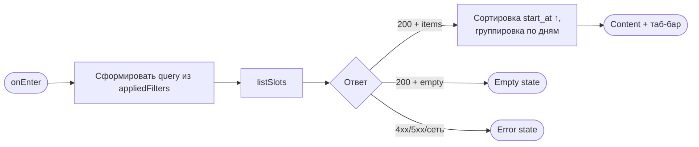
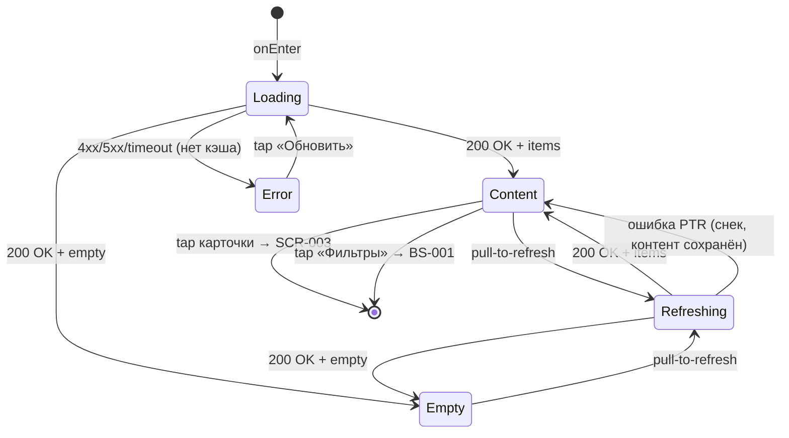

# Список слотов

**ID:** SCR-002  
**Тип:** Экран  
**Домен:** 02. Слоты / Расписание  
**Приоритет:** Critical  
**Статус:** Черновик  
**Функциональные блоки:** FB-SLOTS-001 (Каталог слотов), FB-SLOTS-002 (Фильтрация)  
**Зона авторизации:** АЗ  
**Дизайн-макет:** — (макет не в Figma для «Вертикаль»)

---

## Содержание

- [История изменений](#история-изменений)
- [Обзор](#обзор)
- [Навигация](#навигация)
- [Входные данные](#входные-данные)
- [Применяемые логики](#применяемые-логики)
- [Инициализация](#инициализация)
- [Используемые запросы](#используемые-запросы)
- [Макет экрана](#макет-экрана)
- [Элементы экрана](#элементы-экрана)
- [Состояния экрана](#состояния-экрана)
- [Действия пользователя](#действия-пользователя)
- [Связанные требования](#связанные-требования)
- [Критерии приёмки](#критерии-приёмки)

---

## История изменений

| Релиз | ТЗ | Описание изменений |
|-------|-----|-------------------|
| 0.1.0 | SCR-002 «Список слотов» | Первоначальная версия ТЗ для скалодрома «Вертикаль»: каталог тренировок, фильтры, группировка по дням. |

---

## Обзор

**SCR-002 — главный экран приложения «Вертикаль»** и стартовая вкладка авторизованной зоны (таб **«Тренировки»**). Показывает каталог доступных групповых тренировок по скалолазанию и служит **точкой входа в сценарий записи**.

По умолчанию отображаются слоты на **ближайшие 7 дней** (R-027); более длинный период — через фильтр дат в [BS-001](BS-001-filters.md) (FR-3). Слоты без свободных мест (`free_seats = 0`) показываются с пометкой **«Мест нет»** и остаются в списке, если фильтр «только со свободными местами» выключен (FR-4). Фильтрация — через шторку [BS-001](BS-001-filters.md).

При отсутствии слотов в расписании — empty state **«Пока нет доступных тренировок»** ([00-foundations §6](../3-design-brief/00-foundations.md)). При пустом результате с активными фильтрами — **«Ничего не найдено. Попробуйте изменить фильтры.»**

Каркас экрана — по [00-foundations §4](../3-design-brief/00-foundations.md): фиксированный хедер, скролл-список, таб-бар внизу.

### User Story

> Как клиент скалодрома, я хочу быстро просмотреть ближайшие тренировки с датой, зоной/форматом, инструктором, ценой и свободными местами,
> чтобы выбрать подходящую и записаться без долгого скролла.

### Бизнес-ценность

- Короткий путь к записи (BR-2, NFR-2): главный экран сразу после входа, ≤ 3 экранов до подтверждения брони.
- Прозрачность доступности: заполненные слоты видны с бейджем «Мест нет» — клиент понимает расписание целиком.
- Фильтрация по 4 критериям (FR-4) сужает выдачу без перегрузки основного экрана.

---

## Навигация

### Входящая (откуда открывается)

| Источник | Триггер | Условие | Передаваемые параметры |
|----------|---------|---------|------------------------|
| [SCR-001 Регистрация / Вход](SCR-001-registration.md) | Успешный вход / завершение регистрации | Сессия установлена | — |
| Запуск приложения | Открытие приложения | Активная пара токенов в защищённом хранилище | — |
| Таб-бар | Тап «Тренировки» | Всегда в АЗ | — |
| [SCR-003 Карточка слота](SCR-003-slot-card.md) | Кнопка «Назад» | — | — |
| [BS-001 Фильтры](BS-001-filters.md) | «Применить» / «Сбросить» + «Применить» / закрытие без изменений | — | — |
| [BS-002 Подтверждение записи](BS-002-booking-success.md) | Кнопка «Готово» | — | — |
| [SCR-005 Мои записи](SCR-005-my-bookings.md) | CTA «Записаться на тренировку» (empty state) | — | — |

### Исходящая (куда ведёт)

| Назначение | Триггер | Передаваемые параметры |
|------------|---------|------------------------|
| [SCR-003 Карточка слота](SCR-003-slot-card.md) | Тап по карточке слота | `slotId` (`slot.id`) |
| [BS-001 Фильтры](BS-001-filters.md) | Тап «Фильтры» в хедере | — (черновик фильтров инициализируется из `appliedFilters`) |
| [SCR-005 Мои записи](SCR-005-my-bookings.md) | Таб «Мои записи» | — |
| [SCR-007 Профиль](SCR-007-profile.md) | Таб «Профиль» | — |

> Тап по карточке с `free_seats = 0` или `status = cancelled` **не выполняется** — карточка визуально приглушена и некликабельна.

---

## Входные данные

| Название | Тип | Возможные значения | Описание |
|----------|-----|-------------------|----------|
| `tokens.access_token` | Защищённое хранилище | JWT / отсутствует | Bearer-токен для `listSlots`. При 401 — refresh-on-401. |
| `appliedFilters` | Состояние экрана | объект фильтров | Применённые фильтры, управляют запросом `listSlots` и индикатором в хедере. **Дефолт:** `date_from`/`date_to` не заданы, `zone_format_type = []`, `instructor_id = []`, `only_available = false`. |
| `appliedFilters.date_from` | Состояние | `date-time` / не задано | Начало периода. Не задано → API применяет `now`. |
| `appliedFilters.date_to` | Состояние | `date-time` / не задано | Конец периода. Не задано → API применяет `now + 7 дней`. |
| `appliedFilters.zone_format_type` | Состояние | `[]`, `[novice]`, `[experienced]`, `[novice, experienced]` | Тип тренировки (мультивыбор). Пустой массив = любой тип. |
| `appliedFilters.instructor_id` | Состояние | массив UUID / `[]` | Инструкторы (мультивыбор). Пустой = любой. |
| `appliedFilters.only_available` | Состояние | `true` / `false` | Только слоты с `free_seats > 0`. Дефолт `false`. |
| `slotsCache` | Кэш | массив `SlotSummary` / отсутствует | Последний успешный ответ `listSlots`; при офлайне показывается с баннером «Данные могут быть неактуальны» ([00-foundations §8.3](../3-design-brief/00-foundations.md)). |
| `pagination.offset` | Состояние | integer ≥ 0 | Смещение для подгрузки следующей страницы. |
| `pagination.limit` | Конфигурация | integer (дефолт `20`) | Размер страницы `listSlots`. |

> Числовые лимиты мест (`total_seats`, `capacity_cap`) **не хардкодятся** в UI — приходят из данных слота (новичковый ≤ 8, опытный ≤ 16 — на бэкенде).

---

## Применяемые логики

| Логика | Элемент/Триггер | Описание |
|--------|-----------------|----------|
| [LOGIC-005 Фильтрация слотов](09_Логики/LOGIC-005_Фильтрация-слотов.md) | Кнопка «Фильтры»; возврат из BS-001; pull-to-refresh | Формирование query для `listSlots` из `appliedFilters`; индикатор активных фильтров; сортировка по `start_at` ↑, группировка по дням; empty state при пустой выдаче. |
| [LOGIC-008 Паттерн состояний экрана](09_Логики/LOGIC-008_Паттерн-состояний-экрана.md) | Открытие экрана, pull-to-refresh, ошибка загрузки | Loading → Content / Empty / Error; PTR поверх контента; снек только при ошибке обновления. |

---

## Инициализация

> При открытии экрана выполняется запрос `listSlots` с текущими `appliedFilters`. Дефолтный период (7 дней) задаётся сервером, если даты не переданы.

### Диаграмма загрузки



### Запросы при открытии

| № | Запрос | Критичный | Зависит от | Условие |
|---|--------|-----------|------------|---------|
| 1 | [listSlots](#listslots) | Да | — | Всегда при открытии / возврате из BS-001 после «Применить» |

> Полное описание запросов см. в секции [Используемые запросы](#используемые-запросы).

---

## Используемые запросы

> Все API-запросы экрана — REST. Базовый URL — `https://api.vertical-gym.example/v1` (prod).

### listSlots

**Тип:** REST  
**Метод:** GET `/slots`  
**Спецификация:** [../api/slots/api.yaml](../api/slots/api.yaml) → `listSlots`

**Триггер:** Инициализация экрана; pull-to-refresh; возврат из BS-001 после «Применить»; подгрузка следующей страницы при скролле.

> Заголовки: `Authorization: Bearer <access_token>`.

**Параметры:**

| Параметр | Тип | Обязательность | Источник | Описание |
|----------|-----|----------------|----------|----------|
| `date_from` | string (date-time) | Нет | `appliedFilters.date_from` | Начало периода (включительно). Опускается, если не задано → API: `now`. |
| `date_to` | string (date-time) | Нет | `appliedFilters.date_to` | Конец периода (включительно). Опускается, если не задано → API: `now + 7 дней`. |
| `zone_format_type` | array enum | Нет | `appliedFilters.zone_format_type` | `novice` / `experienced`. OR внутри группы. Опускается, если `[]`. |
| `instructor_id` | array uuid | Нет | `appliedFilters.instructor_id` | OR внутри группы. Опускается, если `[]`. |
| `only_available` | boolean | Нет | `appliedFilters.only_available` | Передаётся только как `true`. Дефолт `false` опускается. |
| `limit` | integer | Нет | `pagination.limit` | Размер страницы (дефолт API: `20`, max `100`). |
| `offset` | integer | Нет | `pagination.offset` | Смещение (`0` для первой страницы). |

**Структура ответа (200):** `{ items: SlotSummary[], meta: { limit, offset, total } }`.

**Обработка ответа:**

| Результат | Условие | UI-реакция |
|-----------|---------|------------|
| Загрузка (первичная) | — | Скелетон карточек слотов |
| Загрузка (PTR) | `isRefreshing = true` | Индикатор обновления сверху; контент **не** сбрасывается в скелетон |
| Успех | HTTP 200, `items` не пуст | Content: список, группировка по дням; обновить `slotsCache`; индикатор фильтров |
| Успех | HTTP 200, `items` пуст, фильтры = дефолт | Empty: «Пока нет доступных тренировок» |
| Успех | HTTP 200, `items` пуст, есть активные фильтры | Empty: «Ничего не найдено. Попробуйте изменить фильтры.» + CTA «Изменить фильтры» → BS-001 |
| Успех | HTTP 200, `meta.total > offset + items.length` | Показать триггер подгрузки следующей страницы при скролле |
| HTTP 400 | Некорректные параметры | Снек с текстом из `message` (защитный сценарий; UI валидирует даты в BS-001) |
| HTTP 401 | Токен невалиден | Refresh-on-401; при неуспехе — SCR-001 |
| HTTP 5xx | — | Error state + кнопка «Обновить» |
| Сеть | Нет соединения, нет кэша | Error state: «Не удалось загрузить. Проверьте соединение и попробуйте снова.» |
| Сеть | Нет соединения, есть кэш | Content из `slotsCache` + баннер «Данные могут быть неактуальны» |
| PTR + ошибка | 5xx / сеть | Контент сохраняется; снек «Не удалось обновить. Проверьте соединение и попробуйте снова.» |

---

## Макет экрана

### Структура

Каркас — по [00-foundations §4.1](../3-design-brief/00-foundations.md). Таб-бар виден (корневой экран вкладки «Тренировки»).

```
┌─────────────────────────────────┐
│  Тренировки          [ Фильтры ]│  ← бейдж, если фильтры активны
├─────────────────────────────────┤
│  Сегодня, 5 июля                 │  ← sticky-заголовок дня
│  ┌───────────────────────────┐  │
│  │ 18:00 · Болдеринг новички  │  │
│  │ Анна · 3 из 8 · 1 200 ₽   │  │
│  └───────────────────────────┘  │
│  ┌───────────────────────────┐  │
│  │ 20:00 · Трассы опытные     │  │
│  │ Мест нет · 1 500 ₽         │  │  ← free_seats = 0, приглушена
│  └───────────────────────────┘  │
│  Завтра, 6 июля                  │
│  ┌───────────────────────────┐  │
│  │ ...                        │  │
│  └───────────────────────────┘  │
├─────────────────────────────────┤
│ [Тренировки] [Мои записи] [Профиль]│
└─────────────────────────────────┘
```

### Компоненты

| Компонент | Описание | Обязательность |
|-----------|----------|----------------|
| Хедер «Тренировки» | Заголовок экрана | Да |
| Кнопка «Фильтры» | Открывает BS-001; бейдж/точка при активных фильтрах | Да |
| Sticky-заголовок дня | Группировка по календарному дню (`start_at`) | Да (при наличии слотов) |
| Карточка слота | Компактное представление одной тренировки | Да (в Content) |
| Баннер stale cache | «Данные могут быть неактуальны» | Опционально (офлайн) |
| Таб-бар | «Тренировки» (активен) / «Мои записи» / «Профиль» | Да |
| Pull-to-refresh | Обновление списка | Да |

---

## Элементы экрана

> **Примечания:**
> - Карточки с `free_seats = 0` или `status = cancelled` — приглушены, некликабельны; статус передаётся не только цветом ([00-foundations §3.2](../3-design-brief/00-foundations.md)).
> - Формат даты/времени — локаль пользователя; источник истины — `start_at` (UTC) из API.

### 1. Хедер

| Элемент | Описание | Источник данных | Валидация | Действие |
|---------|----------|-----------------|-----------|----------|
| Заголовок «Тренировки» | Название экрана / вкладки | — | — | — |
| Кнопка «Фильтры» | Иконка + текст или иконка с подписью | — | — | Открыть [BS-001](BS-001-filters.md) |
| Индикатор активных фильтров | Бейдж/точка на кнопке «Фильтры» | `appliedFilters` ≠ дефолт | — | — |

**Логика:**
- Индикатор: [LOGIC-005](09_Логики/LOGIC-005_Фильтрация-слотов.md) — виден, если хотя бы один параметр `appliedFilters` отличается от дефолта (`date_from`/`date_to` заданы явно, `zone_format_type` не пуст, `instructor_id` не пуст, `only_available = true`).

### 2. Карточка слота в списке

| Элемент | Описание | Источник данных | Валидация | Действие |
|---------|----------|-----------------|-----------|----------|
| Время старта | Крупное, контрастное | `slot.start_at` | — | — |
| Название зоны/формата | Основной текст | `slot.zone_format.name` | — | — |
| Бейдж типа | «Новичковый» / «Опытный» | `slot.zone_format.type` | — | — |
| Имя инструктора | Вторичный текст | `slot.instructor_info.name` | — | — |
| Свободные места | «N из M» или «Мест нет» | `slot.free_seats`, `slot.total_seats` | — | — |
| Цена | «X ₽» за место | `slot.price` | — | — |
| Бейдж «Мест нет» | При `free_seats = 0` | вычисляется | — | — |
| Бейдж «Отменена» | При `status = cancelled` | `slot.status` | — | — |

**Логика:**
- Свободные места: при `free_seats > 0` — «`free_seats` из `total_seats`»; при `free_seats = 0` — текст **«Мест нет»** (не только цветом).
- Тип формата: `novice` → «Новичковый»; `experienced` → «Опытный».
- Тап по карточке: переход на [SCR-003](SCR-003-slot-card.md) с `slotId = slot.id` — **только** при `free_seats > 0` и `status = scheduled`.

**Условия доступности:**
- Карточка **кликабельна**, если: `free_seats > 0` **и** `status = scheduled`.
- Карточка **приглушена и некликабельна**, если: `free_seats = 0` **или** `status = cancelled`.

### 3. Empty state

| Элемент | Описание | Источник данных | Валидация | Действие |
|---------|----------|-----------------|-----------|----------|
| Заглушка (нет расписания) | «Пока нет доступных тренировок» | — | — | Pull-to-refresh |
| Заглушка (фильтры) | «Ничего не найдено. Попробуйте изменить фильтры.» | — | — | CTA «Изменить фильтры» → BS-001 |

### 4. Error state

| Элемент | Описание | Источник данных | Валидация | Действие |
|---------|----------|-----------------|-----------|----------|
| Текст ошибки | «Не удалось загрузить. Проверьте соединение и попробуйте снова.» | — | — | — |
| Кнопка «Обновить» | Primary | — | — | Повтор [listSlots](#listslots) |

---

## Состояния экрана

### Таблица состояний

| Состояние | Условие | Отображение |
|-----------|---------|-------------|
| Loading | Первичный `listSlots` в процессе | Скелетон карточек (не пустой экран) |
| Content | API 200 + `items` не пуст | Список слотов + таб-бар; группировка по дням |
| Empty (E2) | API 200 + пусто, фильтры = дефолт | «Пока нет доступных тренировок» |
| Empty (E1) | API 200 + пусто, есть активные фильтры | «Ничего не найдено…» + CTA «Изменить фильтры» |
| Error | API 4xx/5xx / сеть без кэша | Error state + «Обновить» |
| Stale cache | Офлайн, есть `slotsCache` | Content + баннер «Данные могут быть неактуальны» |
| Refreshing | Pull-to-refresh | Индикатор сверху; контент сохранён |

### Диаграмма переходов



---

## Действия пользователя

| Действие | Элемент | Триггер | Результат |
|----------|---------|---------|-----------|
| Просмотреть расписание | — | Открытие вкладки «Тренировки» | [listSlots](#listslots) → Content / Empty / Error |
| Обновить список | Pull-to-refresh | Swipe down | Повторный `listSlots`; PTR без снека при успехе |
| Открыть фильтры | Кнопка «Фильтры» | Tap | [BS-001](BS-001-filters.md) |
| Выбрать тренировку | Карточка слота | Tap | [SCR-003](SCR-003-slot-card.md) с `slotId` |
| Подгрузить ещё | Скролл до конца | Scroll | `listSlots` с увеличенным `offset` |
| Повторить загрузку | Кнопка «Обновить» | Tap (Error) | Повторный `listSlots` |
| Изменить фильтры (empty) | CTA «Изменить фильтры» | Tap | [BS-001](BS-001-filters.md) |
| Перейти в «Мои записи» | Таб «Мои записи» | Tap | [SCR-005](SCR-005-my-bookings.md) |
| Перейти в профиль | Таб «Профиль» | Tap | [SCR-007](SCR-007-profile.md) |

---

## Связанные требования

### Функциональные (REQ-FUNC-*)

| ID | Название | Приоритет |
|----|----------|-----------|
| FR-3 | Список слотов на 7 дней, состав карточки, empty state | Must |
| FR-4 | Фильтрация по дате, типу, местам, инструктору | Must |

### Интеграции (REQ-INT-*)

| ID | Название | Приоритет |
|----|----------|-----------|
| REQ-INT-SLOTS | Slots API: `listSlots` ([../api/slots/api.yaml](../api/slots/api.yaml)) | Critical |

### UI (REQ-UI-*)

| ID | Название | Приоритет |
|----|----------|-----------|
| US-2 | Просмотр списка тренировок | High |
| US-3 | Фильтрация слотов | High |

### Данные (REQ-DATA-*)

| ID | Название | Приоритет |
|----|----------|-----------|
| NFR-2 | Read-only API слотов | Critical |
| NFR-7 | Скелетон, воспринимаемая скорость | High |

---

## Критерии приёмки

### Позитивные сценарии

| ID | Критерий | Приоритет |
|----|----------|-----------|
| AC-001 | **Дано** клиент авторизован, **Когда** он открывает вкладку «Тренировки», **Тогда** загружается список слотов на ближайшие 7 дней с датой/временем, зоной/форматом, инструктором, местами и ценой. | P0 |
| AC-002 | **Дано** слот с `free_seats = 0`, фильтр «только свободные» выключен, **Когда** список отображён, **Тогда** карточка помечена «Мест нет», приглушена и некликабельна. | P0 |
| AC-003 | **Дано** применён хотя бы один фильтр ≠ дефолт, **Когда** экран в Content, **Тогда** на кнопке «Фильтры» виден индикатор активных фильтров. | P0 |
| AC-004 | **Дано** расписание пусто без фильтров, **Когда** `listSlots` вернул пустой массив, **Тогда** показан empty state «Пока нет доступных тренировок». | P0 |
| AC-005 | **Дано** слоты на разные даты, **Когда** список загружен, **Тогда** слоты отсортированы по `start_at` по возрастанию и сгруппированы по дням со sticky-заголовками. | P1 |
| AC-006 | **Дано** `meta.total >` загружено элементов, **Когда** клиент доскроллил до конца, **Тогда** подгружается следующая страница. | P1 |

### Негативные сценарии

| ID | Критерий | Приоритет |
|----|----------|-----------|
| AC-N01 | **Дано** нет сети и нет кэша, **Когда** открывается экран, **Тогда** показывается Error state с кнопкой «Обновить». | P0 |
| AC-N02 | **Дано** активные фильтры, **Когда** `listSlots` вернул пустой результат, **Тогда** empty state «Ничего не найдено…» с CTA «Изменить фильтры». | P0 |
| AC-N03 | **Дано** экран в Content, **Когда** pull-to-refresh завершился ошибкой, **Тогда** контент сохранён, показан снек «Не удалось обновить…». | P1 |

### Граничные условия (Edge Cases)

| ID | Критерий | Приоритет |
|----|----------|-----------|
| AC-E01 | **Дано** слот `status = cancelled`, **Когда** он в выдаче, **Тогда** карточка с бейджем «Отменена», некликабельна. | P1 |
| AC-E02 | **Дано** офлайн и есть `slotsCache`, **Когда** экран открыт, **Тогда** показан кэш с баннером «Данные могут быть неактуальны». | P2 |
| AC-E03 | **Дано** клиент закрыл BS-001 без «Применить», **Когда** вернулся на SCR-002, **Тогда** список и `appliedFilters` не изменились. | P1 |

---
