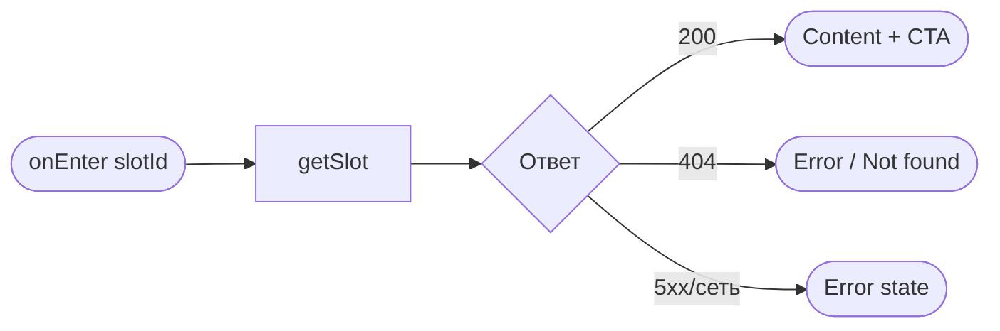
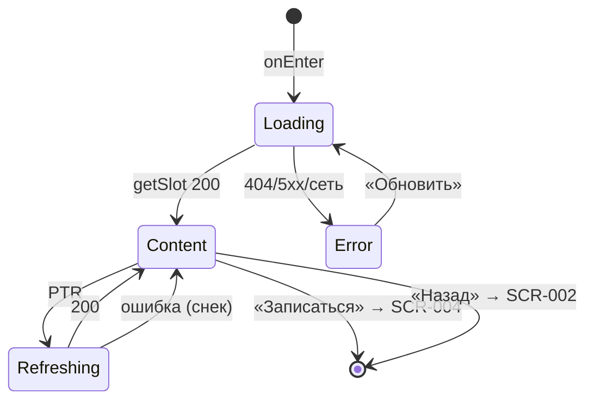

# Карточка слота

**ID:** SCR-003  
**Тип:** Экран  
**Домен:** 03. Запись на слот  
**Приоритет:** Critical  
**Статус:** Черновик  
**Функциональные блоки:** FB-SLOTS-003 (Детали слота), FB-BOOKING-001 (Переход к записи)  
**Зона авторизации:** АЗ  
**Дизайн-макет:** — (макет не в Figma для «Вертикаль»)

> **Без карты.** Экран **не содержит** карты маршрута, Yandex Maps или иных картографических блоков — домен скалодрома, тренировка проходит в зале.

---

## Содержание

- [История изменений](#история-изменений)
- [Обзор](#обзор)
- [Навигация](#навигация)
- [Входные данные](#входные-данные)
- [Применяемые логики](#применяемые-логики)
- [Инициализация](#инициализация)
- [Используемые запросы](#используемые-запросы)
- [Макет экрана](#макет-экрана)
- [Элементы экрана](#элементы-экрана)
- [Состояния экрана](#состояния-экрана)
- [Действия пользователя](#действия-пользователя)
- [Связанные требования](#связанные-требования)
- [Критерии приёмки](#критерии-приёмки)

---

## История изменений

| Релиз | ТЗ | Описание изменений |
|-------|-----|-------------------|
| 0.1.0 | SCR-003 «Карточка слота» | Первоначальная версия ТЗ: полная карточка тренировки для «Вертикаль», без карты. |

---

## Обзор

**SCR-003** показывает **все параметры одной тренировки (слота)** для принятия решения о записи. Промежуточный шаг основного потока: [SCR-002](SCR-002-slot-list.md) → **SCR-003** → [SCR-004](SCR-004-booking.md).

Клиент видит дату/время, зону/формат, инструктора, места, прокатный фонд и цену. Контакты инструктора **не показываются** (NFR-9). Таб-бар скрыт (вложенный экран).

CTA **«Записаться»** активен при `free_seats > 0` и `status = scheduled`. При отсутствии мест — disabled с подписью «Мест нет». При отменённом слоте — «Тренировка отменена», запись недоступна.

### User Story

> Как клиент скалодрома, я хочу увидеть полную информацию о тренировке перед записью,
> чтобы убедиться, что время, формат, инструктор, места и прокат мне подходят.

### Бизнес-ценность

- Прозрачность перед записью (FR-5, US-4) — снижает отмены и обращения к администратору.
- Отдельный показ прокатного фонда (`free_rental_equipment`) готовит к выбору снаряжения на SCR-004.
- Disabled CTA при `free_seats = 0` предотвращает бессмысленный переход к оформлению.

---

## Навигация

### Входящая (откуда открывается)

| Источник | Триггер | Условие | Передаваемые параметры |
|----------|---------|---------|------------------------|
| [SCR-002 Список слотов](SCR-002-slot-list.md) | Тап по карточке слота | `free_seats > 0`, `status = scheduled` | `slotId` (UUID) |

### Исходящая (куда ведёт)

| Назначение | Триггер | Передаваемые параметры |
|------------|---------|------------------------|
| [SCR-004 Оформление записи](SCR-004-booking.md) | CTA «Записаться» | `slotId`, объект `slot` (из ответа `getSlot` или кэша) |
| [SCR-002 Список слотов](SCR-002-slot-list.md) | Кнопка «Назад» | — |

> Таб-бар на экране **скрыт**.

---

## Входные данные

| Название | Тип | Возможные значения | Описание |
|----------|-----|-------------------|----------|
| `slotId` | Параметр навигации | UUID | Идентификатор слота для `getSlot`. |
| `slot` | Состояние / кэш | объект `Slot` | Полные данные слота после загрузки; передаётся на SCR-004 при «Записаться». |
| `slot.free_seats` | Поле слота | integer ≥ 0 | Свободные места; CTA при `0`. |
| `slot.free_rental_equipment` | Поле слота | integer ≥ 0 | Свободные прокатные комплекты; информационно для SCR-004. |
| `slot.status` | Поле слота | `scheduled` / `cancelled` | Статус слота. |
| `slot.zone_format` | Поле слота | `ZoneFormat` | Зона/формат: name, type, duration_min, capacity_cap. |

---

## Применяемые логики

| Логика | Элемент/Триггер | Описание |
|--------|-----------------|----------|
| [LOGIC-002 Расчёт доступности](09_Логики/LOGIC-002_Расчёт-доступности.md) | CTA «Записаться»; блоки мест и проката | Доступность записи: `free_seats > 0`; прокатный фонд (`free_rental_equipment`) **не блокирует** CTA — можно записаться со своим снаряжением. **Одно место** — без степпера и гостей. |
| [LOGIC-003 Расчёт цены брони](09_Логики/LOGIC-003_Расчёт-цены-брони.md) | Блок «Цена» | Отображение `slot.price` за одно место (информационно). |
| [LOGIC-008 Паттерн состояний экрана](09_Логики/LOGIC-008_Паттерн-состояний-экрана.md) | Загрузка `getSlot`, pull-to-refresh | Loading / Content / Error; PTR поверх контента. |

> В домене «Вертикаль» LOGIC-002 применяется в упрощённом виде: **одна запись = одно место**, без счётчика мест и гостей (FR-6, FR-W1).

---

## Инициализация

> При открытии выполняется `getSlot` по `slotId`. Опционально: показать скелетон, если данных из списка недостаточно.

### Диаграмма загрузки



### Запросы при открытии

| № | Запрос | Критичный | Зависит от | Условие |
|---|--------|-----------|------------|---------|
| 1 | [getSlot](#getslot) | Да | `slotId` | Всегда |

---

## Используемые запросы

> Базовый URL — `https://api.vertical-gym.example/v1`.

### getSlot

**Тип:** REST  
**Метод:** GET `/slots/{slotId}`  
**Спецификация:** [../api/slots/api.yaml](../api/slots/api.yaml) → `getSlot`

**Триггер:** Инициализация; pull-to-refresh.

> Заголовки: `Authorization: Bearer <access_token>`.

**Параметры:**

| Параметр | Тип | Обязательность | Источник | Описание |
|----------|-----|----------------|----------|----------|
| `slotId` | uuid (path) | Да | параметр навигации | Идентификатор слота |

**Структура ответа (200):** объект `Slot` — `id`, `start_at`, `zone_format`, `instructor_info`, `total_seats`, `free_seats`, `free_rental_equipment`, `price`, `rental_price`, `status`.

**Обработка ответа:**

| Результат | Условие | UI-реакция |
|-----------|---------|------------|
| Загрузка | — | Скелетон карточки |
| Успех | HTTP 200 | Content: все поля + CTA по [LOGIC-002](#применяемые-логики) |
| HTTP 401 | — | Refresh-on-401; при неуспехе — SCR-001 |
| HTTP 404 | — | Error: «Тренировка не найдена» + «Обновить» / «Назад» |
| HTTP 5xx / сеть | — | Error state + «Обновить» |
| PTR + ошибка | 5xx / сеть | Контент сохранён; снек «Не удалось обновить…» |

---

## Макет экрана

### Структура

Таб-бар скрыт. Фиксированный нижний CTA.

```
┌─────────────────────────────────┐
│ ‹ Назад      Карточка тренировки │
├─────────────────────────────────┤
│  Ср, 9 июля · 18:00              │
│                                  │
│  Болдеринг с инструктажем        │
│  [ Новичковый ] · ~90 мин        │
│                                  │
│  Инструктор: Анна                │
│  Места: 3 из 8 свободно          │
│  Прокат: 2 комплекта свободно    │
│  Цена: 1 200 ₽                   │
│                                  │
│  (описание зоны, если есть)      │
├─────────────────────────────────┤
│  [       Записаться       ]      │  ← disabled при free_seats = 0
└─────────────────────────────────┘
```

### Компоненты

| Компонент | Описание | Обязательность |
|-----------|----------|----------------|
| Хедер с «Назад» | Возврат на SCR-002 | Да |
| Блок даты/времени | Крупное отображение `start_at` | Да |
| Блок зоны/формата | Название, бейдж типа, длительность | Да |
| Блок инструктора | Только имя | Да |
| Блок мест | «N из M свободно» / «Мест нет» | Да |
| Блок проката | «N комплект(ов) свободно» | Да |
| Блок цены | Цена за одно место | Да |
| Описание | `zone_format.description` | Опционально (если не null) |
| CTA «Записаться» | Фиксированный нижний | Да |

---

## Элементы экрана

### 1. Шапка и навигация

| Элемент | Описание | Источник данных | Валидация | Действие |
|---------|----------|-----------------|-----------|----------|
| Кнопка «Назад» | В хедере | — | — | [SCR-002](SCR-002-slot-list.md) |
| Заголовок | «Карточка тренировки» | — | — | — |

### 2. Параметры тренировки

| Элемент | Описание | Источник данных | Валидация | Действие |
|---------|----------|-----------------|-----------|----------|
| Дата и время | «Ср, 9 июля · 18:00» | `slot.start_at` | — | — |
| Название зоны/формата | Основной заголовок | `slot.zone_format.name` | — | — |
| Бейдж типа | «Новичковый» / «Опытный» | `slot.zone_format.type` | — | — |
| Длительность | «~90 мин» | `slot.zone_format.duration_min` | — | — |
| Описание | Текстовый блок | `slot.zone_format.description` | — | — |
| Инструктор | «Инструктор: {name}» | `slot.instructor_info.name` | — | — |
| Места | «Места: N из M свободно» или «Мест нет» | `slot.free_seats`, `slot.total_seats` | — | — |
| Прокат | «Прокат: N комплект(ов) свободно» | `slot.free_rental_equipment` | — | — |
| Цена | «Цена: X ₽» (за одно место) | `slot.price` | — | — |

**Логика:**
- Длительность и описание **скрыты**, если поле отсутствует или null.
- Тип: `novice` → «Новичковый»; `experienced` → «Опытный».
- Места: [LOGIC-002](09_Логики/LOGIC-002_Расчёт-доступности.md) — при `free_seats = 0` текст «Мест нет».
- Прокат: информационно; `free_rental_equipment = 0` **не блокирует** запись (можно со своим снаряжением на SCR-004).
- Цена: [LOGIC-003](09_Логики/LOGIC-003_Расчёт-цены-брони.md) — `slot.price` за одно место.

**Условия видимости:**
- Описание — только при непустом `zone_format.description`.

### 3. CTA «Записаться»

| Элемент | Описание | Источник данных | Валидация | Действие |
|---------|----------|-----------------|-----------|----------|
| Кнопка «Записаться» | Primary, фикс. внизу | — | — | [SCR-004](SCR-004-booking.md) с `slotId`, `slot` |
| Подпись «Мест нет» | Рядом с CTA | `slot.free_seats` | — | — |
| Баннер «Тренировка отменена» | При cancelled | `slot.status` | — | — |

**Логика:**
- [LOGIC-002](09_Логики/LOGIC-002_Расчёт-доступности.md): CTA **enabled** при `free_seats > 0` **и** `status = scheduled`.
- При `free_seats = 0`: CTA **disabled**, подпись «Мест нет».
- При `status = cancelled`: CTA **disabled** / скрыт, текст «Тренировка отменена» (UC-3 E4).

**Условия доступности:**
- CTA **enabled**: `free_seats > 0` ∧ `status = scheduled`.
- CTA **disabled**: иначе.

---

## Состояния экрана

### Таблица состояний

| Состояние | Условие | Отображение |
|-----------|---------|-------------|
| Loading | `getSlot` в процессе | Скелетон карточки |
| Content | HTTP 200 | Все параметры + CTA |
| Content (нет мест) | `free_seats = 0` | Content + disabled CTA «Мест нет» |
| Content (отменён) | `status = cancelled` | «Тренировка отменена»; CTA недоступен |
| Error | 404 / 5xx / сеть | Заглушка + «Обновить» / «Назад» |
| Refreshing | Pull-to-refresh | Индикатор; контент сохранён |

### Диаграмма переходов



---

## Действия пользователя

| Действие | Элемент | Триггер | Результат |
|----------|---------|---------|-----------|
| Вернуться к списку | «Назад» | Tap | [SCR-002](SCR-002-slot-list.md) |
| Обновить данные | Pull-to-refresh | Swipe | Повтор `getSlot` |
| Записаться | CTA «Записаться» | Tap | [SCR-004](SCR-004-booking.md) |
| Повторить загрузку | «Обновить» | Tap (Error) | Повтор `getSlot` |

---

## Связанные требования

### Функциональные (REQ-FUNC-*)

| ID | Название | Приоритет |
|----|----------|-----------|
| FR-5 | Полная карточка слота | Must |
| FR-8 | Раздельный учёт мест и прокатного фонда (отображение) | Must |

### Интеграции (REQ-INT-*)

| ID | Название | Приоритет |
|----|----------|-----------|
| REQ-INT-SLOTS | Slots API: `getSlot` ([../api/slots/api.yaml](../api/slots/api.yaml)) | Critical |

### UI (REQ-UI-*)

| ID | Название | Приоритет |
|----|----------|-----------|
| US-4 | Детали тренировки перед записью | High |

---

## Критерии приёмки

### Позитивные сценарии

| ID | Критерий | Приоритет |
|----|----------|-----------|
| AC-001 | **Дано** валидный `slotId`, **Когда** открывается SCR-003, **Тогда** отображаются все обязательные поля FR-5: дата/время, зона/формат, инструктор, места, прокат, цена. | P0 |
| AC-002 | **Дано** `free_seats > 0` и `status = scheduled`, **Когда** карточка загружена, **Тогда** CTA «Записаться» активен. | P0 |
| AC-003 | **Дано** `free_rental_equipment = 0`, **Когда** карточка загружена, **Тогда** CTA «Записаться» **остаётся активным** (можно записаться со своим снаряжением). | P0 |
| AC-004 | **Дано** клиент нажал «Записаться», **Когда** переход выполнен, **Тогда** открывается SCR-004 с `slotId` и данными слота. | P0 |

### Негативные сценарии

| ID | Критерий | Приоритет |
|----|----------|-----------|
| AC-N01 | **Дано** `free_seats = 0`, **Когда** карточка отображена, **Тогда** CTA disabled, видна подпись «Мест нет». | P0 |
| AC-N02 | **Дано** `status = cancelled`, **Когда** карточка отображена, **Тогда** запись недоступна, показано «Тренировка отменена». | P0 |
| AC-N03 | **Дано** `getSlot` вернул 404, **Когда** экран открыт, **Тогда** Error state, CTA записи отсутствует. | P1 |

### Граничные условия (Edge Cases)

| ID | Критерий | Приоритет |
|----|----------|-----------|
| AC-E01 | **Дано** `zone_format.description = null`, **Когда** карточка отображена, **Тогда** блок описания скрыт. | P2 |
| AC-E02 | **Дано** экран не содержит карты/Yandex Maps, **Когда** проверяется макет, **Тогда** картографических элементов нет. | P0 |
| AC-E03 | **Дано** pull-to-refresh завершился ошибкой, **Когда** данные уже на экране, **Тогда** контент сохранён, показан снек ошибки обновления. | P2 |

---
