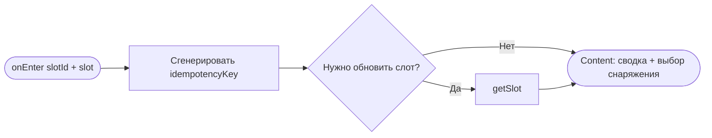
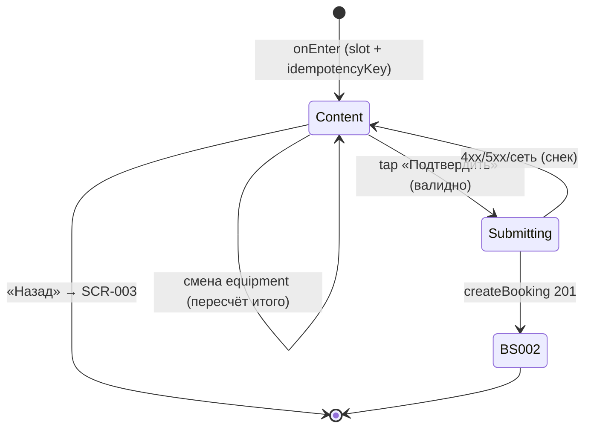

# Оформление записи

**ID:** SCR-004  
**Тип:** Экран  
**Домен:** 03. Запись на слот  
**Приоритет:** Critical  
**Статус:** Черновик  
**Функциональные блоки:** FB-BOOKING-001 (Создание брони), FB-BOOKING-002 (Выбор снаряжения)  
**Зона авторизации:** АЗ  
**Дизайн-макет:** — (макет не в Figma для «Вертикаль»)

> **Одна запись = один клиент = одно место (FR-6, FR-W1).** На экране **нет** счётчика мест, **нет** поля гостей, **нет** групповой брони. Клиент выбирает только вариант снаряжения (`own` / `rental`).

---

## Содержание

- [История изменений](#история-изменений)
- [Обзор](#обзор)
- [Навигация](#навигация)
- [Входные данные](#входные-данные)
- [Применяемые логики](#применяемые-логики)
- [Инициализация](#инициализация)
- [Используемые запросы](#используемые-запросы)
- [Макет экрана](#макет-экрана)
- [Элементы экрана](#элементы-экрана)
- [Состояния экрана](#состояния-экрана)
- [Действия пользователя](#действия-пользователя)
- [Связанные требования](#связанные-требования)
- [Критерии приёмки](#критерии-приёмки)

---

## История изменений

| Релиз | ТЗ | Описание изменений |
|-------|-----|-------------------|
| 0.1.0 | SCR-004 «Оформление записи» | Первоначальная версия ТЗ: запись на одно место, выбор снаряжения, `createBooking` с Idempotency-Key. |

---

## Обзор

**SCR-004** — последний шаг перед подтверждением записи. Клиент выбирает **вариант снаряжения** (своё / прокатное), видит **итоговую цену** и подтверждает бронь одним местом.

Поток записи: [SCR-002](SCR-002-slot-list.md) → [SCR-003](SCR-003-slot-card.md) → **SCR-004** → [BS-002](BS-002-booking-success.md) — **≤ 3 экранов** до подтверждения ([00-foundations P2](../3-design-brief/00-foundations.md)).

**Раздельные лимиты (FR-8):**
- **Место в группе** занимается при любой записи.
- **Прокатный фонд** (`free_rental_equipment`) уменьшается только при `equipment = rental`.
- Свободные места **не** ограничиваются прокатным фондом и наоборот.

Оплата — **офлайн** на месте ([00-foundations §6](../3-design-brief/00-foundations.md)). Таб-бар скрыт.

### User Story

> Как клиент скалодрома, я хочу выбрать своё или прокатное снаряжение, увидеть итоговую цену и подтвердить запись на одно место,
> чтобы быстро зафиксировать бронь перед тренировкой.

### Бизнес-ценность

- Минимум полей в зале (NFR-1): один выбор снаряжения + подтверждение.
- Прозрачная цена до подтверждения (FR-11).
- Идемпотентность `createBooking` (R-022, NFR-5) защищает от дублей при сетевом сбое.

---

## Навигация

### Входящая (откуда открывается)

| Источник | Триггер | Условие | Передаваемые параметры |
|----------|---------|---------|------------------------|
| [SCR-003 Карточка слота](SCR-003-slot-card.md) | CTA «Записаться» | `free_seats > 0`, `status = scheduled` | `slotId`, `slot` (объект `Slot`) |

### Исходящая (куда ведёт)

| Назначение | Триггер | Передаваемые параметры |
|------------|---------|------------------------|
| [BS-002 Подтверждение записи](BS-002-booking-success.md) | `createBooking` → HTTP 201 | `booking` (ответ API), `is_first_booking` |
| [SCR-003 Карточка слота](SCR-003-slot-card.md) | Кнопка «Назад» | — (незавершённая бронь не сохраняется) |

> При успехе **снек не показывается** — обратная связь через переход на BS-002 ([00-foundations §6.2](../3-design-brief/00-foundations.md)).

---

## Входные данные

| Название | Тип | Возможные значения | Описание |
|----------|-----|-------------------|----------|
| `slotId` | Параметр навигации | UUID | Идентификатор слота → `createBooking.slot_id`. |
| `slot` | Параметр / состояние | объект `Slot` | Данные слота для сводки и расчёта превью цены. |
| `equipment` | Состояние формы | `own` / `rental` | Выбранный вариант снаряжения. Дефолт: **`own`**. |
| `idempotencyKey` | Состояние | UUID v4 | Генерируется **один раз** при входе на экран; переиспользуется при повторе `createBooking` (R-022). |
| `slot.free_seats` | Поле слота | integer ≥ 0 | Актуальность мест; при 0 — блокировка CTA. |
| `slot.free_rental_equipment` | Поле слота | integer ≥ 0 | Доступность варианта «Прокатное снаряжение». |
| `slot.price` | Поле слота | integer ≥ 0, RUB | Тариф за место. |
| `slot.rental_price` | Поле слота | integer ≥ 0, RUB | Доплата за прокатный комплект. |

---

## Применяемые логики

| Логика | Элемент/Триггер | Описание |
|--------|-----------------|----------|
| [LOGIC-002 Расчёт доступности](09_Логики/LOGIC-002_Расчёт-доступности.md) | Radio снаряжения; CTA | **Упрощённо для одного места:** CTA активен при `free_seats > 0`; «Прокатное» disabled при `free_rental_equipment = 0`; своё снаряжение доступно при наличии мест. |
| [LOGIC-003 Расчёт цены брони](09_Логики/LOGIC-003_Расчёт-цены-брони.md) | Блок «Итого» | Превью: `own` → `slot.price`; `rental` → `slot.price + slot.rental_price`. После 201 — `price_total` с сервера. |
| [LOGIC-008 Паттерн состояний экрана](09_Логики/LOGIC-008_Паттерн-состояний-экрана.md) | CTA «Подтвердить запись» | `actionStatus = submitting`: лоадер на кнопке, блокировка повторного тапа. |

> LOGIC-003 на SCR-004 для **одного места**: формула превью без `seats_count` — только выбор `equipment`.

---

## Инициализация

> При открытии **сетевой загрузки слота не требуется**, если передан актуальный объект `slot` из SCR-003. Опционально — фоновый `getSlot` для актуализации `free_seats` / `free_rental_equipment`. Генерируется `idempotencyKey` (UUID v4).

### Диаграмма загрузки



### Запросы при открытии

| № | Запрос | Критичный | Зависит от | Условие |
|---|--------|-----------|------------|---------|
| 1 | [getSlot](#getslot) | Нет | `slotId` | Опционально: если `slot` устарел / отсутствует, или pull-to-refresh |

---

## Используемые запросы

> Базовый URL — `https://api.vertical-gym.example/v1`.

### getSlot

**Тип:** REST  
**Метод:** GET `/slots/{slotId}`  
**Спецификация:** [../api/slots/api.yaml](../api/slots/api.yaml) → `getSlot`

**Триггер:** Опционально при открытии / pull-to-refresh для актуализации доступности.

**Параметры:**

| Параметр | Тип | Обязательность | Источник | Описание |
|----------|-----|----------------|----------|----------|
| `slotId` | uuid (path) | Да | параметр навигации | Идентификатор слота |

**Обработка ответа:**

| Результат | Условие | UI-реакция |
|-----------|---------|------------|
| Успех | HTTP 200 | Обновить `slot`; пересчитать доступность и превью цены |
| HTTP 404 | — | Снек «Тренировка не найдена»; CTA disabled |
| HTTP 5xx / сеть | — | Сохранить переданный `slot`; снек при PTR |

---

### createBooking

**Тип:** REST  
**Метод:** POST `/bookings`  
**Спецификация:** [../api/bookings/api.yaml](../api/bookings/api.yaml) → `createBooking`

**Триггер:** Тап «Подтвердить запись».

> Заголовки:
> - `Authorization: Bearer <access_token>`
> - `Content-Type: application/json`
> - **`Idempotency-Key: <idempotencyKey>`** — обязательный UUID (R-022). Повтор с тем же ключом и телом → тот же 201; тот же ключ с другим телом → 409.

**Параметры (body):**

| Параметр | Тип | Обязательность | Источник | Описание |
|----------|-----|----------------|----------|----------|
| `slot_id` | uuid | Да | `slotId` | Идентификатор слота |
| `equipment` | enum | Да | `equipment` (состояние формы) | `own` — своё снаряжение; `rental` — прокатное |

**Структура ответа (201):** `CreateBookingResponse` — объект `Booking` + `is_first_booking`, опционально `reminder_hours`.

**Обработка ответа:**

| Результат | Условие | UI-реакция |
|-----------|---------|------------|
| Загрузка | — | CTA в Loading; форма заблокирована ([LOGIC-008](09_Логики/LOGIC-008_Паттерн-состояний-экрана.md)) |
| Успех | HTTP 201 | Переход на [BS-002](BS-002-booking-success.md) с `booking`, `is_first_booking`; **снек не показывается** |
| HTTP 400 | `bad_request` | Снек из `message` или дефолт «Не удалось выполнить. Попробуйте ещё раз.» |
| HTTP 401 | — | Refresh-on-401; при неуспехе — SCR-001 |
| HTTP 409 | `slot_full` | Снек «Свободных мест больше нет.»; обновить `free_seats` из `details.available_seats` (если есть); CTA disabled при 0 |
| HTTP 409 | `rental_unavailable` | Снек «Прокатное снаряжение закончилось.»; переключить на «Своё» или предложить другой слот |
| HTTP 409 | `double_booking` | Снек «Вы уже записаны на эту тренировку.» |
| HTTP 409 | `idempotency_key_conflict` | Снек из `message`; сгенерировать новый `idempotencyKey` только если пользователь **изменил** параметры брони |
| HTTP 410 | `slot_cancelled` | Снек «Тренировка отменена скалодромом и недоступна для записи.»; CTA disabled |
| HTTP 422 | `slot_started` | Снек из `message` |
| HTTP 5xx | — | Снек «Что-то пошло не так. Попробуйте ещё раз позже.» |
| Сеть | Нет соединения | Снек «Не удалось выполнить. Проверьте соединение и повторите.»; повтор с **тем же** `idempotencyKey` |

---

## Макет экрана

### Структура

```
┌─────────────────────────────────┐
│ ‹ Назад      Оформление записи   │
├─────────────────────────────────┤
│  Ср, 9 июля · 18:00              │  ← read-only сводка
│  Болдеринг с инструктажем        │
│  Анна                            │
│                                  │
│  Снаряжение                      │
│  (•) Своё снаряжение             │  ← radio / segmented
│  ( ) Прокатное снаряжение        │  ← disabled, если free_rental_equipment = 0
│      Скальники + страховочная    │
│      система                     │
│                                  │
│  ─────────────────────────────   │
│  Итого: 1 200 ₽                  │  ← превью по LOGIC-003
│  Оплата на месте: наличные       │
│  или перевод на карту.           │
├─────────────────────────────────┤
│  [     Подтвердить запись    ]    │
└─────────────────────────────────┘
```

### Компоненты

| Компонент | Описание | Обязательность |
|-----------|----------|----------------|
| Хедер с «Назад» | — | Да |
| Сводка слота | Дата/время, зона/формат, инструктор (read-only) | Да |
| Radio «Снаряжение» | Два варианта: own / rental | Да |
| Блок «Итого» | Превью цены | Да |
| Текст об оплате | Из foundations §6 | Да |
| CTA «Подтвердить запись» | Фиксированный нижний | Да |

> **Отсутствуют:** степпер количества мест, поля гостей, счётчик проката.

---

## Элементы экрана

### 1. Сводка слота (read-only)

| Элемент | Описание | Источник данных | Валидация | Действие |
|---------|----------|-----------------|-----------|----------|
| Дата и время | «Ср, 9 июля · 18:00» | `slot.start_at` | — | — |
| Зона/формат | Название | `slot.zone_format.name` | — | — |
| Инструктор | Имя | `slot.instructor_info.name` | — | — |

### 2. Выбор снаряжения

| Элемент | Описание | Источник данных | Валидация | Действие |
|---------|----------|-----------------|-----------|----------|
| Radio «Своё снаряжение» | Значение `own` | `equipment` | — | Установить `equipment = own`; пересчитать итого |
| Radio «Прокатное снаряжение» | Значение `rental` | `equipment` | — | Установить `equipment = rental`; пересчитать итого |
| Подсказка под прокатом | «Скальники + страховочная система» | — | — | — |
| Подсказка «Прокат закончился» | При `free_rental_equipment = 0` | `slot.free_rental_equipment` | — | — |

**Логика:**
- [LOGIC-002](09_Логики/LOGIC-002_Расчёт-доступности.md): «Своё» — занимает место, фонд не расходует. «Прокатное» — дополнительно требует `free_rental_equipment > 0`.
- При `free_rental_equipment = 0`: вариант «Прокатное» **disabled**; текст «Прокат закончился. Выберите своё снаряжение или другую тренировку.» ([00-foundations §6](../3-design-brief/00-foundations.md)).
- Дефолтный выбор: **`own`**.

**Условия доступности:**
- «Прокатное снаряжение» **disabled**, если: `free_rental_equipment = 0` (или sanitized ≤ 0).
- «Своё снаряжение» **enabled**, если: `free_seats > 0`.

### 3. Блок цены и оплаты

| Элемент | Описание | Источник данных | Валидация | Действие |
|---------|----------|-----------------|-----------|----------|
| Строка «Итого» | Крупное число | превью [LOGIC-003](#применяемые-логики) | — | — |
| Текст оплаты | «Оплата на месте: наличные или перевод на карту.» | — | — | — |

**Логика:**
- [LOGIC-003](09_Логики/LOGIC-003_Расчёт-цены-брони.md):
  - `equipment = own` → превью = `slot.price`
  - `equipment = rental` → превью = `slot.price + slot.rental_price`
- Пересчёт **немедленно** при смене radio.
- После 201 на BS-002 показывается серверный `price_total`.

**Условия видимости:**
- При некорректных `price`/`rental_price` (null, отрицательные) — «Итого» скрыто, CTA disabled.

### 4. CTA «Подтвердить запись»

| Элемент | Описание | Источник данных | Валидация | Действие |
|---------|----------|-----------------|-----------|----------|
| Кнопка «Подтвердить запись» | Primary, фикс. внизу | — | — | [createBooking](#createbooking) |

**Логика:**
- Перед отправкой: офлайн-проверка ([00-foundations §8.3](../3-design-brief/00-foundations.md)) — без сети CTA показывает «Нет соединения».
- [LOGIC-008](09_Логики/LOGIC-008_Паттерн-состояний-экрана.md): Loading на кнопке, блокировка повторного тапа.
- `Idempotency-Key` = `idempotencyKey` (тот же UUID при повторе после сетевого сбоя).

**Условия доступности:**
- CTA **enabled**, если: `free_seats > 0` **и** выбран валидный `equipment` (`own`, либо `rental` при `free_rental_equipment > 0`) **и** цена рассчитывается.
- CTA **disabled**, если: `free_seats = 0` **или** выбран `rental` при `free_rental_equipment = 0` **или** некорректные тарифы.

---

## Состояния экрана

### Таблица состояний

| Состояние | Условие | Отображение |
|-----------|---------|-------------|
| Content | `slot` загружен | Сводка + radio + итого + CTA |
| Прокат недоступен | `free_rental_equipment = 0` | «Прокатное» disabled + подсказка |
| Отправка | `createBooking` в процессе | CTA Loading; поля заблокированы |
| Ошибка бронирования | 4xx/5xx/сеть на create | Снек с текстом; экран остаётся, CTA снова active |
| Нет мест (гонка) | 409 `slot_full` | Снек + disabled CTA |

### Диаграмма переходов



---

## Действия пользователя

| Действие | Элемент | Триггер | Результат |
|----------|---------|---------|-----------|
| Вернуться | «Назад» | Tap | [SCR-003](SCR-003-slot-card.md); бронь не создана |
| Выбрать своё снаряжение | Radio «Своё» | Tap | `equipment = own`; пересчёт итого |
| Выбрать прокат | Radio «Прокатное» | Tap | `equipment = rental`; пересчёт итого |
| Подтвердить | «Подтвердить запись» | Tap | [createBooking](#createbooking) → [BS-002](BS-002-booking-success.md) |
| Обновить слот | Pull-to-refresh | Swipe | Опциональный `getSlot` |

---

## Связанные требования

### Функциональные (REQ-FUNC-*)

| ID | Название | Приоритет |
|----|----------|-----------|
| FR-6 | Запись на одно место | Must |
| FR-7 | Выбор own / rental | Must |
| FR-8 | Раздельные лимиты мест и проката | Must |
| FR-9 | Отказ бэкенда при нехватке мест/проката | Must |
| FR-10 | Полагание на ответ API, без овербукинга | Must |
| FR-11 | Цена и офлайн-оплата | Must |

### Интеграции (REQ-INT-*)

| ID | Название | Приоритет |
|----|----------|-----------|
| REQ-INT-BOOKINGS | Bookings API: `createBooking` ([../api/bookings/api.yaml](../api/bookings/api.yaml)) | Critical |
| REQ-INT-SLOTS | Slots API: `getSlot` (опционально) | High |

### UI (REQ-UI-*)

| ID | Название | Приоритет |
|----|----------|-----------|
| US-5 | Запись на тренировку | High |
| US-6 | Выбор снаряжения | High |
| US-8 | Понятная цена и оплата | High |

### Данные (REQ-DATA-*)

| ID | Название | Приоритет |
|----|----------|-----------|
| NFR-5 | Идемпотентность createBooking | Critical |
| FR-W1 | Нет групповой брони / гостей | Won't |

---

## Критерии приёмки

### Позитивные сценарии

| ID | Критерий | Приоритет |
|----|----------|-----------|
| AC-001 | **Дано** клиент на SCR-004, **Когда** он просматривает форму, **Тогда** на экране **нет** счётчика мест и **нет** полей для гостей — только выбор снаряжения. | P0 |
| AC-002 | **Дано** выбрано «Своё снаряжение», **Когда** отображается итого, **Тогда** превью = `slot.price`. | P0 |
| AC-003 | **Дано** выбрано «Прокатное снаряжение» и `free_rental_equipment > 0`, **Когда** отображается итого, **Тогда** превью = `slot.price + slot.rental_price`. | P0 |
| AC-004 | **Дано** клиент нажал «Подтвердить запись», **Когда** `createBooking` вернул 201, **Тогда** открывается BS-002 **без** снека успеха на SCR-004. | P0 |
| AC-005 | **Дано** отправка `createBooking`, **Когда** запрос уходит, **Тогда** заголовок `Idempotency-Key` содержит UUID v4. | P0 |
| AC-006 | **Дано** под блоком цены, **Когда** экран отображён, **Тогда** виден текст «Оплата на месте: наличные или перевод на карту.» | P0 |

### Негативные сценарии

| ID | Критерий | Приоритет |
|----|----------|-----------|
| AC-N01 | **Дано** `free_rental_equipment = 0`, **Когда** экран открыт, **Тогда** вариант «Прокатное снаряжение» disabled с подсказкой о прокате. | P0 |
| AC-N02 | **Дано** параллельно заняли последнее место, **Когда** `createBooking` вернул 409 `slot_full`, **Тогда** снек «Свободных мест больше нет.», CTA disabled. | P0 |
| AC-N03 | **Дано** сетевой сбой при `createBooking`, **Когда** клиент повторяет, **Тогда** используется **тот же** `Idempotency-Key` (без дубля брони). | P0 |
| AC-N04 | **Дано** клиент уже записан на слот, **Когда** `createBooking` вернул 409 `double_booking`, **Тогда** снек «Вы уже записаны на эту тренировку.» | P1 |
| AC-N05 | **Дано** нет сети, **Когда** клиент нажимает «Подтвердить», **Тогда** запрос не отправляется, показан снек о соединении. | P1 |

### Граничные условия (Edge Cases)

| ID | Критерий | Приоритет |
|----|----------|-----------|
| AC-E01 | **Дано** `price = 0`, **Когда** выбрано «Своё», **Тогда** итого «0 ₽», CTA **доступен**. | P2 |
| AC-E02 | **Дано** идёт `createBooking`, **Когда** клиент тапает CTA повторно, **Тогда** повторный запрос не отправляется (Loading блокирует). | P1 |
| AC-E03 | **Дано** слот отменён между SCR-003 и подтверждением, **Когда** `createBooking` вернул 410, **Тогда** снек об отмене скалодромом, CTA disabled. | P2 |

---
