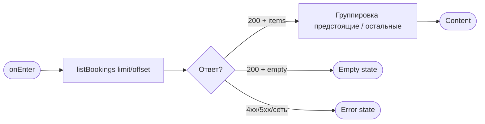
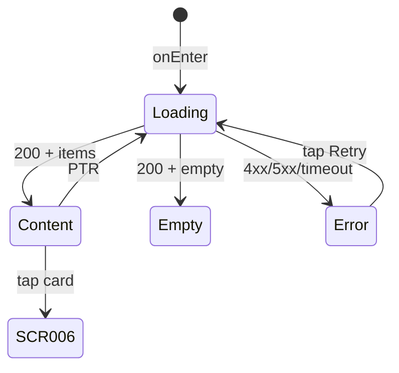

# Мои записи

**ID:** SCR-005  
**Тип:** Экран  
**Домен:** 03. Мои бронирования  
**Приоритет:** Critical  
**Статус:** Черновик  
**Функциональные блоки:** FB-BOOKINGS-001 (Список броней), FB-BOOKINGS-002 (Статусы и группировка)  
**Зона авторизации:** АЗ  
**Дизайн-макет:** [SCR-005 «Мои бронирования»](../3-design-brief/SCR-005-my-bookings.md) — версия 0.1

---

## Содержание

- [История изменений](#история-изменений)
- [Обзор](#обзор)
- [Навигация](#навигация)
- [Входные данные](#входные-данные)
- [Применяемые логики](#применяемые-логики)
- [Инициализация](#инициализация)
- [Используемые запросы](#используемые-запросы)
- [Макет экрана](#макет-экрана)
- [Элементы экрана](#элементы-экрана)
- [Состояния экрана](#состояния-экрана)
- [Действия пользователя](#действия-пользователя)
- [Связанные требования](#связанные-требования)
- [Критерии приёмки](#критерии-приёмки)

---

## История изменений

| Релиз | ТЗ | Описание изменений |
|-------|-----|-------------------|
| 0.1 | [SCR-005](../3-design-brief/SCR-005-my-bookings.md) | Первоначальная версия ТЗ на экран «Мои записи» для скалодрома «Вертикаль». |

---

## Обзор

**SCR-005 «Мои записи»** — корневая вкладка таб-бара «Мои записи». Показывает список **своих бронирований** с актуальным статусом и параметрами слота: дата/время, зона/формат, инструктор, вариант снаряжения, цена. Включает все статусы: `active`, `cancelled`, `late_cancel`, `club_cancelled` (FR-12, FR-16).

Список загружается запросом `listBookings` (`GET /bookings`) с пагинацией. **Группировка на клиенте:**
- **Предстоящие** — `status = active` и `slot.start_at` в будущем;
- **Прошедшие и отменённые** — прошедшие по времени, отмены клиентом и отмены скалодромом.

Только брони текущего авторизованного клиента (NFR-9).

### User Story

> Как клиент, я хочу видеть список своих записей на тренировки с актуальными статусами,
> чтобы контролировать расписание, перейти к деталям и при необходимости отменить запись.

### Бизнес-ценность

- Контроль записей без обращения к администратору (замена Telegram/тетради).
- Прозрачность отмен скалодромом с указанием причины (FR-16, US-11).
- Быстрый переход к деталям и отмене (UC-4, UC-5).

---

## Навигация

## Навигация

### Входящая (откуда открывается)

| Источник | Триггер | Условие | Передаваемые параметры |
|----------|---------|---------|------------------------|
| Таб-бар | Тап «Мои записи» | Клиент в АЗ | — |
| [BS-002 «Подтверждение записи»](BS-002-booking-success.md) | Тап «Мои записи» | После успешной записи | — |
| Push-уведомление | Тап об отмене скалодромом | `type = club_cancelled` (опционально deep link) | `bookingId` |

### Исходящая (куда ведёт)

| Назначение | Триггер | Передаваемые параметры |
|------------|---------|------------------------|
| [SCR-006 «Детали записи»](SCR-006-booking-details.md) | Тап по карточке брони | `bookingId` |
| [SCR-002 «Список слотов»](SCR-002-slot-list.md) | CTA «Найти тренировку» (empty state) | — |
| [SCR-002](SCR-002-slot-list.md) / [SCR-007](SCR-007-profile.md) | Таб-бар | — |

---

## Входные данные

| Название | Тип | Возможные значения | Описание |
|----------|-----|-------------------|----------|
| `bookingId` | Параметр навигации (deep link) | UUID | Опционально: открыть детали конкретной брони после push |
| `applied_filters` | Состояние | — | На SCR-005 фильтры не используются в MVP |
| `pagination.offset` | Состояние | integer ≥ 0 | Текущее смещение пагинации |
| `pagination.limit` | Конфигурация | integer (дефолт 20) | Размер страницы |

---

## Применяемые логики

| Логика | Элемент/Триггер | Описание |
|--------|-----------------|----------|
| [LOGIC-008 Паттерн состояний экрана](09_Логики/LOGIC-008_Паттерн-состояний-экрана.md) | Загрузка списка, PTR, retry | Loading / Content / Empty / Error по [foundations §5](../3-design-brief/00-foundations.md) |

---

## Инициализация

### Диаграмма загрузки



### Запросы при открытии

| № | Запрос | Критичный | Зависит от | Условие |
|---|--------|-----------|------------|---------|
| 1 | [listBookings](#listbookings) | Да | — | Всегда при открытии / PTR |

---

## Используемые запросы

### listBookings

**Тип:** REST  
**Метод:** GET `/bookings`  
**Спецификация:** [../api/bookings/api.yaml](../api/bookings/api.yaml) → `listBookings`

**Триггер:** Инициализация; pull-to-refresh; подгрузка следующей страницы

**Параметры (query):**

| Параметр | Тип | Обязательность | Источник | Описание |
|----------|-----|----------------|----------|----------|
| `limit` | integer | Нет | `pagination.limit` (дефолт 20) | Размер страницы |
| `offset` | integer | Нет | `pagination.offset` | Смещение |
| `status` | string[] | Нет | — | Не передаётся в MVP — все статусы |

**Обработка ответа:**

| Результат | Условие | UI-реакция |
|-----------|---------|------------|
| Загрузка | — | Скелетон карточек |
| Успех 200 | `items` не пуст | Сгруппированный список; обновить `meta` для пагинации |
| Успех 200 | `items` пуст | Empty: «У вас пока нет записей» + CTA «Найти тренировку» |
| HTTP 401 | — | Refresh-flow; при неуспехе → SCR-001 |
| HTTP 5xx / сеть | — | Error state + «Обновить» ([foundations §6](../3-design-brief/00-foundations.md)) |

> Сортировка сервера: по `slot.start_at` по убыванию. Группировка «предстоящие / остальные» — на клиенте по `status` и `slot.start_at`.

---

## Макет экрана

### Структура

```
┌─────────────────────────────────┐
│  Мои записи                      │  ← хедер (без «назад»)
├─────────────────────────────────┤
│  Предстоящие                      │
│  ┌───────────────────────────┐  │
│  │ 9 июл · 18:00              │  │
│  │ Болдеринг · Своё           │  │
│  │ 1 200 ₽                    │  │
│  └───────────────────────────┘  │
│                                  │
│  Прошедшие и отменённые          │
│  ┌───────────────────────────┐  │
│  │ [Отменена скалодромом]     │  │
│  │ Профилактика зоны          │  │
│  └───────────────────────────┘  │
├─────────────────────────────────┤
│ [Тренировки] [Мои записи] [Профиль]│
└─────────────────────────────────┘
```

### Компоненты

| Компонент | Описание | Обязательность |
|-----------|----------|----------------|
| Хедер «Мои записи» | Заголовок корневого экрана | Да |
| Секция «Предстоящие» | Заголовок группы | Да (если есть элементы) |
| Секция «Прошедшие и отменённые» | Заголовок группы | Да (если есть элементы) |
| Карточка брони | Краткая сводка + бейдж статуса | Да |
| Pull-to-refresh | Обновление списка | Да |
| Таб-бар | Три вкладки АЗ | Да |
| Empty state | Заглушка + CTA | При пустом списке |
| Error state | Заглушка + «Обновить» | При ошибке загрузки |

---

## Элементы экрана

### 1. Карточка брони

| Элемент | Описание | Источник данных | Валидация | Действие |
|---------|----------|-----------------|-----------|----------|
| Дата/время | «9 июл · 18:00» | `item.slot.start_at` | — | Тап → [SCR-006](SCR-006-booking-details.md) |
| Зона/формат | Название формата | `item.slot.zone_format.name` | — | — |
| Инструктор | Имя (caption) | `item.slot.instructor_info.name` | — | — |
| Снаряжение | «Своё» / «Прокатное» | `item.equipment` | — | — |
| Цена | `price_total` ₽ | `item.price_total` | — | — |
| Бейдж статуса | Текст + цвет/иконка | `item.status` + время | — | — |
| Причина отмены | Текст под бейджем | `item.cancellation_reason` | — | Только для `club_cancelled` |

**Логика — бейджи статусов:**

| `status` | Бейдж | Примечание |
|----------|-------|------------|
| `active` | «Активна» или без бейджа | Если `start_at` в будущем — секция «Предстоящие» |
| `cancelled` | «Отменена» | Ранняя отмена клиентом |
| `late_cancel` | «Поздняя отмена» | Место не освобождено |
| `club_cancelled` | «Отменена скалодромом» | + `cancellation_reason` |
| *(производное)* | «Прошедшая» | `start_at` в прошлом при `active` |

- Статусы дублируются **текстом/иконкой**, не только цветом ([foundations §3.2](../3-design-brief/00-foundations.md)).
- Лейблы снаряжения: `own` → «Своё снаряжение» (кратко «Своё»), `rental` → «Прокатное».

### 2. Empty state

| Элемент | Описание | Источник данных | Валидация | Действие |
|---------|----------|-----------------|-----------|----------|
| Текст | «У вас пока нет записей» | — | — | — |
| CTA «Найти тренировку» | Primary button | — | — | [SCR-002](SCR-002-slot-list.md), таб «Тренировки» |

---

## Состояния экрана

### Таблица состояний

| Состояние | Условие | Отображение |
|-----------|---------|-------------|
| Loading | Ожидание `listBookings` | Скелетон карточек |
| Content | 200 + items | Сгруппированный список |
| Empty | 200 + empty | «У вас пока нет записей» + CTA |
| Error | 4xx/5xx/сеть | Error state + «Обновить» |
| PTR loading | Pull-to-refresh | Индикатор обновления; снек при ошибке PTR |

### Диаграмма переходов



---

## Действия пользователя

| Действие | Элемент | Триггер | Результат |
|----------|---------|---------|-----------|
| Обновить список | Pull-to-refresh | Swipe | Повтор `listBookings` |
| Открыть детали | Карточка брони | Tap | [SCR-006](SCR-006-booking-details.md) с `bookingId` |
| Найти тренировку | CTA empty state | Tap | [SCR-002](SCR-002-slot-list.md) |
| Повторить загрузку | «Обновить» | Tap | Повтор `listBookings` |
| Подгрузить ещё | Скролл к концу | Scroll | `listBookings` с увеличенным `offset` |

---

## Связанные требования

### Функциональные (REQ-FUNC-*)

| ID | Название | Приоритет |
|----|----------|-----------|
| FR-12 | Список броней с параметрами слота и статусом | Must |
| FR-16 | Статус «Отменена скалодромом» + причина | Must |

### Интеграции (REQ-INT-*)

| ID | Название | Приоритет |
|----|----------|-----------|
| REQ-INT-BOOKINGS | Bookings API: `listBookings` ([../api/bookings/api.yaml](../api/bookings/api.yaml)) | Critical |

### UI (REQ-UI-*)

| ID | Название | Приоритет |
|----|----------|-----------|
| US-9 | Контроль своих записей | Must |
| US-11 | Видеть отмену скалодромом | Must |

### Данные (REQ-DATA-*)

| ID | Название | Приоритет |
|----|----------|-----------|
| NFR-9 | Только свои брони текущего клиента | Critical |

---

## Критерии приёмки

### Позитивные сценарии

| ID | Критерий | Приоритет |
|----|----------|-----------|
| AC-001 | **Дано** у клиента есть брони всех статусов, **Когда** открыт SCR-005, **Тогда** отображаются `active`, `cancelled`, `late_cancel`, `club_cancelled`; для `club_cancelled` — причина | P0 |
| AC-002 | **Дано** есть предстоящие и прошедшие/отменённые, **Когда** список загружен, **Тогда** секции «Предстоящие» и «Прошедшие и отменённые» визуально разделены | P0 |
| AC-003 | **Дано** клиент авторизован, **Когда** выполняется `listBookings`, **Тогда** возвращаются только его брони | P0 |
| AC-004 | **Дано** список пуст, **Когда** API вернул empty, **Тогда** «У вас пока нет записей» и CTA «Найти тренировку» | P1 |

### Негативные сценарии

| ID | Критерий | Приоритет |
|----|----------|-----------|
| AC-N01 | **Дано** ошибка сети, **Когда** открытие экрана, **Тогда** error state с «Обновить» | P0 |
| AC-N02 | **Дано** ошибка PTR, **Когда** pull-to-refresh, **Тогда** снек ошибки, предыдущий список сохранён | P1 |

### Граничные условия (Edge Cases)

| ID | Критерий | Приоритет |
|----|----------|-----------|
| AC-E01 | **Дано** deep link с `bookingId`, **Когда** открыт SCR-005, **Тогда** после загрузки списка открывается SCR-006 для указанной брони | P2 |
| AC-E02 | **Дано** больше записей, чем `limit`, **Когда** скролл к концу, **Тогда** подгружается следующая страница | P2 |

---
