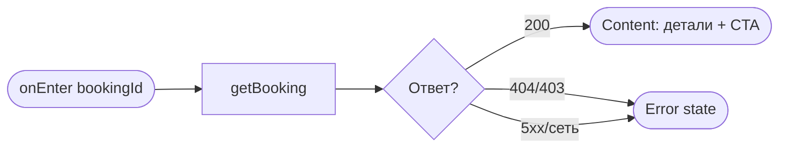
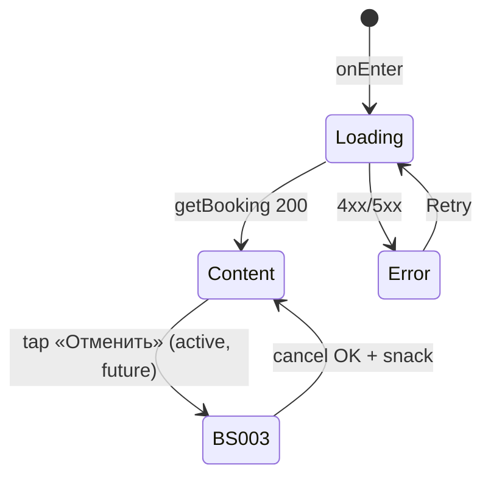

# Детали записи

**ID:** SCR-006  
**Тип:** Экран  
**Домен:** 03. Мои бронирования  
**Приоритет:** Critical  
**Статус:** Черновик  
**Функциональные блоки:** FB-BOOKINGS-003 (Детали брони), FB-BOOKINGS-004 (Отмена записи)  
**Зона авторизации:** АЗ  
**Дизайн-макет:** [SCR-006 «Детали брони + отмена»](../3-design-brief/SCR-006-booking-details.md) — версия 0.1

> **Карта маршрута отсутствует** — экран показывает только параметры брони и слота; навигация к карте не предусмотрена (MVP скалодрома «Вертикаль»).

---

## Содержание

- [История изменений](#история-изменений)
- [Обзор](#обзор)
- [Навигация](#навигация)
- [Входные данные](#входные-данные)
- [Применяемые логики](#применяемые-логики)
- [Инициализация](#инициализация)
- [Используемые запросы](#используемые-запросы)
- [Макет экрана](#макет-экрана)
- [Элементы экрана](#элементы-экрана)
- [Состояния экрана](#состояния-экрана)
- [Действия пользователя](#действия-пользователя)
- [Связанные требования](#связанные-требования)
- [Критерии приёмки](#критерии-приёмки)

---

## История изменений

| Релиз | ТЗ | Описание изменений |
|-------|-----|-------------------|
| 0.1 | [SCR-006](../3-design-brief/SCR-006-booking-details.md) | Первоначальная версия ТЗ: детали брони и точка входа в отмену для «Вертикаль». |

---

## Обзор

**SCR-006 «Детали записи»** — вложенный экран просмотра одной брони и точка входа в **отмену записи** клиентом (FR-13). Показывает полные параметры: дата/время, зона/формат, инструктор, снаряжение, итоговая цена, статус, правило отмены 2 часов.

Для статуса **`club_cancelled`** отображается **причина отмены** (`cancellation_reason`) — блок вместо CTA отмены (FR-16, UC-5).

После успешной отмены через [BS-003](BS-003-cancel-confirm.md) экран обновляет статус; **снек успеха показывает SCR-006** (родитель шторки):
- ранняя отмена → «Бронь отменена»;
- поздняя → «Поздняя отмена: место не освобождено (правило 2 часов). Штраф не взимается.» ([foundations §6.1](../3-design-brief/00-foundations.md)).

Таб-бар скрыт.

### User Story

> Как клиент, я хочу видеть детали своей записи и при необходимости отменить её до старта тренировки, понимая правило 2 часов,
> чтобы управлять планами без скрытых штрафов.

### Бизнес-ценность

- Прозрачность правил отмены (BR-3, P6).
- Единая точка отмены с подтверждением последствий (UC-4).
- Информирование об отмене скалодромом (US-11).

---

## Навигация

### Входящая (откуда открывается)

| Источник | Триггер | Условие | Передаваемые параметры |
|----------|---------|---------|------------------------|
| [SCR-005 «Мои записи»](SCR-005-my-bookings.md) | Тап по карточке | Всегда | `bookingId` |
| Push-уведомление | Тап (напоминание / отмена) | Опционально deep link | `bookingId` |

### Исходящая (куда ведёт)

| Назначение | Триггер | Передаваемые параметры |
|------------|---------|------------------------|
| [BS-003 «Подтверждение отмены»](BS-003-cancel-confirm.md) | Тап «Отменить запись» | `booking` (текущий объект) |
| [SCR-005 «Мои записи»](SCR-005-my-bookings.md) | «Назад» | — |

---

## Входные данные

| Название | Тип | Возможные значения | Описание |
|----------|-----|-------------------|----------|
| `bookingId` | Параметр навигации | UUID | Идентификатор брони |
| `booking` | Состояние / Кэш | объект `Booking` | Данные после `getBooking`; обновляются после отмены |
| `pending_snack` | Состояние (transient) | текст снека | Снек после закрытия BS-003 (ранняя/поздняя отмена) |

---

## Применяемые логики

| Логика | Элемент/Триггер | Описание |
|--------|-----------------|----------|
| [LOGIC-004 Отмена: правило 2 часов](09_Логики/LOGIC-004_Отмена-правило-2-часов.md) | CTA «Отменить запись», блок правила, BS-003 | Доступность отмены; тексты ранней/поздней отмены; сервер — источник истины |
| [LOGIC-008 Паттерн состояний экрана](09_Логики/LOGIC-008_Паттерн-состояний-экрана.md) | Первичная загрузка | Loading / Content / Error |

---

## Инициализация

### Диаграмма загрузки



### Запросы при открытии

| № | Запрос | Критичный | Зависит от | Условие |
|---|--------|-----------|------------|---------|
| 1 | [getBooking](#getbooking) | Да | — | Всегда |

---

## Используемые запросы

### getBooking

**Тип:** REST  
**Метод:** GET `/bookings/{bookingId}`  
**Спецификация:** [../api/bookings/api.yaml](../api/bookings/api.yaml) → `getBooking`

**Триггер:** Инициализация; актуализация после отмены / ошибки 409 / 422

**Параметры:**

| Параметр | Тип | Обязательность | Источник | Описание |
|----------|-----|----------------|----------|----------|
| `bookingId` | string (uuid), path | Да | Параметр навигации | ID брони |

**Обработка ответа:**

| Результат | Условие | UI-реакция |
|-----------|---------|------------|
| Загрузка | — | Скелетон деталей |
| Успех 200 | `Booking` | Content: детали + условный CTA |
| HTTP 403 / 404 | — | Error state + «Обновить» / возврат на SCR-005 |
| HTTP 5xx / сеть | — | Error state + «Обновить» |

---

### cancelBooking

**Тип:** REST  
**Метод:** POST `/bookings/{bookingId}/cancel`  
**Спецификация:** [../api/bookings/api.yaml](../api/bookings/api.yaml) → `cancelBooking`

**Триггер:** Подтверждение в [BS-003](BS-003-cancel-confirm.md) (не на SCR-006 напрямую)

> Полное описание — в [BS-003](BS-003-cancel-confirm.md) и [LOGIC-004](09_Логики/LOGIC-004_Отмена-правило-2-часов.md). После успеха SCR-006 обновляет UI и показывает снек.

---

## Макет экрана

### Структура

```
┌─────────────────────────────────┐
│ ‹ Назад        Детали записи     │
├─────────────────────────────────┤
│  [ Активна ]                     │  ← бейдж статуса
│                                  │
│  Ср, 9 июля · 18:00              │
│  Болдеринг с инструктажем        │
│  Инструктор: Анна                │
│  Своё снаряжение                 │
│  Итого: 1 200 ₽                  │
│                                  │
│  ℹ Отмена не позднее чем за 2 ч  │
│    до старта — место             │
│    освобождается...              │
│                                  │
│  ── club_cancelled ──            │
│  [Отменена скалодромом]          │
│  Причина: Профилактика зоны      │
├─────────────────────────────────┤
│  [        Отменить запись      ] │  ← только active + до старта
└─────────────────────────────────┘
```

### Компоненты

| Компонент | Описание | Обязательность |
|-----------|----------|----------------|
| Хедер с «Назад» | Возврат на SCR-005 | Да |
| Бейдж статуса | Текст + иконка | Да |
| Блок параметров | Дата, формат, инструктор, снаряжение, цена | Да |
| Блок правила отмены | Текст из foundations §6 | Да (для active до старта) |
| Блок причины | `cancellation_reason` | Только `club_cancelled` |
| CTA «Отменить запись» | Fixed bottom | Условно |
| Снек (transient) | После отмены через BS-003 | По событию |

---

## Элементы экрана

### 1. Детали брони

| Элемент | Описание | Источник данных | Валидация | Действие |
|---------|----------|-----------------|-----------|----------|
| Бейдж статуса | См. таблицу ниже | `booking.status`, время | — | — |
| Дата/время | Форматированный старт | `booking.slot.start_at` | — | — |
| Зона/формат | Название (+ длительность caption) | `booking.slot.zone_format` | — | — |
| Инструктор | «Инструктор: {имя}» | `booking.slot.instructor_info.name` | — | — |
| Снаряжение | own/rental → лейблы foundations | `booking.equipment` | — | — |
| Итого | «Итого: {price_total} ₽» | `booking.price_total` | — | — |
| Правило отмены | Текст **только из** [foundations §6](../3-design-brief/00-foundations.md) | — | — | — |
| Причина отмены | «Причина: {text}» | `booking.cancellation_reason` | — | Только `club_cancelled` |

**Логика — отображение статусов:**

| `status` | UI |
|----------|-----|
| `active` | Бейдж «Активна»; CTA отмены (если до старта) |
| `cancelled` | «Отменена»; CTA скрыт |
| `late_cancel` | «Поздняя отмена»; CTA скрыт |
| `club_cancelled` | «Отменена скалодромом» + **причина**; CTA скрыт |
| Прошедшая | «Прошедшая» (производное: `active` + `start_at` в прошлом) |

### 2. CTA «Отменить запись»

| Элемент | Описание | Источник данных | Валидация | Действие |
|---------|----------|-----------------|-----------|----------|
| Кнопка «Отменить запись» | Destructive / secondary | — | — | [BS-003](BS-003-cancel-confirm.md) |

**Логика:** [LOGIC-004](09_Логики/LOGIC-004_Отмена-правило-2-часов.md)

**Условия доступности:**
- **Visible + enabled:** `status = active` **и** `slot.start_at` в будущем (UC-4).
- **Hidden/disabled:** `cancelled`, `late_cancel`, `club_cancelled`; тренировка началась → «Тренировка уже началась — отмена недоступна»; уже отменена → «Запись уже отменена».

**После отмены через BS-003:**
- Обновить `booking` из ответа `cancelBooking` или `getBooking`.
- Показать снек на **SCR-006** ([foundations §6.2](../3-design-brief/00-foundations.md)): ранняя — «Бронь отменена»; поздняя — текст поздней отмены из §6.

---

## Состояния экрана

### Таблица состояний

| Состояние | Условие | Отображение |
|-----------|---------|-------------|
| Loading | Ожидание `getBooking` | Скелетон |
| Content | 200 + `Booking` | Детали + условный CTA |
| Error | 4xx/5xx/сеть | Error + «Обновить» |
| Post-cancel snack | Закрытие BS-003 после успеха | Content + снек на SCR-006 |

### Диаграмма переходов



---

## Действия пользователя

| Действие | Элемент | Триггер | Результат |
|----------|---------|---------|-----------|
| Вернуться | «Назад» | Tap | [SCR-005](SCR-005-my-bookings.md) |
| Отменить | «Отменить запись» | Tap | [BS-003](BS-003-cancel-confirm.md) |
| Обновить | «Обновить» (error) | Tap | Повтор `getBooking` |

---

## Связанные требования

### Функциональные (REQ-FUNC-*)

| ID | Название | Приоритет |
|----|----------|-----------|
| FR-12 | Детали брони | Must |
| FR-13 | Отмена до старта | Must |
| FR-14–FR-15 | Правило 2 часов | Must |
| FR-16 | Отмена скалодромом + причина | Must |

### Интеграции (REQ-INT-*)

| ID | Название | Приоритет |
|----|----------|-----------|
| REQ-INT-BOOKINGS | `getBooking`, `cancelBooking` ([../api/bookings/api.yaml](../api/bookings/api.yaml)) | Critical |

### UI (REQ-UI-*)

| ID | Название | Приоритет |
|----|----------|-----------|
| US-9–US-11 | Просмотр, отмена, отмена клуба | Must |

### Данные (REQ-DATA-*)

| ID | Название | Приоритет |
|----|----------|-----------|
| NFR-6 | Корректное отображение последствий отмены | High |

---

## Критерии приёмки

### Позитивные сценарии

| ID | Критерий | Приоритет |
|----|----------|-----------|
| AC-001 | **Дано** активная предстоящая бронь, **Когда** открыт SCR-006, **Тогда** CTA «Отменить запись» доступен, правило 2 ч видно | P0 |
| AC-002 | **Дано** `club_cancelled`, **Когда** открыт SCR-006, **Тогда** показана `cancellation_reason`, CTA отмены отсутствует | P0 |
| AC-003 | **Дано** успешная поздняя отмена через BS-003, **Когда** шторка закрыта, **Тогда** бейдж «Поздняя отмена» и снек из foundations §6.1 | P0 |
| AC-004 | **Дано** успешная ранняя отмена, **Когда** шторка закрыта, **Тогда** снек «Бронь отменена» на SCR-006 | P0 |

### Негативные сценарии

| ID | Критерий | Приоритет |
|----|----------|-----------|
| AC-N01 | **Дано** тренировка началась, **Когда** SCR-006, **Тогда** CTA disabled/hidden с текстом «Тренировка уже началась — отмена недоступна» | P0 |
| AC-N02 | **Дано** бронь уже отменена, **Когда** SCR-006, **Тогда** CTA скрыт, «Запись уже отменена» | P1 |

### Граничные условия (Edge Cases)

| ID | Критерий | Приоритет |
|----|----------|-----------|
| AC-E01 | **Дано** `getBooking` 404, **Когда** открытие, **Тогда** error state, возможен возврат на SCR-005 | P2 |

---
