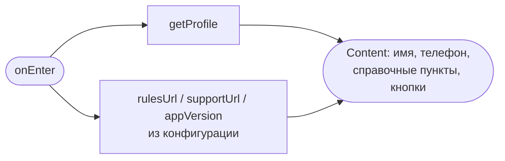
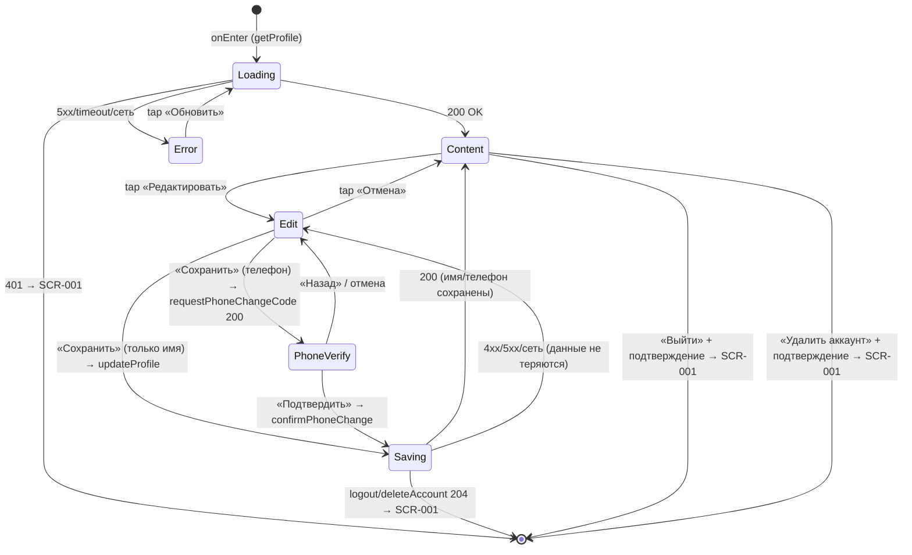

# Профиль клиента

**ID:** SCR-007  
**Тип:** Экран  
**Домен:** 01. Авторизация  
**Приоритет:** Medium  
**Статус:** Черновик  
**Функциональные блоки:** FB-AUTH-002 (Сессия и выход), FB-PROFILE-001 (Контактные данные клиента), FB-PROFILE-002 (Удаление аккаунта)  
**Зона авторизации:** АЗ  
**Дизайн-макет:** — (макет не зафиксирован)

---

## Содержание

- [История изменений](#история-изменений)
- [Обзор](#обзор)
- [Навигация](#навигация)
- [Входные данные](#входные-данные)
- [Применяемые логики](#применяемые-логики)
- [Инициализация](#инициализация)
- [Используемые запросы](#используемые-запросы)
- [Макет экрана](#макет-экрана)
- [Элементы экрана](#элементы-экрана)
- [Состояния экрана](#состояния-экрана)
- [Действия пользователя](#действия-пользователя)
- [Связанные требования](#связанные-требования)
- [Критерии приёмки](#критерии-приёмки)
---

## История изменений

| Релиз | ТЗ | Описание изменений |
|-------|-----|-------------------|
| 0.1.0 | SCR-007 «Профиль клиента» | Первоначальная версия ТЗ: просмотр/редактирование имени и телефона (смена телефона по коду из SMS), выход и удаление аккаунта с подтверждением, справочные пункты. |

---

## Обзор

SCR-007 — корневой экран авторизованной зоны (АЗ), доступный по табу «Профиль». Назначение в MVP:

- **Показать собственные контактные данные** клиента — имя и телефон — и дать их отредактировать (FR-1, FR-2). Данные читаются запросом `getProfile` (GET `/profile`).
- **Режим просмотра / редактирования.** По «Редактировать» поля становятся вводимыми. Смена **только имени** → `updateProfile` (PATCH `/profile`) без подтверждения кодом. Смена **телефона** (телефон — логин) подтверждается кодом из SMS: `requestPhoneChangeCode` (POST `/profile/phone/request-code`) + `confirmPhoneChange` (POST `/profile/phone/confirm`) — как шаг 2 OTP-флоу на [SCR-001](SCR-001-registration.md).
- **Выход из аккаунта** → `logout` (POST `/auth/logout`) с обязательным подтверждением → [SCR-001](SCR-001-registration.md).
- **Удаление аккаунта** (деструктивно, ПДн) → `deleteAccount` (DELETE `/profile`) с обязательным явным подтверждением → [SCR-001](SCR-001-registration.md). **Последствия удаления (R-009):** активные брони (`status = active`) **аннулируются и освобождают места и прокатные доски** в своих слотах; прошедшие/завершённые брони **анонимизируются** (обезличиваются от ПДн), но остаются в данных клуба для статистики.
- **Справочные пункты** — «Правила клуба», «Поддержка» (URL из конфигурации), «Версия приложения» (текст из сборки).

Экран показывает **только данные текущего клиента** (NFR-11, NFR-12): чужие данные и любые административные функции отсутствуют. Это не «личный кабинет»: ленты записей здесь нет (см. [SCR-005](SCR-005-my-bookings.md)), управления уведомлениями нет — запрос push-разрешения на этом экране **не показывается** (он в [BS-002](BS-002-booking-success.md), см. [foundations §8.1](../3-design-brief/00-foundations.md#81-напоминания-и-уведомления-fr-33-nfr-13)). Таб-бар на экране виден (корневой экран АЗ).

### User Story

> Как клиент SUP-клуба, я хочу видеть и при необходимости менять своё имя и номер телефона, а также безопасно выходить из аккаунта,
> чтобы быть уверенным, что вошёл под своими данными, и чтобы под моим аккаунтом не записались другие на чужом устройстве.

### Бизнес-ценность

- Контроль клиента над своими ПДн: проверка и актуализация имени/телефона (FR-1, FR-2).
- Защита от случайного выхода и необратимого удаления — обязательные подтверждения (P1).
- Прозрачность и доверие: правила клуба, контакты поддержки и версия приложения доступны из одного места.

---

## Навигация

### Входящая (откуда открывается)

| Источник | Триггер | Условие | Передаваемые параметры |
|----------|---------|---------|------------------------|
| Таб-бар АЗ ([foundations §4.2](../3-design-brief/00-foundations.md#42-таб-бар-авторизованная-зона)) | Тап на таб «Профиль» | Пользователь авторизован (есть активная сессия) | — |

> Это единственная точка входа на экран. Экран корневой, поэтому таб-бар на нём виден; активна вкладка «Профиль».

### Исходящая (куда ведёт)

| Назначение | Триггер | Передаваемые параметры |
|------------|---------|------------------------|
| [SCR-001 Регистрация / Вход](SCR-001-registration.md) | «Выйти» + подтверждение → `logout` 204 (сессия завершена, `token` стёрт) | — |
| [SCR-001 Регистрация / Вход](SCR-001-registration.md) | «Удалить аккаунт» + подтверждение → `deleteAccount` 204 (аккаунт удалён, сессия завершена) | — |
| [SCR-002 Список слотов](SCR-002-slot-list.md) | Тап на таб «Прогулки» | — |
| [SCR-005 Мои записи](SCR-005-my-bookings.md) | Тап на таб «Мои записи» | — |
| Правила клуба (внешний ресурс) | Тап на «Правила клуба ›» | URL из конфигурации |
| Поддержка (внешний ресурс) | Тап на «Поддержка ›» | URL/контакт из конфигурации |

> После выхода или удаления аккаунта пользователь попадает в неавторизованную зону; вернуться к авторизованным экранам без повторного входа нельзя.

---

## Входные данные

| Название | Тип | Возможные значения | Описание |
|----------|-----|-------------------|----------|
| `token` | Защищённое хранилище (Keychain / Keystore) | JWT-строка | Bearer-токен активной сессии; передаётся в `Authorization: Bearer <token>` для всех запросов экрана. После `logout`/`deleteAccount` стирается. |
| `rulesUrl` | Remote Config / конфигурация | URL-строка | Адрес страницы «Правила клуба». |
| `supportUrl` | Remote Config / конфигурация | URL-строка / контакт | Адрес/контакт поддержки. |
| `appVersion` | Сборка приложения | строка (пример `1.0.0`) | Версия приложения; нередактируемый текст. |
| `name` | Состояние экрана (из `getProfile`) | строка 1–100 символов / пусто | Имя клиента для отображения и предзаполнения поля в режиме редактирования. |
| `phone` | Состояние экрана (из `getProfile`) | E.164, `^\+[1-9]\d{1,14}$` | Телефон клиента для отображения и предзаполнения поля. |
| `newPhone` | Состояние флоу смены телефона | E.164 | Введённый новый номер; хранится между шагом ввода и шагом подтверждения кодом. |

> Числовые величины OTP не зашиваются в UI: длина кода — из паттерна `^\d{4,6}$`, таймер повтора — из `resend_after_seconds`, срок жизни — из `ttl_seconds` (ответ `requestPhoneChangeCode`).

---

## Применяемые логики

| Логика | Элемент/Триггер | Описание |
|--------|-----------------|----------|
| [LOGIC-001 OTP-авторизация](09_Логики/LOGIC-001_OTP-авторизация.md) | Смена телефона: «Сохранить» при изменённом `phone` → шаг кода | Подтверждение нового номера кодом из SMS (как шаг 2 SCR-001): `requestPhoneChangeCode` → ввод кода → `confirmPhoneChange`; таймер повтора, обработка ошибок кода. |
| [LOGIC-008 Паттерн состояний экрана](09_Логики/LOGIC-008_Паттерн-состояний-экрана.md) | Инициализация / загрузка профиля; действия (Сохранить / Подтвердить / Выйти / Удалить аккаунт) | Сквозной паттерн Loading → Content / Error для чтения данных профиля (`getProfile`); состояние Empty неприменимо (у авторизованного клиента телефон есть всегда). Поведение действий — лоадер на кнопке + блокировка повторного тапа ([Шаг 5](09_Логики/LOGIC-008_Паттерн-состояний-экрана.md#шаг-5-состояние-действий-кнопки-отправки)) и снеки результата ([Шаг 6](09_Логики/LOGIC-008_Паттерн-состояний-экрана.md#шаг-6-каталог-снеков-success--error--info)). |
| [LOGIC-007 Запрос push-разрешения](09_Логики/LOGIC-007_Запрос-push-разрешения.md) | — | **Не применяется.** Запрос разрешения на push показывается только после первой успешной записи на [BS-002](BS-002-booking-success.md); на экране профиля он **не запрашивается** (управления уведомлениями в MVP нет — см. [foundations §8.1](../3-design-brief/00-foundations.md#81-напоминания-и-уведомления-fr-33-nfr-13)). |

---

## Инициализация

> **Примечание:** При открытии экрана отправляется один критичный запрос `getProfile` для чтения имени и телефона. Справочные значения (`rulesUrl`, `supportUrl`, `appVersion`) — из конфигурации/сборки, сетевых запросов не требуют. Действия (редактирование, смена телефона, выход, удаление) инициируются пользователем, а не открытием экрана.

### Диаграмма загрузки



### Запросы при открытии

| № | Запрос | Критичный | Зависит от | Условие |
|---|--------|-----------|------------|---------|
| 1 | [getProfile](#getprofile) | Да | — | Всегда |

> Полное описание запросов см. в секции [Используемые запросы](#используемые-запросы).

---

## Используемые запросы

> Все API-запросы экрана с полным описанием параметров и обработки ответов. Тип — REST. GraphQL не используется.

### getProfile

**Тип:** REST  
**Метод:** GET  
**Спецификация:** [../api/profile/api.yaml](../api/profile/api.yaml) → `getProfile`

**Триггер:** Инициализация экрана

**Параметры:**

| Параметр | Тип | Обязательность | Источник | Описание |
|----------|-----|----------------|----------|----------|
| `Authorization` | string (header) | Да | `token` из защищённого хранилища | Bearer-токен сессии; ответ содержит только данные текущего клиента (NFR-12). |

**Обработка ответа:**

| Результат | Условие | UI-реакция |
|-----------|---------|------------|
| Загрузка | — | Скелетон-шиммер блока данных (две строки «лейбл/значение») |
| Успех 200 | `Client` получен | Отобразить `name` и `phone` (Content, режим просмотра) |
| HTTP 401 | Токен невалиден/просрочен | `token` стёрт → переход на [SCR-001](SCR-001-registration.md) |
| HTTP 5xx / default | — | Error state с кнопкой «Обновить»; «Выйти» остаётся доступной |
| Сеть | Нет соединения | Error state с кнопкой «Обновить»; «Выйти» остаётся доступной |

---

### updateProfile

**Тип:** REST  
**Метод:** PATCH  
**Спецификация:** [../api/profile/api.yaml](../api/profile/api.yaml) → `updateProfile`

**Триггер:** Тап «Сохранить» в режиме редактирования, когда изменено **только имя** (телефон не менялся)

**Параметры:**

| Параметр | Тип | Обязательность | Источник | Описание |
|----------|-----|----------------|----------|----------|
| `name` | string | Да | Поле «Имя» → `UpdateProfileRequest.name` | Новое имя, 1–100 символов. |
| `Authorization` | string (header) | Да | `token` | Bearer-токен сессии. |

**Обработка ответа:**

| Результат | Условие | UI-реакция |
|-----------|---------|------------|
| Загрузка | — | Лоадер на кнопке «Сохранить», повторные тапы заблокированы ([LOGIC-008 Шаг 5](09_Логики/LOGIC-008_Паттерн-состояний-экрана.md#шаг-5-состояние-действий-кнопки-отправки)) |
| Успех 200 | Обновлённый `Client` | Снек успеха «Профиль обновлён» ([foundations §6.1](../3-design-brief/00-foundations.md#61-каталог-снеков-успеха-единые-формулировки)); возврат в режим просмотра с новым именем |
| HTTP 400 | Недопустимый формат имени | Снек/ошибка поля «Проверьте имя — кажется, тут лишние символы»; данные не теряются |
| HTTP 401 | Токен невалиден | `token` стёрт → [SCR-001](SCR-001-registration.md) |
| HTTP 5xx / default | — | Снек «Произошла ошибка. Попробуйте позже»; данные в полях сохраняются |
| Сеть | Нет соединения | Снек «Нет соединения. Проверьте подключение»; данные не теряются |

---

### requestPhoneChangeCode

**Тип:** REST  
**Метод:** POST  
**Спецификация:** [../api/profile/api.yaml](../api/profile/api.yaml) → `requestPhoneChangeCode`

**Триггер:** Тап «Сохранить» в режиме редактирования, когда изменён **телефон** (переход к шагу подтверждения кодом)

**Параметры:**

| Параметр | Тип | Обязательность | Источник | Описание |
|----------|-----|----------------|----------|----------|
| `new_phone` | string | Да | Поле «Телефон» → `ChangePhoneRequestCodeRequest.new_phone` | Новый номер в E.164, `^\+[1-9]\d{1,14}$`. |
| `Authorization` | string (header) | Да | `token` | Bearer-токен сессии. |

**Обработка ответа:**

| Результат | Условие | UI-реакция |
|-----------|---------|------------|
| Загрузка | — | Лоадер на кнопке «Сохранить», повторные тапы заблокированы ([LOGIC-008 Шаг 5](09_Логики/LOGIC-008_Паттерн-состояний-экрана.md#шаг-5-состояние-действий-кнопки-отправки)) |
| Успех 200 | `RequestCodeResponse` (`ttl_seconds`, `resend_after_seconds`) | Переход к шагу подтверждения «Подтвердите новый номер кодом из SMS.»; запуск таймера повтора |
| HTTP 400 | Неверный формат номера | Снек/ошибка поля «Похоже, номер введён не полностью»; код не отправлен |
| HTTP 401 | Токен невалиден | `token` стёрт → [SCR-001](SCR-001-registration.md) |
| HTTP 409 | Номер уже занят другим клиентом | Снек «Этот номер уже используется. Укажите другой» |
| HTTP 429 | Слишком частые запросы | Снек «Слишком много попыток. Подождите немного»; кнопка повтора по таймеру `resend_after_seconds` |
| HTTP 5xx / default | — | Снек «Произошла ошибка. Попробуйте позже» |
| Сеть | Нет соединения | Снек «Нет соединения. Проверьте подключение» |

---

### confirmPhoneChange

**Тип:** REST  
**Метод:** POST  
**Спецификация:** [../api/profile/api.yaml](../api/profile/api.yaml) → `confirmPhoneChange`

**Триггер:** Тап «Подтвердить» на шаге ввода кода смены телефона

**Параметры:**

| Параметр | Тип | Обязательность | Источник | Описание |
|----------|-----|----------------|----------|----------|
| `new_phone` | string | Да | `newPhone` (состояние) → `ChangePhoneConfirmRequest.new_phone` | Подтверждаемый новый номер, E.164. |
| `code` | string | Да | Поле «Код из SMS» → `ChangePhoneConfirmRequest.code` | OTP-код, `^\d{4,6}$`. |
| `Authorization` | string (header) | Да | `token` | Bearer-токен сессии. |

**Обработка ответа:**

| Результат | Условие | UI-реакция |
|-----------|---------|------------|
| Загрузка | — | Лоадер на кнопке «Подтвердить», повторные тапы заблокированы ([LOGIC-008 Шаг 5](09_Логики/LOGIC-008_Паттерн-состояний-экрана.md#шаг-5-состояние-действий-кнопки-отправки)) |
| Успех 200 | Обновлённый `Client` | Снек успеха «Изменения сохранены» ([foundations §6.1](../3-design-brief/00-foundations.md#61-каталог-снеков-успеха-единые-формулировки)); возврат в просмотр с новым телефоном |
| HTTP 400 | Неверный/просроченный код | Ошибка поля «Неверный код. Проверьте и введите ещё раз» |
| HTTP 401 | Токен невалиден | `token` стёрт → [SCR-001](SCR-001-registration.md) |
| HTTP 409 | Номер занят к моменту подтверждения | Снек «Этот номер уже используется. Укажите другой» |
| HTTP 5xx / default | — | Снек «Произошла ошибка. Попробуйте позже» |
| Сеть | Нет соединения | Снек «Нет соединения. Проверьте подключение» |

---

### logout

**Тип:** REST  
**Метод:** POST  
**Спецификация:** [../api/auth/api.yaml](../api/auth/api.yaml) → `logout`

**Триггер:** Подтверждение «Выйти» в мини-шторке подтверждения выхода

**Параметры:**

| Параметр | Тип | Обязательность | Источник | Описание |
|----------|-----|----------------|----------|----------|
| `Authorization` | string (header) | Да | `token` | Bearer-токен завершаемой сессии (инвалидируется на бэкенде). |

**Обработка ответа:**

| Результат | Условие | UI-реакция |
|-----------|---------|------------|
| Загрузка | — | Лоадер на кнопке «Выйти», повторные тапы заблокированы ([LOGIC-008 Шаг 5](09_Логики/LOGIC-008_Паттерн-состояний-экрана.md#шаг-5-состояние-действий-кнопки-отправки)) |
| Успех 204 | — | `token` стёрт; переход на [SCR-001](SCR-001-registration.md). **Снек успеха не показывается** — обратная связь — сам переход на SCR-001 ([foundations §6.1](../3-design-brief/00-foundations.md#61-каталог-снеков-успеха-единые-формулировки)) |
| HTTP 401 | Токен уже невалиден | Сессия считается завершённой; `token` стёрт → [SCR-001](SCR-001-registration.md) |
| HTTP 5xx / default | — | Снек «Не удалось выйти. Проверьте соединение и попробуйте снова.»; пользователь остаётся в аккаунте |
| Сеть | Нет соединения | Снек «Не удалось выйти. Проверьте соединение и попробуйте снова.»; пользователь остаётся в аккаунте |

---

### deleteAccount

**Тип:** REST  
**Метод:** DELETE  
**Спецификация:** [../api/profile/api.yaml](../api/profile/api.yaml) → `deleteAccount`

**Триггер:** Подтверждение «Удалить аккаунт» в мини-шторке подтверждения удаления (деструктивное действие)

**Параметры:**

| Параметр | Тип | Обязательность | Источник | Описание |
|----------|-----|----------------|----------|----------|
| `Authorization` | string (header) | Да | `token` | Bearer-токен сессии текущего клиента; удаляются только его данные (NFR-11/12). |

**Обработка ответа:**

| Результат | Условие | UI-реакция |
|-----------|---------|------------|
| Загрузка | — | Лоадер на кнопке «Удалить аккаунт», повторные тапы заблокированы ([LOGIC-008 Шаг 5](09_Логики/LOGIC-008_Паттерн-состояний-экрана.md#шаг-5-состояние-действий-кнопки-отправки)) |
| Успех 204 | — | Аккаунт и ПДн удалены; **активные брони аннулированы и освободили места и прокатные доски** в слотах, прошедшие — **анонимизированы** (R-009); сессия завершена, `token` стёрт → [SCR-001](SCR-001-registration.md). Снек успеха «Аккаунт удалён» показывается **на экране входа** ([SCR-001](SCR-001-registration.md)) после выхода из сессии ([foundations §6.1](../3-design-brief/00-foundations.md#61-каталог-снеков-успеха-единые-формулировки)) |
| HTTP 401 | Токен невалиден | `token` стёрт → [SCR-001](SCR-001-registration.md) |
| HTTP 5xx / default | — | Снек «Произошла ошибка. Попробуйте позже»; аккаунт не удалён, пользователь остаётся в профиле |
| Сеть | Нет соединения | Снек «Нет соединения. Проверьте подключение»; аккаунт не удалён |

---

### Матрица состояния действий (лоадер + блокировка + снек успеха)

> Единое поведение для всех действий экрана по [LOGIC-008 Шаг 5](09_Логики/LOGIC-008_Паттерн-состояний-экрана.md#шаг-5-состояние-действий-кнопки-отправки) (лоадер на кнопке + блокировка повторного тапа на время запроса) и [Шаг 6](09_Логики/LOGIC-008_Паттерн-состояний-экрана.md#шаг-6-каталог-снеков-success--error--info) (снеки результата). Тексты снеков успеха — из [foundations §6.1](../3-design-brief/00-foundations.md#61-каталог-снеков-успеха-единые-формулировки) и не дублируются здесь своими формулировками.

| Действие (запрос) | Кнопка с лоадером | На время запроса | Снек успеха |
|-------------------|-------------------|------------------|-------------|
| Сохранение имени ([updateProfile](#updateprofile)) | «Сохранить» | Лоадер на кнопке, повторные тапы заблокированы | «Профиль обновлён» |
| Запрос кода смены телефона ([requestPhoneChangeCode](#requestphonechangecode)) | «Сохранить» | Лоадер на кнопке, повторные тапы заблокированы | — (промежуточный шаг: переход к вводу кода) |
| Подтверждение смены телефона ([confirmPhoneChange](#confirmphonechange)) | «Подтвердить» | Лоадер на кнопке, повторные тапы заблокированы | «Изменения сохранены» |
| Выход ([logout](#logout)) | «Выйти» (в шторке) | Лоадер на кнопке, повторные тапы заблокированы | — (снек не показывается; обратная связь — переход на [SCR-001](SCR-001-registration.md)) |
| Удаление аккаунта ([deleteAccount](#deleteaccount)) | «Удалить аккаунт» (в шторке) | Лоадер на кнопке, повторные тапы заблокированы | «Аккаунт удалён» — показывается на [SCR-001](SCR-001-registration.md) после выхода из сессии |

---

## Макет экрана

### Структура

```
┌─────────────────────────────────────┐
│ Профиль                Редактировать│  ← Header (режим просмотра)
├─────────────────────────────────────┤
│                                     │
│  Блок данных (имя, телефон)         │  ← Scrollable content
│  Справочные пункты                  │
│  [ Выйти ] · Удалить аккаунт        │
│                                     │
├─────────────────────────────────────┤
│ Прогулки · Мои записи · ●Профиль    │  ← Tab-bar (foundations §4.2)
└─────────────────────────────────────┘
```

### Режим просмотра (ASCII-макет из брифа §5)

```
┌─────────────────────────────┐
│  Профиль        Редактировать│  ← хедер + вход в редактирование
├─────────────────────────────┤
│  Имя                         │
│  Анна Петрова                │  ← блок данных
│  Телефон                     │
│  +7 999 123-45-67            │
│  · · · · · · · · · · · · ·   │
│  Правила клуба            ›  │  ← справочные пункты
│  Поддержка                ›  │
│  Версия приложения   1.0.0   │
│                              │
│        [   Выйти   ]         │  ← безопасная зона
│      Удалить аккаунт         │  ← деструктивное, с подтверждением
├─────────────────────────────┤
│ Прогулки Мои записи ●Профиль │  ← таб-бар (foundations §4.2)
└─────────────────────────────┘
```

### Режим редактирования (ASCII-макет из брифа §5)

```
┌─────────────────────────────┐
│  ‹ Отмена   Редактирование    │
├─────────────────────────────┤
│  Имя                         │
│  [ Анна Петрова           ]  │  ← поле ввода
│  Телефон                     │
│  [ +7 999 123-45-67       ]  │  ← поле ввода (смена → код из SMS)
├─────────────────────────────┤
│  [        Сохранить       ]  │  ← фикс. CTA
└─────────────────────────────┘
```

### Шаг подтверждения смены телефона (при изменённом телефоне, как шаг 2 SCR-001)

```
┌─────────────────────────────┐
│  ‹ Назад    Подтверждение     │
├─────────────────────────────┤
│  Подтвердите новый номер     │
│  кодом из SMS.               │
│  Код из SMS                  │
│  [ _ _ _ _ ]                 │  ← OTP, числовая клавиатура
│  Отправить код повторно (60) │  ← таймер resend_after_seconds
├─────────────────────────────┤
│  [       Подтвердить      ]  │
└─────────────────────────────┘
```

### Компоненты

| Компонент | Описание | Обязательность |
|-----------|----------|----------------|
| Хедер | Заголовок «Профиль» + кнопка «Редактировать» (просмотр) / «Отмена» + «Редактирование» (редактирование) | Да |
| Блок данных | Пары «лейбл → значение» (имя, телефон); значение крупнее лейбла; в редактировании — поля ввода | Да |
| Поле «Имя» | Однострочное текстовое поле, предзаполнено `name` | Да (режим редактирования) |
| Поле «Телефон» | Поле с маской нац. формата, предзаполнено `phone`; числовая клавиатура | Да (режим редактирования) |
| Поле «Код из SMS» | OTP, 4–6 цифр, числовая клавиатура | Да (шаг смены телефона) |
| Справочные пункты | «Правила клуба ›», «Поддержка ›» (переходы), «Версия приложения» (текст) | Да |
| Кнопка «Выйти» | Тач-зона ≥ 44–48 pt, в безопасной зоне, отделена отступом | Да |
| Кнопка «Удалить аккаунт» | Деструктивная, ниже «Выйти», менее акцентна | Да |
| Кнопка «Сохранить» | Фикс. CTA в режиме редактирования | Да (режим редактирования) |
| Таб-бар | Постоянный, активна вкладка «Профиль» | Да |

---

## Элементы экрана

> **Примечания:**
> - Момент валидации полей имени/телефона — **под полем, при потере фокуса и при сохранении** (тап «Сохранить»); во время набора экран «не ругается». Те же правила и тексты, что на [SCR-001](SCR-001-registration.md) (телефон/имя — единый источник формулировок).
> - Логика, использующая переиспользуемые блоки, описана после таблиц со ссылкой на [09_Логики](09_Логики/_INDEX.md).

### 1. Хедер

| Элемент | Описание | Источник данных | Валидация | Действие |
|---------|----------|-----------------|-----------|----------|
| Заголовок «Профиль» | Статичный заголовок (просмотр) / «Редактирование» (редактирование) | — | — | — |
| Кнопка «Редактировать» | Видна в режиме просмотра | — | — | Перейти в режим редактирования (поля становятся вводимыми) |
| Кнопка «Отмена» | Видна в режиме редактирования | — | — | Выйти из редактирования без сохранения; вернуть исходные значения |

**Условия доступности:**
- «Редактировать» активна только в состоянии Content (после успешного `getProfile`); в Loading/Error скрыта/неактивна.

### 2. Блок данных (просмотр)

| Элемент | Описание | Источник данных | Валидация | Действие |
|---------|----------|-----------------|-----------|----------|
| «Имя» → значение | Имя клиента, крупно и контрастно | `name` из [getProfile](#getprofile) | — | — |
| «Телефон» → значение | Телефон, группировка цифр для читаемости | `phone` из [getProfile](#getprofile) | — | — |

### 3. Блок данных (редактирование)

| Элемент | Описание | Источник данных | Валидация | Действие |
|---------|----------|-----------------|-----------|----------|
| Поле «Имя*» | Однострочное, предзаполнено текущим именем | `name` → `updateProfile.name` / предзаполнение | 1–100 символов (`minLength:1`, `maxLength:100`); ввод сверх **100 символов** не принимается. Пусто → «Укажите, как к вам обращаться». Недопустимый формат (ответ 400) → «Проверьте имя — кажется, тут лишние символы». Правила/тексты — как на [SCR-001](SCR-001-registration.md) | — |
| Поле «Телефон*» | С маской нац. формата, числовая клавиатура, предзаполнено | `phone` → `requestPhoneChangeCode.new_phone` / предзаполнение | Формат E.164 `^\+[1-9]\d{1,14}$`. Пусто → «Введите номер телефона». Неполный/неверный → «Похоже, номер введён не полностью». Правила/тексты — как на [SCR-001](SCR-001-registration.md) | — |
| Кнопка «Сохранить» | Фикс. CTA | — | — | Валидация → ветвление (см. логику) |

**Момент валидации:** имя/телефон — сообщение **под полем**, показывается при потере фокуса и при тапе «Сохранить» (те же правила/тексты, что на [SCR-001](SCR-001-registration.md)).

**Логика:**
- Кнопка «Сохранить»: при тапе валидируются оба поля; затем **ветвление**:
  - изменилось **только имя** → [updateProfile](#updateprofile) → снек «Профиль обновлён» → возврат в просмотр;
  - изменился **телефон** → [LOGIC-001 OTP-авторизация](09_Логики/LOGIC-001_OTP-авторизация.md): [requestPhoneChangeCode](#requestphonechangecode) → шаг кода → [confirmPhoneChange](#confirmphonechange);
  - изменились **оба** → сначала шаг подтверждения телефона кодом, имя сохраняется через [updateProfile](#updateprofile) при возврате.

**Условия доступности:**
- «Сохранить» **disabled**, пока есть невалидное поле или нет ни одного изменения; во время запроса — **Loading**.

### 4. Шаг подтверждения смены телефона

| Элемент | Описание | Источник данных | Валидация | Действие |
|---------|----------|-----------------|-----------|----------|
| Кнопка «Назад» (хедер) | Отмена шага подтверждения, возврат к редактированию | — | — | Откат в режим **Edit** без смены телефона; введённые имя/телефон сохраняются (`newPhone` сбрасывается) |
| Поле «Код из SMS*» | OTP, числовая клавиатура, автофокус | Поле кода → `confirmPhoneChange.code` | Формат `^\d{4,6}$`. Неверный код (ответ 400) → «Неверный код. Проверьте и введите ещё раз» | — |
| Кнопка «Отправить код повторно» | С таймером обратного отсчёта | `resend_after_seconds` | — | Повторно [requestPhoneChangeCode](#requestphonechangecode) |
| Кнопка «Подтвердить» | CTA шага; на время запроса — лоадер, повторные тапы заблокированы ([LOGIC-008 Шаг 5](09_Логики/LOGIC-008_Паттерн-состояний-экрана.md#шаг-5-состояние-действий-кнопки-отправки)) | — | — | [confirmPhoneChange](#confirmphonechange) |

**Момент валидации:** формат кода — при тапе «Подтвердить»; валидность кода проверяет бэкенд.

**Логика:**
- Кнопка «Подтвердить»: [LOGIC-001 OTP-авторизация](09_Логики/LOGIC-001_OTP-авторизация.md) — отправка `confirmPhoneChange`; при 200 телефон обновлён, возврат в просмотр.

**Условия доступности:**
- «Отправить код повторно» активна только по истечении таймера `resend_after_seconds`.

### 5. Справочные пункты

| Элемент | Описание | Источник данных | Валидация | Действие |
|---------|----------|-----------------|-----------|----------|
| «Правила клуба ›» | Строка-переход | `rulesUrl` из конфигурации | — | Открыть внешний ресурс по `rulesUrl` |
| «Поддержка ›» | Строка-переход | `supportUrl` из конфигурации | — | Открыть внешний ресурс/контакт по `supportUrl` |
| «Версия приложения» | Нередактируемый текст | `appVersion` из сборки | — | — |

### 6. Действия с аккаунтом

| Элемент | Описание | Источник данных | Валидация | Действие |
|---------|----------|-----------------|-----------|----------|
| Кнопка «Выйти» | В безопасной зоне, отделена отступом | — | — | Открыть мини-шторку подтверждения выхода |
| Кнопка «Удалить аккаунт» | Деструктивная, ниже «Выйти», менее акцентна | — | — | Открыть мини-шторку подтверждения удаления |

**Логика — мини-шторка подтверждения выхода** (см. [foundations §4.3](../3-design-brief/00-foundations.md#43-bottom-sheet-шторки-bs-001--bs-002--bs-003), §6.2):
- Заголовок «Выйти из аккаунта?»; пояснение «Чтобы снова записаться на прогулку, нужно будет войти по номеру телефона.»
- Два действия: «Выйти» → [logout](#logout); «Отмена» → закрыть шторку, остаться в профиле. Закрытие шторки = отмена.
- При сбое `logout` — снек «Не удалось выйти. Проверьте соединение и попробуйте снова.», пользователь остаётся в аккаунте.

**Логика — мини-шторка подтверждения удаления** (деструктивно, [foundations §4.3](../3-design-brief/00-foundations.md#43-bottom-sheet-шторки-bs-001--bs-002--bs-003), §6.3):
- Заголовок «Удалить аккаунт?»; пояснение «Ваши данные и записи будут удалены безвозвратно. Активные брони отменятся и освободят места, прошедшие — обезличатся. Это действие нельзя отменить.» (последствия по R-009; точная формулировка — за копирайтером)
- Деструктивная «Удалить аккаунт» (менее акцентна) → [deleteAccount](#deleteaccount); акцентная «Отмена» → закрыть, ничего не удалять. Закрытие = отмена.

**Условия доступности:**
- «Выйти» доступна в любом состоянии экрана, включая Error загрузки профиля (выход не зависит от `getProfile`).

---

## Состояния экрана

### Таблица состояний

| Состояние | Условие | Отображение |
|-----------|---------|-------------|
| Loading | Ожидание `getProfile` | Скелетон-шиммер блока данных (две строки «лейбл/значение»); «Выйти» видна, но неактивна до загрузки |
| Content (просмотр) | `getProfile` 200 | Имя, телефон, справочные пункты, кнопки «Редактировать», «Выйти», «Удалить аккаунт» |
| Edit (редактирование) | Тап «Редактировать» | Поля ввода имени/телефона + «Сохранить» / «Отмена» |
| PhoneVerify | «Сохранить» при изменённом телефоне → `requestPhoneChangeCode` 200 | Шаг ввода кода из SMS + «Подтвердить» |
| Saving | Идёт `updateProfile` / `confirmPhoneChange` / `logout` / `deleteAccount` | Индикация процесса, повторные тапы заблокированы |
| Error | `getProfile` 4xx (кроме 401)/5xx/timeout | Заглушка ошибки + кнопка «Обновить»; «Выйти» остаётся доступной |
| Empty | **Неприменимо** | У авторизованного клиента имя/телефон есть всегда — пустого состояния профиля не бывает (см. [LOGIC-008 Шаг 3](09_Логики/LOGIC-008_Паттерн-состояний-экрана.md#шаг-3-empty)) |

### Диаграмма переходов



---

## Действия пользователя

| Действие | Элемент | Триггер | Результат |
|----------|---------|---------|-----------|
| Открыть профиль | Таб «Профиль» | Tap | Загрузка `getProfile`, отображение данных |
| Войти в редактирование | «Редактировать» | Tap | Режим редактирования (поля вводимы) |
| Отменить редактирование | «Отмена» | Tap | Возврат в просмотр без изменений |
| Сохранить имя | «Сохранить» (изменено только имя) | Tap | `updateProfile` → снек «Профиль обновлён» |
| Сменить телефон | «Сохранить» (изменён телефон) | Tap | `requestPhoneChangeCode` → шаг кода → `confirmPhoneChange` |
| Подтвердить новый телефон | «Подтвердить» | Tap | `confirmPhoneChange` → обновлённый телефон в просмотре |
| Выйти | «Выйти» → шторка → «Выйти» | Tap | `logout` → [SCR-001](SCR-001-registration.md) |
| Отменить выход | Шторка выхода → «Отмена» / закрытие | Tap / Swipe | Остаётся в профиле |
| Удалить аккаунт | «Удалить аккаунт» → шторка → «Удалить аккаунт» | Tap | `deleteAccount` → [SCR-001](SCR-001-registration.md) |
| Отменить удаление | Шторка удаления → «Отмена» / закрытие | Tap / Swipe | Аккаунт не удалён, остаётся в профиле |
| Открыть правила клуба | «Правила клуба ›» | Tap | Внешний ресурс по `rulesUrl` |
| Открыть поддержку | «Поддержка ›» | Tap | Внешний ресурс/контакт по `supportUrl` |
| Перейти к прогулкам | Таб «Прогулки» | Tap | [SCR-002](SCR-002-slot-list.md) |
| Перейти к записям | Таб «Мои записи» | Tap | [SCR-005](SCR-005-my-bookings.md) |

---

## Связанные требования

### Функциональные (REQ-FUNC-*)

| ID | Название | Приоритет |
|----|----------|-----------|
| FR-1 | Лёгкая регистрация по имени и телефону без пароля (данные профиля) | Must |
| FR-2 | Авторизация клиента по номеру телефона (выход и возврат к входу; телефон — логин) | Must |

### Данные (REQ-DATA-*)

| ID | Название | Приоритет |
|----|----------|-----------|
| NFR-11 | Безопасность/Приватность: ПДн (имя, телефон) защищены, передаются по Bearer-токену | Высокий |
| NFR-12 | Разграничение доступа: клиент видит и управляет только своими данными; чужих/административных сведений в UI нет | Высокий |

---

## Критерии приёмки

### Позитивные сценарии

| ID | Критерий | Приоритет |
|----|----------|-----------|
| AC-001 | **Дано** клиент авторизован, **Когда** он открывает таб «Профиль», **Тогда** `getProfile` возвращает его данные и отображаются его имя и телефон. | P0 |
| AC-002 | **Дано** клиент в режиме редактирования изменил только имя, **Когда** он нажимает «Сохранить», **Тогда** отправляется `updateProfile`, показывается снек «Профиль обновлён», профиль показывает новое имя — без подтверждения кодом. | P0 |
| AC-003 | **Дано** клиент в режиме редактирования изменил телефон, **Когда** он нажимает «Сохранить», **Тогда** отправляется `requestPhoneChangeCode` и показывается шаг ввода кода из SMS; **И** после верного кода `confirmPhoneChange` обновляет телефон. | P0 |
| AC-004 | **Дано** клиент на экране «Профиль», **Когда** он нажимает «Выйти» и подтверждает в шторке, **Тогда** отправляется `logout`, сессия завершается и он попадает на [SCR-001](SCR-001-registration.md). | P0 |
| AC-005 | **Дано** открыта шторка подтверждения выхода, **Когда** клиент выбирает «Отмена» или закрывает шторку, **Тогда** `logout` не отправляется и он остаётся в профиле. | P0 |
| AC-006 | **Дано** клиент на экране «Профиль», **Когда** он нажимает «Удалить аккаунт» и подтверждает деструктивное действие, **Тогда** отправляется `deleteAccount`, аккаунт и ПДн удаляются, **активные брони аннулируются и освобождают места/прокатные доски**, прошедшие **анонимизируются** (R-009), сессия завершается и он попадает на [SCR-001](SCR-001-registration.md). | P0 |
| AC-007 | **Дано** открыта шторка подтверждения удаления, **Когда** клиент выбирает «Отмена» или закрывает шторку, **Тогда** `deleteAccount` не отправляется и аккаунт не удаляется. | P0 |
| AC-008 | **Дано** клиент авторизован, **Когда** он находится на экране «Профиль», **Тогда** отображаются только его собственные данные — чужие данные и любые административные функции отсутствуют (NFR-11, NFR-12). | P0 |
| AC-009 | **Дано** клиент тапает «Правила клуба» или «Поддержка», **Когда** ссылка задана в конфигурации, **Тогда** открывается соответствующий внешний ресурс; версия приложения отображается как нередактируемый текст. | P1 |

### Негативные сценарии

| ID | Критерий | Приоритет |
|----|----------|-----------|
| AC-N01 | **Дано** загрузка профиля завершилась ошибкой 5xx/сети, **Когда** открыт экран, **Тогда** показывается заглушка ошибки с кнопкой «Обновить», **И** кнопка «Выйти» остаётся доступной. | P0 |
| AC-N02 | **Дано** клиент ввёл имя в недопустимом формате, **Когда** он нажимает «Сохранить», **Тогда** показывается ошибка «Проверьте имя — кажется, тут лишние символы», данные в полях не теряются. | P1 |
| AC-N03 | **Дано** при смене телефона введён неверный код, **Когда** клиент нажимает «Подтвердить» и приходит 400, **Тогда** показывается «Неверный код. Проверьте и введите ещё раз», телефон не меняется. | P1 |
| AC-N04 | **Дано** новый номер уже используется другим клиентом, **Когда** отправляется `requestPhoneChangeCode`/`confirmPhoneChange` и приходит 409, **Тогда** показывается «Этот номер уже используется. Укажите другой». | P1 |
| AC-N05 | **Дано** сбой запроса `logout` (5xx/сеть), **Когда** клиент подтвердил выход, **Тогда** показывается «Не удалось выйти. Проверьте соединение и попробуйте снова.» и он остаётся в аккаунте. | P1 |

### Граничные условия (Edge Cases)

| ID | Критерий | Приоритет |
|----|----------|-----------|
| AC-E01 | **Дано** клиент не изменил ни одного поля в режиме редактирования, **Когда** он смотрит на CTA, **Тогда** кнопка «Сохранить» disabled. | P1 |
| AC-E02 | **Дано** запрошен код смены телефона, **Когда** таймер `resend_after_seconds` не истёк, **Тогда** «Отправить код повторно» неактивна; по истечении таймера — активна. | P2 |
| AC-E03 | **Дано** ответ 401 на `getProfile` (токен просрочен), **Когда** открыт экран, **Тогда** `token` стирается и происходит переход на [SCR-001](SCR-001-registration.md). | P1 |
| AC-E04 | **Дано** потеря сети во время `updateProfile`/`confirmPhoneChange`, **Когда** соединение восстановлено, **Тогда** введённые значения сохранены и доступен повторный «Сохранить»/«Подтвердить». | P2 |

---
