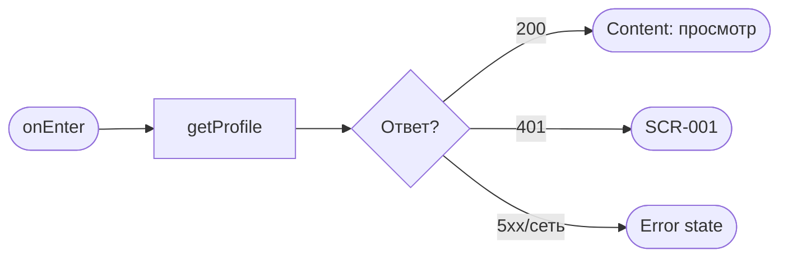
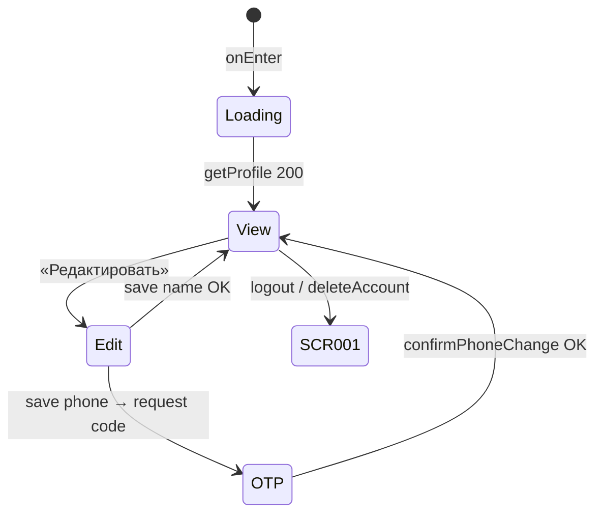

# Профиль

**ID:** SCR-007  
**Тип:** Экран  
**Домен:** 04. Профиль клиента  
**Приоритет:** Medium  
**Статус:** Черновик  
**Функциональные блоки:** FB-PROFILE-001 (Просмотр профиля), FB-PROFILE-002 (Редактирование), FB-AUTH-002 (Сессия и выход)  
**Зона авторизации:** АЗ  
**Дизайн-макет:** [SCR-007 «Профиль клиента»](../3-design-brief/SCR-007-profile.md) — версия 0.1

> Push-уведомления **не управляются** на этом экране — запрос разрешения только на [BS-002](BS-002-booking-success.md) ([foundations §8.1](../3-design-brief/00-foundations.md)).

---

## Содержание

- [История изменений](#история-изменений)
- [Обзор](#обзор)
- [Навигация](#навигация)
- [Входные данные](#входные-данные)
- [Применяемые логики](#применяемые-логики)
- [Инициализация](#инициализация)
- [Используемые запросы](#используемые-запросы)
- [Макет экрана](#макет-экрана)
- [Элементы экрана](#элементы-экрана)
- [Состояния экрана](#состояния-экрана)
- [Действия пользователя](#действия-пользователя)
- [Связанные требования](#связанные-требования)
- [Критерии приёмки](#критерии-приёмки)

---

## История изменений

| Релиз | ТЗ | Описание изменений |
|-------|-----|-------------------|
| 0.1 | [SCR-007](../3-design-brief/SCR-007-profile.md) | Первоначальная версия ТЗ на экран профиля для «Вертикаль». |

---

## Обзор

**SCR-007 «Профиль»** — корневая вкладка таб-бара. В MVP:

- Просмотр и редактирование **имени** и **телефона** (FR-1, FR-2).
- **Выход** из аккаунта (`logout`) с подтверждением.
- **Удаление аккаунта** (`deleteAccount`) с предупреждением; активные брони отменяются на бэкенде.
- Справочные пункты: правила клуба, поддержка, версия приложения.

Не содержит списка записей ([SCR-005](SCR-005-my-bookings.md)). Только данные **текущего** клиента (NFR-9).

Смена **телефона** требует OTP на новый номер (как шаг 2 [SCR-001](SCR-001-registration.md), [LOGIC-001](09_Логики/LOGIC-001_OTP-авторизация.md)).

### User Story

> Как клиент, я хочу просматривать и редактировать имя и телефон, а также безопасно выйти или удалить аккаунт,
> чтобы управлять своими данными на общем устройстве в зале.

### Бизнес-ценность

- Минимальный набор ПДн (P3, NFR-10).
- Безопасный выход на общем устройстве.
- Прозрачное удаление аккаунта с последствиями для активных броней.

---

## Навигация

### Входящая (откуда открывается)

| Источник | Триггер | Условие | Передаваемые параметры |
|----------|---------|---------|------------------------|
| Таб-бар | Тап «Профиль» | Клиент в АЗ | — |

### Исходящая (куда ведёт)

| Назначение | Триггер | Передаваемые параметры |
|------------|---------|------------------------|
| [SCR-001 «Регистрация / Вход»](SCR-001-registration.md) | «Выйти» + подтверждение (`logout`) | — |
| [SCR-001](SCR-001-registration.md) | «Удалить аккаунт» + подтверждение (`deleteAccount`) | снек «Аккаунт удалён» на SCR-001 |
| Inline OTP (модальный шаг) | Смена телефона | `new_phone` → OTP → `confirmPhoneChange` |

---

## Входные данные

| Название | Тип | Возможные значения | Описание |
|----------|-----|-------------------|----------|
| `profile` | Состояние / API | объект `Client` | `id`, `name`, `phone`, `created_at` после `getProfile` |
| `edit_mode` | Состояние UI | `view` / `edit` | Режим просмотра / редактирования |
| `new_phone` | Состояние флоу смены телефона | E.164 | Новый номер до OTP |
| `otp_step` | Состояние UI | `hidden` / `visible` | Шаг ввода кода при смене телефона |

---

## Применяемые логики

| Логика | Элемент/Триггер | Описание |
|--------|-----------------|----------|
| [LOGIC-001 OTP-авторизация](09_Логики/LOGIC-001_OTP-авторизация.md) | Смена телефона: `requestPhoneChangeCode` → ввод кода → `confirmPhoneChange` | OTP на новый номер; таймер повтора |
| [LOGIC-008 Паттерн состояний экрана](09_Логики/LOGIC-008_Паттерн-состояний-экрана.md) | `getProfile` | Loading / Content / Error |

---

## Инициализация

### Диаграмма загрузки



### Запросы при открытии

| № | Запрос | Критичный | Зависит от | Условие |
|---|--------|-----------|------------|---------|
| 1 | [getProfile](#getprofile) | Да | — | Всегда |

---

## Используемые запросы

### getProfile

**Тип:** REST  
**Метод:** GET `/profile`  
**Спецификация:** [../api/profile/api.yaml](../api/profile/api.yaml) → `getProfile`

**Триггер:** Инициализация; возврат из режима редактирования

**Обработка ответа:**

| Результат | Условие | UI-реакция |
|-----------|---------|------------|
| Загрузка | — | Скелетон полей |
| Успех 200 | `Client` | Read-only: имя, телефон |
| HTTP 401 | — | Refresh; при неуспехе → SCR-001 |
| HTTP 5xx / сеть | — | Error + «Обновить» |

---

### updateProfile

**Тип:** REST  
**Метод:** PATCH `/profile`  
**Спецификация:** [../api/profile/api.yaml](../api/profile/api.yaml) → `updateProfile`

**Триггер:** «Сохранить» при изменении **только имени** (телефон не меняется здесь)

**Параметры (тело):**

| Параметр | Тип | Обязательность | Источник | Описание |
|----------|-----|----------------|----------|----------|
| `name` | string | Да | Поле «Имя» | 1–100 символов |

**Обработка ответа:**

| Результат | Условие | UI-реакция |
|-----------|---------|------------|
| Загрузка | — | CTA loading |
| Успех 200 | — | Режим просмотра; снек «Профиль обновлён» |
| HTTP 400 | — | Ошибка валидации имени |
| HTTP 5xx / сеть | — | Снек по foundations §6 |

---

### requestPhoneChangeCode

**Тип:** REST  
**Метод:** POST `/profile/phone/request-code`  
**Спецификация:** [../api/profile/api.yaml](../api/profile/api.yaml) → `requestPhoneChangeCode`

**Триггер:** «Сохранить» при изменении телефона (перед OTP)

**Параметры (тело):**

| Параметр | Тип | Обязательность | Источник | Описание |
|----------|-----|----------------|----------|----------|
| `phone` | string (E.164) | Да | Поле «Телефон» | Новый номер |

**Обработка ответа:**

| Результат | Условие | UI-реакция |
|-----------|---------|------------|
| Успех 200 | — | Показать шаг OTP; таймер `resend_after_seconds` |
| HTTP 409 | номер занят | Снек с `message` |
| HTTP 429 | — | Таймер повтора |
| HTTP 5xx / сеть | — | Снек ошибки |

---

### confirmPhoneChange

**Тип:** REST  
**Метод:** POST `/profile/phone/confirm`  
**Спецификация:** [../api/profile/api.yaml](../api/profile/api.yaml) → `confirmPhoneChange`

**Триггер:** Подтверждение OTP при смене телефона

**Параметры (тело):**

| Параметр | Тип | Обязательность | Источник | Описание |
|----------|-----|----------------|----------|----------|
| `phone` | string | Да | `new_phone` | Новый номер |
| `code` | string | Да | Поле OTP | `^\d{4,6}$` |

**Обработка ответа:**

| Результат | Условие | UI-реакция |
|-----------|---------|------------|
| Успех 200 | обновлённый `Client` | Режим просмотра; снек «Изменения сохранены» |
| HTTP 400 | `invalid_code` | Снек «Код неверен или просрочен…» |
| HTTP 409 | — | Снек с `message` |

---

### logout

**Тип:** REST  
**Метод:** POST `/auth/logout`  
**Спецификация:** [../api/auth/api.yaml](../api/auth/api.yaml) → `logout`

**Триггер:** «Выйти» + подтверждение в диалоге

**Обработка ответа:**

| Результат | Условие | UI-реакция |
|-----------|---------|------------|
| Успех 204 | — | Стереть токены; `deletePushToken` (если был); переход SCR-001 **без снека** |
| HTTP 401 | — | Локально стереть токены → SCR-001 |
| HTTP 5xx / сеть | — | Локально завершить сессию → SCR-001 |

---

### deleteAccount

**Тип:** REST  
**Метод:** DELETE `/profile`  
**Спецификация:** [../api/profile/api.yaml](../api/profile/api.yaml) → `deleteAccount`

**Триггер:** «Удалить аккаунт» + подтверждение (явное предупреждение об отмене активных броней)

**Обработка ответа:**

| Результат | Условие | UI-реакция |
|-----------|---------|------------|
| Успех 204 | — | Стереть токены → SCR-001; снек «Аккаунт удалён» |
| HTTP 5xx / сеть | — | Снек ошибки; остаться на SCR-007 |

---

## Макет экрана

### Структура

```
┌─────────────────────────────────┐
│  Профиль                         │
├─────────────────────────────────┤
│  Имя                             │
│  Мария                           │
│  Телефон                         │
│  +7 999 123-45-67                │
│                                  │
│  [      Редактировать      ]     │
│                                  │
│  Правила клуба                   │
│  Поддержка                       │
│  Версия 1.0.0                    │
│                                  │
│  [          Выйти          ]     │
│  Удалить аккаунт                 │
├─────────────────────────────────┤
│ [Тренировки] [Мои записи] [Профиль]│
└─────────────────────────────────┘
```

### Компоненты

| Компонент | Описание | Обязательность |
|-----------|----------|----------------|
| Поля «Имя», «Телефон» | Read-only / editable | Да |
| «Редактировать» / «Сохранить» | Переключение режима | Да |
| OTP-блок (inline/modal) | При смене телефона | Условно |
| Справочные ссылки | Правила, поддержка, версия | Да |
| «Выйти» | С подтверждением | Да |
| «Удалить аккаунт» | Деструктивный, вторичный стиль | Да |
| Диалоги подтверждения | Выход / удаление | Да |

---

## Элементы экрана

### 1. Данные профиля

| Элемент | Описание | Источник данных | Валидация | Действие |
|---------|----------|-----------------|-----------|----------|
| Поле «Имя» | Read / edit | `profile.name` | 1–100 символов | `updateProfile.name` |
| Поле «Телефон» | Read / edit | `profile.phone` | E.164 | Смена → OTP-flow |
| «Редактировать» | Primary | — | — | `edit_mode = edit` |
| «Сохранить» | Primary (в edit) | — | — | Имя → `updateProfile`; телефон изменён → `requestPhoneChangeCode` |

**Логика:**
- Смена **имени** — без OTP; снек «Профиль обновлён».
- Смена **телефона** — [LOGIC-001](09_Логики/LOGIC-001_OTP-авторизация.md): OTP на новый номер; снек «Изменения сохранены».

### 2. Выход и удаление

| Элемент | Описание | Источник данных | Валидация | Действие |
|---------|----------|-----------------|-----------|----------|
| «Выйти» | Secondary | — | — | Диалог «Выйти из аккаунта?» → [logout](#logout) |
| «Удалить аккаунт» | Text/destructive link | — | — | Диалог с предупреждением → [deleteAccount](#deleteaccount) |

**Условия доступности:**
- Диалог выхода обязателен — защита от случайного тапа.
- Удаление — явное предупреждение: активные брони будут отменены.

### 3. Справочные пункты

| Элемент | Описание | Источник данных | Валидация | Действие |
|---------|----------|-----------------|-----------|----------|
| «Правила клуба» | Статическая ссылка | Remote config / URL | — | Открыть in-app browser |
| «Поддержка» | Контакт клуба | Статика | — | tel: / mailto: |
| «Версия X.Y.Z» | Caption | `app version` | — | — |

---

## Состояния экрана

### Таблица состояний

| Состояние | Условие | Отображение |
|-----------|---------|-------------|
| Loading | `getProfile` | Скелетон |
| Content (просмотр) | 200, `edit_mode = view` | Read-only поля |
| Content (редактирование) | `edit_mode = edit` | Editable + «Сохранить» |
| OTP step | Смена телефона | Поле кода + таймер |
| Saving | Запрос save/logout/delete | CTA loading |
| Error | 5xx при загрузке | Error + «Обновить» |

### Диаграмма переходов



---

## Действия пользователя

| Действие | Элемент | Триггер | Результат |
|----------|---------|---------|-----------|
| Редактировать | «Редактировать» | Tap | Режим edit |
| Сохранить имя | «Сохранить» | Tap | `updateProfile` |
| Сменить телефон | «Сохранить» + новый номер | Tap | OTP flow |
| Выйти | «Выйти» + OK | Tap | `logout` → SCR-001 |
| Удалить аккаунт | Link + OK | Tap | `deleteAccount` → SCR-001 + снек |

---

## Связанные требования

### Функциональные (REQ-FUNC-*)

| ID | Название | Приоритет |
|----|----------|-----------|
| FR-1 | Имя клиента | Must |
| FR-2 | Телефон как логин | Must |

### Интеграции (REQ-INT-*)

| ID | Название | Приоритет |
|----|----------|-----------|
| REQ-INT-PROFILE | Profile API ([../api/profile/api.yaml](../api/profile/api.yaml)) | Critical |
| REQ-INT-AUTH | `logout` ([../api/auth/api.yaml](../api/auth/api.yaml)) | Critical |

### UI (REQ-UI-*)

| ID | Название | Приоритет |
|----|----------|-----------|
| — | Безопасный выход на общем устройстве | High |

### Данные (REQ-DATA-*)

| ID | Название | Приоритет |
|----|----------|-----------|
| NFR-9 | Только свои данные | Critical |
| NFR-10 | Безопасная работа с ПДн | High |

---

## Критерии приёмки

### Позитивные сценарии

| ID | Критерий | Приоритет |
|----|----------|-----------|
| AC-001 | **Дано** авторизованный клиент, **Когда** открыт SCR-007, **Тогда** отображаются его имя и телефон | P0 |
| AC-002 | **Дано** изменено имя, **Когда** «Сохранить» успешно, **Тогда** снек «Профиль обновлён» | P0 |
| AC-003 | **Дано** изменён телефон, **Когда** OTP подтверждён, **Тогда** снек «Изменения сохранены» | P0 |
| AC-004 | **Дано** «Выйти» + подтверждение, **Когда** `logout` 204, **Тогда** SCR-001 без снека | P0 |
| AC-005 | **Дано** удаление аккаунта + подтверждение, **Когда** `deleteAccount` 204, **Тогда** SCR-001 + «Аккаунт удалён» | P1 |

### Негативные сценарии

| ID | Критерий | Приоритет |
|----|----------|-----------|
| AC-N01 | **Дано** неверный OTP при смене телефона, **Когда** 400, **Тогда** сообщение об ошибке кода | P1 |
| AC-N02 | **Дано** ошибка `getProfile`, **Когда** 5xx, **Тогда** error state + «Обновить» | P1 |

### Граничные условия (Edge Cases)

| ID | Критерий | Приоритет |
|----|----------|-----------|
| AC-E01 | **Дано** телефон не изменён при save, **Когда** только имя изменено, **Тогда** OTP не запрашивается | P2 |

---
