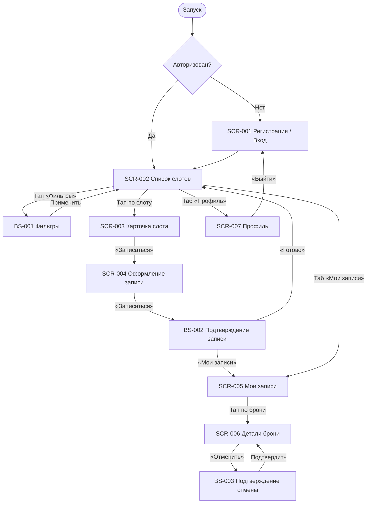

# Фича-лист мобильного приложения «Вертикаль»

> **Этап 5.** Перечень экранов клиентского приложения и доступных на них функций.
> Связующий артефакт между [требованиями](../2-requirements/) и детальным ТЗ по экранам
> ([`_SCREEN_TEMPLATE.md`](_SCREEN_TEMPLATE.md), файлы `SCR-*` / `BS-*`).

**Статус:** Актуален · **Версия:** 1.0 · **Дата:** 2026-07-05

---

## 1. Назначение

**«Вертикаль»** — клиентское мобильное приложение для самостоятельной записи на групповые
тренировки по скалолазанию в скалодроме. Заменяет ручную запись через Telegram и бумажную
тетрадь, устраняя двойные брони и путаницу с местами.

**Скоуп приложения — только роль «Клиент».** Инструктор и владелец работают через
существующую инфраструктуру/админку и в приложение **не входят**. Справочные данные (слоты,
зоны/форматы, инструкторы) приложение получает из API в режиме **read-only**; оплата — **офлайн**
(наличные / перевод на карту на месте), приложение лишь показывает цену и фиксирует запись.

**Источники:**
[Бриф](../0-customer-brief/brief-climbing.md) ·
[Бизнес-требования](../2-requirements/business-requirements.md) ·
[Функциональные требования](../2-requirements/functional-requirements.md) ·
[Нефункциональные требования](../2-requirements/non-functional-requirements.md) ·
[Use cases](../2-requirements/use-cases.md) ·
[User stories](../2-requirements/user-stories.md) ·
[Дизайн-бриф](../3-design-brief/design-brief.md) ·
[Foundations](../3-design-brief/00-foundations.md) ·
[Модель данных](../4-design/data-model.md) ·
[API (OpenAPI)](../api/redocly.yaml)

---

## 2. Глоссарий и роли

| Термин | Значение |
|--------|----------|
| **Тренировка / Слот** | Конкретное занятие: дата, время старта, зона/формат, инструктор, цена, всего/свободно мест. |
| **Зона / Формат** | Вариант тренировки (болдеринг для новичков / трассы для опытных). У каждого формата — свой потолок мест и длительность. |
| **Снаряжение** | Скальники, страховочная система. Бывает **своё** (клиент со своим комплектом) или **прокатное** (из прокатного фонда клуба). |
| **Запись (бронь)** | Бронь **одного места** на слот: вариант снаряжения, статус. Одна запись = один клиент (FR-6, FR-W1). |
| **Ранняя отмена** | Отмена ≥ 2 ч до старта → место и прокатный комплект (если был прокат) возвращаются в слот. |
| **Поздняя отмена** | Отмена < 2 ч до старта → запись фиксируется, место **не** освобождается, штрафов нет. |
| **Отменена скалодромом** | Тренировку отменил клуб; бронь сохраняется с причиной; повторная запись на слот запрещена. |

**Роль приложения:** **Клиент** — просматривает и фильтрует слоты, записывается на **одно место**,
выбирает вариант снаряжения, отменяет записи, получает напоминания.

> **Принцип абстракции.** В фича-листе **не привязываемся к конкретным числам** (размер
> прокатного фонда, потолки форматов, длительность). Все лимиты — параметры, приходящие из
> данных/конфигурации слота и зоны/формата.
>
> **Раздельная модель доступности (места ≠ прокатный фонд, FR-8).** Места в группе и прокатный
> фонд считаются **независимо**:
> - **Место в группе** занимается при любой записи (своё или прокатное снаряжение).
> - **Прокатный фонд** уменьшается только при выборе «Прокатное снаряжение».
> - Свободные места **не** ограничиваются прокатным фондом и наоборот.
>
> **Одно место на запись (FR-6).** Групповая бронь нескольких людей одним аккаунтом не
> поддерживается (FR-W1). На экране оформления нет счётчика гостей — только выбор снаряжения.

---

## 3. Карта навигации

**Таб-бар (АЗ):** **Тренировки** (SCR-002) · **Мои записи** (SCR-005) · **Профиль** (SCR-007).

---

## 4. Инвентарь экранов

| ID | Экран | Тип | Назначение | Зона | Приоритет | Требования |
|----|-------|-----|------------|------|-----------|------------|
| **SCR-001** | Регистрация / Вход | Экран | Лёгкий вход по имени и телефону без пароля | НЗ | Critical | FR-1, FR-2 / US-1 |
| **SCR-002** | Список слотов | Экран | Каталог тренировок со свободными местами + фильтры | АЗ | Critical | FR-3, FR-4 / UC-2, US-2, US-3 |
| **BS-001** | Фильтры | Bottom Sheet | Фильтрация списка слотов | АЗ | High | FR-4 / US-3 |
| **SCR-003** | Карточка слота | Экран | Полные параметры тренировки перед записью | АЗ | Critical | FR-5 / US-4 |
| **SCR-004** | Оформление записи | Экран | Выбор снаряжения, цена, запись на одно место | АЗ | Critical | FR-6–FR-11 / UC-3, US-5–US-8 |
| **BS-002** | Подтверждение записи | Bottom Sheet | Успешная бронь: сводка, офлайн-оплата, push после 1-й записи | АЗ | High | FR-6, FR-11, FR-17 / US-5, US-8 |
| **SCR-005** | Мои бронирования | Экран | Список предстоящих и прошедших записей | АЗ | Critical | FR-12, FR-16 / US-9, US-11 |
| **SCR-006** | Детали брони + отмена | Экран | Детали записи и запуск отмены | АЗ | Critical | FR-13–FR-15 / UC-4, US-10 |
| **BS-003** | Подтверждение отмены | Bottom Sheet | Показ правила 2 часов и подтверждение отмены | АЗ | High | FR-13–FR-15 / US-10 |
| **SCR-007** | Профиль клиента | Экран | Просмотр/редактирование имени и телефона, выход, удаление аккаунта | АЗ | Medium | FR-1, FR-2 / NFR-10 |

> **Зоны:** НЗ — неавторизованная зона, АЗ — авторизованная зона.
>
> **Всего 10 экранов/шторок** (7 экранов + 3 bottom sheet). Карта маршрута (BS-004) **не входит в MVP**.

---

## 5. Детализация по экранам

### SCR-001 · Регистрация / Вход

- **Назначение:** минимальный порог входа — регистрация и повторный вход по телефону.
- **Зона:** НЗ.
- **Доступные функции:**
  - Ввод номера телефона и подтверждение OTP-кодом из SMS.
  - Ввод имени (только для нового клиента).
  - Повторный вход по номеру телефона.
- **Ключевые элементы:** поле «Телефон», поле «Код», поле «Имя» (шаг 3), кнопки «Получить код» / «Подтвердить» / «Продолжить».
- **Бизнес-правила/валидации:** валидация формата телефона (E.164); отсутствие пароля (NFR-3); push-разрешение **не** запрашивается на этом экране.
- **Требования:** FR-1, FR-2 / US-1 / NFR-3.
- **Логики:** [LOGIC-001](09_Логики/LOGIC-001_OTP-авторизация.md).

### SCR-002 · Список слотов

- **Назначение:** главный экран вкладки «Тренировки» — список доступных слотов; точка входа в запись.
- **Зона:** АЗ.
- **Доступные функции:**
  - Просмотр списка слотов (по умолчанию — **ближайшие 7 дней**, `only_available=false`; больший период — фильтром дат).
  - Открыть шторку фильтров [BS-001](#bs-001--фильтры).
  - Переход в карточку слота [SCR-003](#scr-003--карточка-слота).
  - Pull-to-refresh для обновления доступности.
  - Переходы в «Мои записи» и «Профиль» по таб-бару.
- **Ключевые элементы:** карточка слота (дата/время, зона/формат, инструктор, цена, всего/свободно мест); индикатор активных фильтров.
- **Бизнес-правила/валидации:** список показывает слоты на **ближайшие 7 дней** (дефолт API); заполненные слоты **не скрываются**, а помечаются «Мест нет» с **неактивной CTA «Записаться»**; empty state «Пока нет доступных тренировок».
- **Требования:** FR-3, FR-4 / UC-2, US-2, US-3 / NFR-7.
- **Логики:** [LOGIC-005](09_Логики/LOGIC-005_Фильтрация-слотов.md), [LOGIC-008](09_Логики/LOGIC-008_Паттерн-состояний-экрана.md).

### BS-001 · Фильтры

- **Назначение:** уточнить список слотов под запрос клиента.
- **Зона:** АЗ.
- **Доступные функции:**
  - Фильтр по дате / периоду старта.
  - Фильтр по типу тренировки (зона/формат: novice / experienced).
  - Фильтр «только со свободными местами».
  - Фильтр по инструктору.
  - Применить / Сбросить фильтры.
- **Бизнес-правила/валидации:** фильтры комбинируются: OR внутри группы, AND между группами; при пустом результате — empty state с подсказкой изменить/сбросить фильтры.
- **Требования:** FR-4 / US-3.
- **Логики:** [LOGIC-005](09_Логики/LOGIC-005_Фильтрация-слотов.md).

### SCR-003 · Карточка слота

- **Назначение:** показать все параметры тренировки, чтобы клиент решил записаться.
- **Зона:** АЗ.
- **Доступные функции:**
  - Просмотр полных параметров слота (дата/время, зона/формат и длительность, инструктор, места, цена, доступность проката).
  - Переход к оформлению записи [SCR-004](#scr-004--оформление-записи).
- **Ключевые элементы:** дата/время, зона/формат, инструктор, цена, всего/свободно мест, доступность прокатного снаряжения; кнопка «Записаться».
- **Бизнес-правила/валидации:** кнопка «Записаться» неактивна, если `free_seats = 0` или слот отменён.
- **Требования:** FR-5 / US-4.
- **Логики:** [LOGIC-002](09_Логики/LOGIC-002_Расчёт-доступности.md), [LOGIC-003](09_Логики/LOGIC-003_Расчёт-цены-брони.md), [LOGIC-008](09_Логики/LOGIC-008_Паттерн-состояний-экрана.md).

### SCR-004 · Оформление записи

- **Назначение:** выбрать вариант снаряжения и зафиксировать запись на **одно место**.
- **Зона:** АЗ.
- **Доступные функции:**
  - Выбор снаряжения: **своё** или **прокатное**.
  - Просмотр итоговой цены (own = `price`; rental = `price + rental_price`).
  - Подтверждение записи → [BS-002](#bs-002--подтверждение-записи).
- **Ключевые элементы:** переключатель «Своё / Прокатное снаряжение», блок цены, кнопка «Записаться».
- **Бизнес-правила/валидации:**
  - Запись доступна при `free_seats > 0`.
  - «Прокатное» доступно при `free_rental_equipment > 0`; «своё» не расходует прокатный фонд (FR-8).
  - Сервер отклоняет запись при нехватке мест или проката (FR-9, FR-10); клиент обрабатывает отказ.
  - Идемпотентность запроса создания брони (NFR-5).
- **Требования:** FR-6–FR-11 / UC-3, US-5–US-8 / NFR-2, NFR-5.
- **Логики:** [LOGIC-002](09_Логики/LOGIC-002_Расчёт-доступности.md), [LOGIC-003](09_Логики/LOGIC-003_Расчёт-цены-брони.md).

### BS-002 · Подтверждение записи

- **Назначение:** подтвердить успешную бронь и показать дальнейшие шаги.
- **Тип:** **Bottom Sheet** (см. [design-brief BS-002](../3-design-brief/BS-002-booking-success.md)).
- **Зона:** АЗ.
- **Доступные функции:**
  - Просмотр сводки записи (слот, снаряжение, цена).
  - Напоминание об офлайн-оплате.
  - Запрос push-разрешения после **первой** успешной записи.
  - Переход в «Мои записи» [SCR-005](#scr-005--мои-бронирования) (primary).
  - «Готово» — возврат к списку «Тренировки» [SCR-002](#scr-002--список-слотов) (secondary).
- **Бизнес-правила/валидации:** запись появляется в «Моих записях»; свободные места слота уменьшены; при прокате — прокатный фонд уменьшен.
- **Требования:** FR-6, FR-11, FR-17 / US-5, US-8.
- **Логики:** [LOGIC-003](09_Логики/LOGIC-003_Расчёт-цены-брони.md), [LOGIC-007](09_Логики/LOGIC-007_Запрос-push-разрешения.md).

### SCR-005 · Мои бронирования

- **Назначение:** контроль предстоящих и прошедших тренировок клиента.
- **Зона:** АЗ.
- **Доступные функции:**
  - Просмотр списка своих записей (предстоящие / прошедшие).
  - Переход к деталям брони [SCR-006](#scr-006--детали-брони--отмена).
- **Ключевые элементы:** карточка записи (статус, параметры слота, вариант снаряжения, цена).
- **Бизнес-правила/валидации:** клиент видит только свои записи (NFR-10); отображение статуса «Отменена скалодромом» с причиной; empty state при отсутствии записей.
- **Требования:** FR-12, FR-16 / US-9, US-11 / NFR-10.
- **Логики:** [LOGIC-003](09_Логики/LOGIC-003_Расчёт-цены-брони.md), [LOGIC-008](09_Логики/LOGIC-008_Паттерн-состояний-экрана.md).

### SCR-006 · Детали брони + отмена

- **Назначение:** показать полную информацию о брони и дать отменить её.
- **Зона:** АЗ.
- **Доступные функции:**
  - Просмотр деталей записи и статуса.
  - Запуск отмены → [BS-003](#bs-003--подтверждение-отмены).
- **Ключевые элементы:** статус, дата/время, зона/формат, инструктор, вариант снаряжения, цена; кнопка «Отменить».
- **Бизнес-правила/валидации:**
  - Кнопка «Отменить» доступна только при `status = active` и до старта тренировки.
  - Повторная отмена уже отменённой записи не выполняется.
  - Подсказка дедлайна ранней отмены («до `<start_at − 2 ч>`»).
- **Требования:** FR-13–FR-15 / UC-4, US-10.
- **Логики:** [LOGIC-003](09_Логики/LOGIC-003_Расчёт-цены-брони.md), [LOGIC-004](09_Логики/LOGIC-004_Отмена-правило-2-часов.md), [LOGIC-008](09_Логики/LOGIC-008_Паттерн-состояний-экрана.md).

### BS-003 · Подтверждение отмены

- **Назначение:** объяснить последствия отмены и подтвердить действие.
- **Зона:** АЗ.
- **Доступные функции:**
  - Просмотр правила 2 часов и текущего статуса (ранняя / поздняя отмена).
  - Подтверждение / отказ от отмены.
- **Бизнес-правила/валидации:**
  - **Ранняя отмена** (≥ 2 ч до старта): место и прокатный комплект возвращаются в слот (FR-14).
  - **Поздняя отмена** (< 2 ч до старта): статус `late_cancel`, место **не** освобождается, штрафов нет (FR-15).
  - Граница ровно 2 ч трактуется как ранняя отмена.
- **Требования:** FR-13–FR-15 / US-10.
- **Логики:** [LOGIC-004](09_Логики/LOGIC-004_Отмена-правило-2-часов.md).

### SCR-007 · Профиль клиента

- **Назначение:** контактные данные, выход и удаление аккаунта.
- **Зона:** АЗ.
- **Доступные функции:**
  - Просмотр и редактирование имени и телефона (смена телефона — с подтверждением OTP).
  - Выход из аккаунта.
  - Удаление аккаунта (с обязательным подтверждением).
- **Бизнес-правила/валидации:** доступ только к собственным данным (NFR-9, NFR-10); при удалении аккаунта активные брони аннулируются.
- **Требования:** FR-1, FR-2 / NFR-9, NFR-10.
- **Логики:** [LOGIC-001](09_Логики/LOGIC-001_OTP-авторизация.md), [LOGIC-008](09_Логики/LOGIC-008_Паттерн-состояний-экрана.md).

---

## 6. Сквозные функции (не отдельные экраны)

- **Напоминания / уведомления** (FR-17, FR-18, NFR-8): push за **24 ч и 2 ч** до старта
  (`reminder_hours = [24, 2]`); push при отмене тренировки скалодромом. Канал в MVP — **системный
  push** (регистрация push-токена через API). SMS / email — Phase 2 (FR-W6).
- **Состояния экранов** ([LOGIC-008](09_Логики/LOGIC-008_Паттерн-состояний-экрана.md)): единый паттерн
  Loading (скелетон) → Content → Empty → Error (+ «Обновить»). Применяется ко всем экранам с запросами.
- **NFR, влияющие на UI**: mobile-first для зала — крупные элементы, высокий контраст (NFR-1);
  запись ≤ 3 экранов до подтверждения (NFR-2); отклик списка и подтверждения < 2–3 с (NFR-7).
  Приложение — нативное/гибридное для iOS и Android.

---

## 7. Не входит в MVP (Phase 2+)

| Функция | Причина / источник |
|---------|--------------------|
| **Групповая бронь** (несколько людей одним аккаунтом) | FR-W1 — Won't |
| **Онлайн-оплата** | FR-W2 — Phase 2; на старте оплата офлайн |
| **Оценка инструктора** (звёзды 1–5) | FR-W3 — Phase 2 |
| **Программа лояльности** | FR-W4 — Phase 2 |
| **Интерфейсы инструктора и владельца** | FR-W5 — существующая инфраструктура |
| **SMS / WhatsApp / email-напоминания** | FR-W6 — Phase 2 |
| **Авто-учёт профилактики по календарю** | FR-W7 — Phase 2 |
| **Карта маршрута / BS-004** | Не входит в MVP скалодрома «Вертикаль» |

---

## 8. Трассировка требований → экраны

| Требование | Покрывающий экран/функция |
|------------|----------------------------|
| FR-1, FR-2 (регистрация/авторизация) | SCR-001, SCR-007 |
| FR-3 (список слотов, 7 дней) | SCR-002 |
| FR-4 (фильтрация) | SCR-002 + BS-001 |
| FR-5 (карточка слота) | SCR-003 |
| FR-6–FR-11 (запись, снаряжение, лимиты, цена) | SCR-004, BS-002 |
| FR-12, FR-16 (список броней, отмена скалодромом) | SCR-005, SCR-006 |
| FR-13–FR-15 (отмена, правило 2 ч) | SCR-006 + BS-003 |
| FR-17, FR-18 (push-напоминания и отмена скалодромом) | Сквозная функция (§6), BS-002 (запрос разрешения) |
| UC-1 (вход) | SCR-001 → SCR-002 |
| UC-2 (фильтрация) | SCR-002 + BS-001 |
| UC-3 (запись) | SCR-002 → SCR-003 → SCR-004 → BS-002 |
| UC-4 (отмена клиентом) | SCR-005 → SCR-006 → BS-003 |
| UC-5 (отмена скалодромом) | Push → SCR-005 / SCR-006 |
| UC-6 (напоминания) | Сквозная функция (§6) |

---

## 9. Замечания по данным

- **API описан** в многофайловой OpenAPI-спецификации [`../api/`](../api/) (точка входа —
  [`../api/redocly.yaml`](../api/redocly.yaml)). Домены: **auth**, **profile**, **slots**,
  **bookings**, **instructors** (read-only справочники).
- **Логики** вынесены в [`09_Логики/`](09_Логики/_INDEX.md) — 7 переиспользуемых спецификаций
  (без карты маршрута).
- Числовые лимиты (потолок формата, прокатный фонд) подставляются из данных слота, не хардкодятся
  в UI-текстах.
