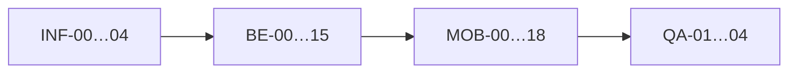

# Чеклист реализации «Вертикаль»

> План повторяет архитектуру [surfstudio/summer-school-2026](https://github.com/surfstudio/summer-school-2026)
> (ветки `feature/be` + `feature/client`) для другой предметной области, **без изменений `01-analysis/`**.
>
> **Стек (зафиксирован):** Flutter (Dart) + Spring Boot 3 (Kotlin) + PostgreSQL + Docker + GitHub Actions.
>
> **Источники:** `01-analysis/5-mobile-app-spec/`, `01-analysis/api/`, `01-analysis/4-design/data-model.md`.
>
> **Статус:** QA-03 завершён — **MVP готов к приёмке**.

---

## Отличия от референса «Волна» (SUP)

| Референс | «Вертикаль» (наше ТЗ) |
|----------|------------------------|
| Go backend | **Spring Boot + Kotlin + JPA + Flyway** |
| KMP Compose (`client/`) | **Flutter (`mobile/`)** |
| `route`, `seats_count` 1–3, `rental_count` | `zone_format`, **одно место** на бронь, `equipment`: own / rental |
| `BS-004` карта маршрута, `LOGIC-006` | **Вне скоупа** (удалены из ТЗ) |
| `listInstructors` only | + **`listZoneFormats`** |
| OTP token pair (частично) | **access + refresh** (`refreshToken`), push-tokens в auth |

---

## Целевая структура monorepo

```text
summer-school-2026/
├── 01-analysis/              # READ-ONLY — не менять при разработке
├── 02-development/           # планы и чеклисты
│   └── IMPLEMENTATION_CHECKLIST.md
├── AGENTS.md                 # правила для AI-агента (стек Vertical)
├── backend/                  # Spring Boot API
│   ├── src/main/kotlin/com/vertical/
│   │   ├── config/
│   │   ├── common/           # exceptions, pagination, clock
│   │   ├── auth/
│   │   ├── profile/
│   │   ├── slots/
│   │   ├── bookings/
│   │   ├── instructors/      # + zone formats
│   │   └── push/             # Phase 2 (напоминания, FCM)
│   └── src/main/resources/db/migration/
├── mobile/                   # Flutter
│   └── lib/
│       ├── app/              # router, theme
│       ├── core/             # api, storage, config, widgets
│       └── features/
│           ├── auth/         # SCR-001, LOGIC-001
│           ├── slots/        # SCR-002, SCR-003, BS-001, LOGIC-005
│           ├── bookings/     # SCR-004–006, BS-002, BS-003, LOGIC-003, LOGIC-004
│           ├── profile/      # SCR-007
│           └── notifications/# LOGIC-007 — Phase 2
├── docker-compose.yml
├── .github/workflows/ci.yml
└── .cursor/rules/
```

**Слои backend (как в референсе, адаптация под Spring):**

```text
Controller (HTTP) → Service (@Transactional) → Repository (JPA) → PostgreSQL
                      ↓
                   Domain rules + DTO mapping
```

**Слои mobile (аналог KMP Clean + MVI → Flutter + riverpod):**

```text
presentation (screens, providers) → domain (models, policies) → data (repositories, dio)
```

---

## Правила выполнения

1. **Не редактировать** `01-analysis/` (контракт и ТЗ — источник истины).
2. Один пункт чеклиста = одна задача агенту; минимальный вертикальный срез + тесты.
3. После изменения публичного API — сверка с `01-analysis/api/` (`npm --prefix 01-analysis/api run lint`).
4. `operationId` из OpenAPI — имена методов на BE и в mobile API-клиенте.
5. MVP scope: только роль **Клиент**; без admin, schedule CRUD, оплаты, рейтингов, карт маршрута.
6. **Проверка функциональности:** приложение ходит в **реальный backend API** (`docker compose`); отдельные mock/stub слои на клиенте и имитация push/scheduler на сервере **не нужны**.

---

## Фаза 0 — Инфраструктура и правила

| # | ID | Задача | Готово когда | Статус |
|---|-----|--------|--------------|--------|
| 0.1 | INF-00 | Создать `AGENTS.md` для «Вертикаль» (стек, source of truth, MVP traps, layered architecture) | Файл в корне, согласован с `.cursor/rules/` | ☑ |
| 0.2 | INF-01 | Дополнить `backend/README.md`: env, migrate, run, test, docker | Новый разработчик поднимает API по README | ☑ |
| 0.3 | INF-02 | Добавить `mobile/README.md` (заглушка структуры до CMP-00) | Есть описание feature-first layout | ☑ |
| 0.4 | INF-03 | Исправить `.gitignore`: разрешить `.env.example` (сейчас блокируется `.env.*`) | `.env.example` в репо | ☑ |
| 0.5 | INF-04 | Расширить CI: job `mobile` (analyze/test) после появления `mobile/` | GitHub Actions зелёный | ☑ |

---

## Фаза 1 — Backend (Spring Boot)

> Аналог `02-development/BE_IMPLEMENTATION_PLAN.md` референса (BE-00…BE-14). **Фаза завершена (2026-07-06).**

| # | ID | Задача | ТЗ / API | Готово когда | Статус |
|---|-----|--------|----------|--------------|--------|
| 1.1 | BE-00 | Довести каркас: пакеты `auth`, `profile`, `slots`, `bookings`, `instructors`, `common`, `config` | `AnalyzePromts.md` | `./gradlew build` проходит | ☑ |
| 1.2 | BE-01 | Flyway **V2**: схема БД по `data-model.md` (clients, otp, sessions, zone_formats, instructors, slots, bookings, idempotency_keys) | `4-design/data-model.md` | Миграции на пустой PostgreSQL | ☑ |
| 1.3 | BE-02 | Seed **V3**: dev-данные (2 zone_format, 2 instructors, 5+ slots на 7 дней) | — | `listSlots` возвращает данные | ☑ |
| 1.4 | BE-03 | Global `@ControllerAdvice` → ошибки `{code, message, details}` по `common/models.yaml` | OpenAPI common | Contract test на 400/401/404 | ☑ |
| 1.5 | BE-04 | Spring Security + JWT (access/refresh), `Clock` bean для тестов | `auth/api.yaml` | Bearer на protected endpoints | ☑ |
| 1.6 | BE-05 | **Auth:** `requestAuthCode`, `verifyAuthCode`, `refreshToken`, `logout` (OTP mock → лог) | SCR-001, LOGIC-001 | Integration test login flow | ☑ |
| 1.7 | ~~BE-06~~ | ~~Push tokens~~ | — | **Phase 2** | — |
| 1.8 | BE-07 | **Profile:** `getProfile`, `updateProfile`, `deleteAccount`, `logout` | SCR-007 | Только свой профиль; delete → анонимизация | ☑ |
| 1.9 | BE-08 | **Catalog:** `listZoneFormats`, `listInstructors`, `listSlots`, `getSlot` (read-only, фильтры) | SCR-002, BS-001, SCR-003, LOGIC-005 | Фильтры + пагинация + 404 | ☑ |
| 1.10 | BE-09 | **createBooking:** `@Transactional`, pessimistic lock, `Idempotency-Key`, equipment own/rental, 201/409/410 | SCR-004, api-sequence.md | Concurrency test: нет overbooking | ☑ |
| 1.11 | BE-10 | **Bookings read:** `listBookings`, `getBooking` (вложенный slot, zone_format, instructor) | SCR-005, SCR-006 | 403 чужая бронь | ☑ |
| 1.12 | BE-11 | **cancelBooking:** правило 2 ч (≥2ч → cancelled, <2h → late_cancel), `club_cancelled` read path | LOGIC-004, BS-003 | Unit tests границ 2h | ☑ |
| 1.12 | ~~BE-12~~ | ~~Push scheduler~~ | — | **Phase 2** | — |
| 1.14 | BE-13 | springdoc-openapi: Swagger UI, сверка paths с `01-analysis/api/` | — | Все operationId покрыты | ☑ |
| 1.15 | BE-14 | Тесты: Testcontainers, createBooking 201/409/410, cancel boundaries, auth OTP | UC-1…UC-4 | `./gradlew test` стабильно | ☑ |
| 1.16 | BE-15 | Финальная сверка endpoints с таблицей в `5-mobile-app-spec` и OpenAPI | — | Нет лишнего scope | ☑ |

---

## Фаза 2 — Mobile (Flutter)

> Аналог `CMP_CLIENT_IMPLEMENTATION_PLAN.md` (CMP-00…CMP-18), адаптация под Flutter + riverpod.

| # | ID | Задача | ТЗ / LOGIC | Готово когда | Статус |
|---|-----|--------|------------|--------------|--------|
| 2.1 | MOB-00 | Создать `mobile/`: `flutter create`, FVM или фикс версии SDK, `analysis_options.yaml` | — | `flutter analyze` без ошибок | ☑ |
| 2.2 | MOB-01 | **core:** `dio`, interceptors (Bearer, refresh-on-401), `flutter_secure_storage`, env config (`API_BASE_URL`) | LOGIC-001 | 401 → logout flow | ☑ |
| 2.3 | MOB-02 | API models + client (openapi_generator или ручные DTO 1:1 с OpenAPI) | `01-analysis/api/` | Все operationId клиента | ☑ |
| 2.4 | MOB-03 | **core/widgets:** `LoadableState` — Loading / Content / Empty / Error / Refreshing (LOGIC-008) | LOGIC-008 | Переиспользуемые виджеты | ☑ |
| 2.5 | MOB-04 | **domain/policies:** `AvailabilityPolicy`, `BookingPriceCalculator`, `CancellationPolicy`, `SlotFilterPolicy` | LOGIC-002–005 | Unit tests политик | ☑ |
| 2.6 | MOB-05 | **app:** `go_router`, theme из `00-foundations.md` (токены, без hardcode в features) | design-brief | Splash → auth / main | ☑ |
| 2.7 | MOB-06 | **auth** feature: SCR-001 (phone → OTP → name if is_new) | SCR-001, LOGIC-001 | UC-1 ручной прогон | ☑ |
| 2.8 | MOB-07 | **slots** feature: SCR-002 список слотов, empty state, pull-to-refresh | SCR-002, LOGIC-005 | UC-2 | ☑ |
| 2.9 | MOB-08 | **BS-001** фильтры (bottom sheet), OR внутри группы, AND между | BS-001 | Фильтры меняют query | ☑ |
| 2.10 | MOB-09 | **SCR-003** карточка слота (`getSlot`), CTA «Записаться» disabled если нет мест | SCR-003, LOGIC-002 | UC-3 начало | ☑ |
| 2.11 | MOB-10 | **SCR-004** оформление: equipment own/rental, preview цены, `Idempotency-Key` UUID | SCR-004, LOGIC-003 | Одно место, без счётчика гостей | ☑ |
| 2.12 | MOB-11 | **BS-002** экран успеха записи (без push-разрешения в MVP) | BS-002 | Переход в «Мои записи» / список слотов | ☑ |
| 2.13 | MOB-12 | **SCR-005** мои брони, группировка предстоящие/прошедшие на клиенте | SCR-005 | UC-4 список | ☑ |
| 2.14 | MOB-13 | **SCR-006 + BS-003** детали, отмена, preview early/late cancel | SCR-006, BS-003, LOGIC-004 | UC-4 отмена | ☑ |
| 2.15 | MOB-14 | **SCR-007** профиль: имя, телефон (read-only), logout, delete account | SCR-007 | UC-1 logout; **без смены телефона** | ☑ |
| 2.16 | MOB-15 | Обработка API errors: snackbar на 4xx action, full-screen на load fail; 409/410 на booking | LOGIC-008 | slot_full обновляет форму | ☑ |
| 2.17 | MOB-16 | **Тесты:** unit policies + widget/integration auth → book → list → cancel | UC-1…UC-4 | `flutter test` зелёный | ☑ |
| 2.18 | MOB-17 | E2E smoke против локального API (`docker compose up`) | — | Полный сценарий клиента | ☑ |
| 2.18 | MOB-18 | Финальная сверка экранов с `feature-list.md` §3 навигация | feature-list | Все переходы работают | ☑ |

---

## Фаза 3 — Интеграция и приёмка

| # | ID | Задача | Готово когда | Статус |
|---|-----|--------|--------------|--------|
| 3.1 | QA-01 | Ручной прогон **UC-1…UC-5** через приложение → backend API (UC-6 push — Phase 2) | Чеклист UC отмечен | ☑ |
| 3.2 | QA-02 | `npm --prefix 01-analysis/api run lint` + springdoc vs OpenAPI | 0 ошибок lint | ☑ |
| 3.3 | QA-03 | README корня: актуальный quick start (docker + mobile + backend) | Один сценарий «с нуля» | ☑ |
| 3.4 | ~~QA-04~~ | ~~Push smoke~~ | — | **Phase 2** | — |

---

## Решения по уточнениям (2026-07-06)

| Вопрос | Решение |
|--------|---------|
| **Смена телефона** (SCR-007) | **Отложить (Phase 2).** MVP: имя редактируется, телефон read-only. |
| **Push / напоминания** (LOGIC-007, FR-17/18, BE-06, BE-12) | **Отложить (Phase 2).** Firebase, scheduler, `registerPushToken` — не в MVP. |
| **Как тестируем MVP** | Flutter → **реальный REST API** (Spring + PostgreSQL). Без mock-клиента, без имитации push на сервере, без stub-токенов. |

### Phase 2 (после MVP)

- Push: `registerPushToken`, scheduler 24ч/2ч, LOGIC-007 на BS-002, Firebase.
- Смена телефона: `requestPhoneChangeCode` / `confirmPhoneChange`.

---

## Подтверждение

После **«ок, начинай»** агент выполняет пункты **строго по порядку**, отмечая `☐` → `☑` в этом файле.

**Уточнения закрыты:**

- [x] Смена телефона — **отложить**
- [x] Push / Firebase — **отложить (Phase 2)**
- [x] Тестирование — **только через реальный API**, без mock push

---

## Карта: экран ТЗ → код

| ТЗ | Backend | Mobile |
|----|---------|--------|
| SCR-001 | `auth/*` | `features/auth/` |
| SCR-002, BS-001, SCR-003 | `slots/*`, `instructors/*` | `features/slots/` |
| SCR-004, BS-002 | `bookings` POST | `features/bookings/` |
| SCR-005, SCR-006, BS-003 | `bookings` GET, cancel | `features/bookings/` |
| SCR-007 | `profile/*` | `features/profile/` |
| LOGIC-001…008 | серверные правила в services | `domain/` + `core/` |

---

## Порядок исполнения (рекомендуемый)



**Параллельно возможно:** после BE-08 (каталог) — старт MOB-00…07, пока делается BE-09…11.

---

## Старт

Напишите **«ок, начинай»** — выполнение с **INF-00**, пункты отмечаются `☑` в этом файле.
